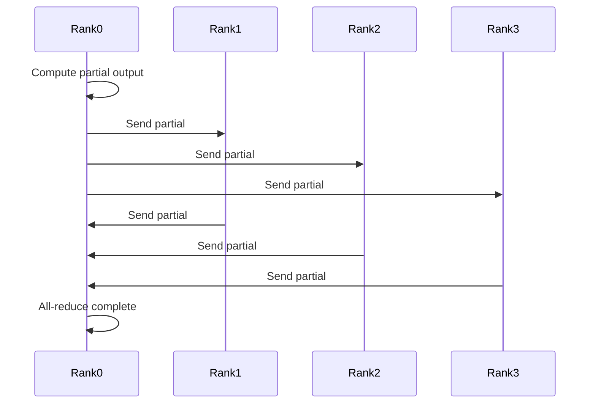

Distributed inference is not just splitting work across machines—it is a communication problem first.

## What Actually Gets Coordinated?

When people talk about tensor parallelism, they usually focus on the math: splitting weight matrices, computing partial results, all-reducing gradients. But in production, the hard part is coordination.

### The Hidden Costs

1. **All-reduce synchronization** — Every micro-batch requires a global barrier.
2. **Load balancing** — Uneven sequence lengths create stragglers.
3. **Memory fragmentation** — Each TP rank allocates identical KV cache shapes.

### Communication Patterns



### Optimization Strategies

- **Overlap communication with computation**: Start all-reduce while computing next layer.
- **Fuse operations**: Combine multiple small collectives into one large one.
- **Use NCCL tuned algorithms**: Tree vs ring topology matters at scale.

```python
# Optimized all-reduce with computation overlap
with torch.cuda.stream(compute_stream):
    next_output = model.next_layer(input)

with torch.cuda.stream(comm_stream):
    torch.distributed.all_reduce(current_output, async_op=True)

torch.cuda.synchronize()
```

## Conclusion

The FLOPs are the easy part. The coordination is what breaks at scale.

