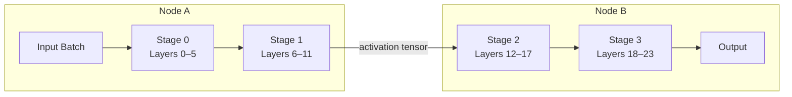

# Inter-Node Tensor Placement in Distributed Inference: A Practical Look at Pipeline Parallelism

## Real-time model serving at scale is often limited less by FLOPs and more by where you put the tensors.

**TL;DR**
- In model-parallel inference, the dominant cost is usually moving intermediate activations across the network, not allocating weight buffers.
- A practical placement strategy assigns whole, contiguous layers to each node, keeps weights stationary, and streams micro-batches to overlap communication with computation.
- The payoff depends heavily on the communication-to-computation ratio: high-bandwidth, low-latency interconnects and sufficiently large batch sizes are prerequisites.

---

Distributed inference for large models rarely fits on a single accelerator. Teams serving transformer-based evaluation engines, recommendation models, or vision backbones often split a model across two or more nodes. At that point, the problem changes shape. Local optimization—faster kernels, lower precision, pruning—still matters, but the new first-order concern is *inter-node tensor placement*: deciding which tensors live where, when they move, and how much data has to cross the wire for every request.

This post focuses on the architectural pattern that matters most in that setting: pipeline-style model partitioning with stationary weights and streaming activations.

---

## Why does inter-node tensor movement dominate latency?

Because weights are large but read once per request, while activations are smaller but cross the network on every forward and backward pass.

In a typical model-parallel setup, each node owns a contiguous slice of the model—say, the first twelve transformer blocks on Node A and the remaining twelve on Node B. Every node keeps its own weights in local HBM or DRAM. For each input batch, Node A computes its slice and produces an intermediate activation tensor. That tensor must be sent to Node B before B can start its work. If the model is split into more stages, this handoff repeats at every stage boundary.

The total latency therefore looks roughly like:

> per-request latency ≈ sum of local compute latencies + sum of network transfer latencies + scheduling noise

The network term is stubborn. Compute can be batched up, fused, or kernel-optimized, but a tensor still has to traverse whatever link exists between nodes. In clusters connected by Ethernet or even moderately fast InfiniBand, cross-node transfers can consume a double-digit percentage of the end-to-end latency budget; in oversubscribed or multi-rack deployments, the impact is larger. That is why placement strategy is arguably more important than single-node kernel tuning once the model exceeds one accelerator.

---

## What does a reasonable placement pattern look like?

The key idea: **keep whole layers together, keep weights stationary, and make activation handoffs explicit and regular.**

A common anti-pattern is to treat model partitioning as a generic graph-cut problem and slice individual operators across devices. In inference, that rarely helps. Operators such as `LayerNorm`, activation functions, or residual additions have tiny compute kernels relative to the synchronization cost required to feed them split inputs. The practical approach is *stage-based* partitioning: group layers into coarse stages, assign each stage to one node, and accept that the boundary between stages is the only place where expensive cross-node traffic occurs.

To reduce that traffic, teams usually adopt three complementary tactics:

1. **Micro-batching.** Split the incoming batch into smaller “micro-batches” and pipeline them through the stages so that downstream nodes are kept busy while earlier ones process the next chunk.
2. **Activation compression.** Apply quantization or lightweight lossless compression to boundary activations only, not the weights.
3. **Co-location of shared cluster stages.** Put the split at a layer boundary with the smallest activation footprint, often after a pooling, projection, or dimensionality-reduction layer.

The architecture below shows a four-stage pipeline spread across two nodes. The arrows at stage boundaries represent activation tensors moving between devices after local compute finishes.



---

## A minimal Python sketch of the pattern

Below is a deliberately simplified PyTorch illustration. It defines a small multi-layer network, splits it into two stages on two different devices, and shows how a single inference request flows across the stage boundary. In a real system, this would be wrapped by a serving framework (for example, TensorRT-LLM, vLLM pipeline parallelism, or a custom gRPC/NCCL driver), but the handoff mechanism remains the same.

```python
import torch
import torch.nn as nn

class TinyModel(nn.Module):
    def __init__(self, dim: int = 512):
        super().__init__()
        # Eight fully-connected blocks stand in for transformer layers
        self.blocks = nn.ModuleList([
            nn.Sequential(nn.Linear(dim, dim), nn.GELU())
            for _ in range(8)
        ])
        self.head = nn.Linear(dim, 10)

    def forward(self, x: torch.Tensor):
        for block in self.blocks:
            x = block(x)
        return self.head(x)


# Decide a split point: keep first half on device A, second half on device B.
# In production, 'cuda:0' and 'cuda:1' would usually become distinct nodes.
device_a = torch.device("cpu")   # substitute cuda:0
device_b = torch.device("cpu")   # substitute cuda:1

full_model = TinyModel(dim=512)
stage_0 = nn.Sequential(*full_model.blocks[:4]).to(device_a)
stage_1 = nn.Sequential(*full_model.blocks[4:]).to(device_a)
head = full_model.head.to(device_b)


def pipeline_infer(x: torch.Tensor) -> torch.Tensor:
    # Node A computes the first half of the model.
    hidden = stage_0(x.to(device_a))

    # The activation tensor crosses the network boundary.
    hidden = hidden.to(device_b)

    # Node B finishes the model and applies the head.
    hidden = stage_1(hidden)
    return head(hidden)


# Simulate one request.
x = torch.randn(16, 512)          # batch size 16
out = pipeline_infer(x)
assert out.shape == (16, 10)
```

A few honest details are worth noting:

- Weights never move; only `hidden` crosses the boundary.
- The `.to(device_b)` call hides all of the real complexity: in production it becomes a `send`/`recv` over NCCL, gRPC, or RDMA.
- The split point is chosen manually here. Auto-partitioning tools exist, but they usually optimize for the same objective—minimize boundary tensor size and balance per-stage latency—not for abstract graph-cut elegance.

---

## When does model partitioning actually pay off?

Only when the communication cost is smaller than the compute cost it unlocks.

If each stage has enough work to keep its accelerator busy while the previous stage is computing the next micro-batch, the pipeline stays full and throughput scales near-linearly with the number of stages. But if the network link is slow, or the batch size is so small that every transfer dominates the compute time, partitioning can make latency worse than running everything on a single, larger node.

As a rule of thumb for teams evaluating this pattern:

- **Prefer tensor parallelism within a node** when the bottleneck is memory bandwidth on a single device; it uses fast NVLink or shared memory.
- **Prefer pipeline parallelism across nodes** when a single layer group fits in node-local memory but the full model does not; its boundary traffic is smaller than the all-reduce traffic tensor parallelism would generate.
- **Prefer not splitting at all** when the model fits on one accelerator and latency is the only metric that matters.

There is no universal dividend. A pipeline partition that works well at batch size 64 on InfiniBand may be a latency regression at batch size 1 on a cloud VPC.

---

## Operational implications

From an engineering standpoint, getting this right requires more than choosing a split point.

**Measure the right things.** Latency dashboards should break out *time spent in local compute*, *time in cross-node send/recv*, and *pipeline bubble time* when stages sit idle waiting for work. Without that decomposition, teams optimize the wrong bottleneck.

**Watch the boundary tensors.** Activations scale with batch size and sequence length, so a deployment that behaves well for short queries can saturate the network once context length grows. Caching repeated prefix activations, when semantically valid, is one of the most effective ways to reduce boundary traffic in long-context inference.

**Plan for failures.** A pipeline-parallel stage is single-threaded in its stage assignment: if Node B becomes unavailable, the whole pipeline stalls. Production systems need timeouts, request rerouting, and staged health checks rather than relying on a perfectly stable network.

---

## Topics

- Distributed Systems
- Machine Learning Inference
- Model Parallelism
- Pipeline Parallelism
- Tensor Placement
- Latency Optimization
- PyTorch
- Real-Time ML Systems