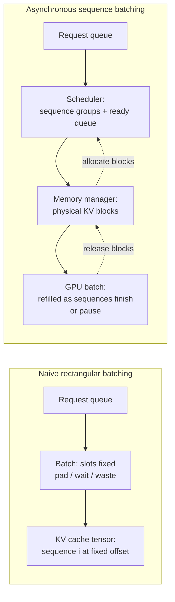

# Making LLM Serving Efficient: Asynchronous Sequence Batching for KV Caches
**How modern inference engines reconcile throughput, latency, and memory pressure in transformer KV cache management.**


**TL;DR**
- LLM inference spends most of its wall-clock time in decode steps, where each new token requires reading the full key–value history; batching these requests naively wastes memory and compute.
- Asynchronous sequence batching separates request arrival from execution scheduling: requests are grouped into sequence groups, their KV cache blocks are managed independently of batch slot position, and the scheduler continuously refills the GPU batch as sequences finish or pause.
- Real-time evaluation and online serving pipelines benefit most when the workload has variable prompt lengths, mixed prefill/decode phases, and strict tail-latency requirements.

---

Large language model serving is not a generic key–value caching problem, though it starts with one. Every autoregressive transformer keeps a *KV cache* of previously computed key and value tensors so that generating the next token only touches the newest token plus history. That cache is huge, dynamic, and tightly coupled to the batch in flight. How you schedule requests onto it determines whether your GPU is starved or saturated.

Teams running distributed inference often find that the bottleneck is not the model weights but the memory traffic and occupancy of these KV caches. The same hardware can serve two very different workloads: a prompt prefill, where many tokens are processed in parallel to warm the cache, and a decode phase, where one token at a time is generated for each active sequence. Asynchronous sequence batching is the pattern modern engines use to keep both phases busy without tying a sequence’s memory layout to its position in the batch.

## Why does naive batching break down at scale?

The short answer is that rectangular batches fit rectangular tensors, but real request streams are jagged.

In a simple batched implementation, every sequence in a batch must have the same length. If one request has a 2-token prompt and another has a 200-token prompt, you either truncate, pad, or wait. Padding wastes compute and memory; waiting increases latency. Worse, once a sequence finishes generating, its slot stays occupied until every other sequence in the batch finishes, leaving the GPU partially idle.

The KV cache compounds this. In a fixed-shape batch, each sequence’s key–value tensors sit at a predetermined tensor offset. When sequence *i* finishes early, you cannot just slide sequence *j* into its place without copying tensors and invalidating attention masks. Copying multi-gigabyte caches between forward passes is not practical.

So the rectangular batch assumption collides with three realities of production inference:

1. **Variable arrival times.** Requests reach the server as a stream, not as a synchronized block.
2. **Variable sequence lengths.** Prompts and generated lengths differ by orders of magnitude.
3. **Variable termination times.** A sequence may stop because it emitted an end-of-sequence token, hit a user limit, or was preempted.

Asynchronous sequence batching attacks all three by decoupling the logical request sequence from the physical memory blocks that hold its KV cache.

## What does asynchronous sequence batching actually look like?

The scheduler, not the tensor shape, owns the batch. Requests arrive into a queue. The scheduler groups them into *sequence groups*, assigns physical KV cache blocks through a separate memory manager, and dispatches execution when enough ready work exists or a latency deadline fires.

The diagram below contrasts the two approaches.



In the asynchronous design, each sequence group carries its own metadata: prompt tokens, generated tokens, sampling parameters, and a list of physical block IDs where its KV tensors live. The attention kernel reads those blocks through a block table rather than through tensor offsets imputed from the batch index. This is the core idea behind PagedAttention and its descendants: treat the KV cache like virtual memory.

A sequence can now leave the batch without disturbing others. When it finishes or is preempted, the scheduler returns its blocks to the free list and pulls the next ready sequence group from the queue. New arrivals are not forced to wait for the current batch to drain; they are added as soon as blocks and compute capacity allow.

### Anatomy of a scheduler

At a high level, the scheduler must simulate two resources: compute slots and KV block capacity.

1. **Scheduling constraints.** A sequence group is schedulable only if enough free KV blocks exist for its prompt and a reasonable decode budget. The scheduler also respects pipeline-parallel stages and tensor-parallel placement if the model is sharded.
2. **Preemption policies.** When memory pressure rises, the scheduler can swap or recompute KV blocks for low-priority sequences. Swapping is faster for short sequences; recomputation is cheaper when the eviction cost exceeds the recompute cost.
3. **Batch formation.** The scheduler builds a candidate batch from ready sequence groups, runs it through the model executor, then immediately re-runs scheduling before the next forward pass. The loop is tight: scheduling overhead must stay well below a single decode step.

The model executor then dispatches two kinds of kernels. *Cache-write kernels* store the new key–value pairs computed in the current step. *Attention kernels* read the historical key–value pairs through the block table. Because the block table is per-sequence, sequences of different lengths can coexist in the same forward pass.

### Concrete example: a simplified scheduler loop

The Python sketch below is illustrative, not production code. It shows how sequence groups, block allocation, and a ready queue interact.

```python
from dataclasses import dataclass
from typing import List, Deque
from collections import deque
import heapq

BLOCK_SIZE = 16          # tokens per physical KV block
MAX_BLOCKS = 1024        # total physical blocks available
MAX_BATCH_TOKENS = 4096  # budget per forward pass

@dataclass
class SequenceGroup:
    request_id: str
    prompt_tokens: List[int]
    generated: List[int]
    block_ids: List[int] = None
    status: str = "waiting"  # waiting, running, finished

    def num_logical_tokens(self) -> int:
        return len(self.prompt_tokens) + len(self.generated)

    def num_blocks(self) -> int:
        return (self.num_logical_tokens() + BLOCK_SIZE - 1) // BLOCK_SIZE


class BlockManager:
    def __init__(self, max_blocks: int):
        self.free_blocks = list(range(max_blocks))
        self.allocated: dict[int, str] = {}

    def allocate(self, seq: SequenceGroup) -> bool:
        needed = seq.num_blocks()
        if len(self.free_blocks) < needed:
            return False
        seq.block_ids = [self.free_blocks.pop() for _ in range(needed)]
        for bid in seq.block_ids:
            self.allocated[bid] = seq.request_id
        return True

    def free(self, seq: SequenceGroup):
        for bid in seq.block_ids or []:
            self.allocated.pop(bid, None)
            self.free_blocks.append(bid)
        seq.block_ids = []


class Scheduler:
    def __init__(self, block_manager: BlockManager):
        self.waiting: Deque[SequenceGroup] = deque()
        self.running: List[SequenceGroup] = []
        self.block_manager = block_manager

    def add_request(self, seq: SequenceGroup):
        self.waiting.append(seq)

    def schedule(self) -> List[SequenceGroup]:
        ready: List[SequenceGroup] = []
        token_budget = MAX_BATCH_TOKENS

        # First, keep running sequences if they still fit
        still_running = []
        for seq in self.running:
            if seq.status == "finished":
                self.block_manager.free(seq)
                continue
            seq_len = seq.num_logical_tokens()
            if token_budget >= seq_len:
                token_budget -= seq_len
                still_running.append(seq)
                ready.append(seq)

        # Then backfill from the waiting queue
        while self.waiting and token_budget > 0:
            seq = self.waiting[0]
            if not self.block_manager.allocate(seq):
                break  # out of KV memory
            seq_len = seq.num_logical_tokens()
            if token_budget < seq_len:
                self.block_manager.free(seq)
                break
            token_budget -= seq_len
            seq.status = "running"
            ready.append(seq)
            self.waiting.popleft()

        self.running = still_running + [s for s in ready if s not in still_running]
        return ready


# Example usage
bm = BlockManager(MAX_BLOCKS)
sched = Scheduler(bm)

for i in range(5):
    sched.add_request(SequenceGroup(
        request_id=f"req-{i}",
        prompt_tokens=list(range(20 + i * 10)),  # jagged prompts
        generated=[]
    ))

batch = sched.schedule()
print(f"scheduled {len(batch)} sequence groups")
print(f"remaining waiting: {len(sched.waiting)}")
```

Real systems extend this with chunked prefill—splitting long prompts across multiple scheduler iterations—so decode latency is not held hostage by a single enormous prefill. They also track block reference counts for beam search and speculatively schedule future tokens.

## When is the complexity worth it?

Not every inference deployment needs this machinery. A batch API that accepts jobs in bulk and returns complete responses can use simpler static batching. Asynchronous sequence batching pays off when the workload has one or more of these traits:

- **Continuous streaming traffic.** Requests arrive one by one rather than in pre-formed batches.
- **Tight tail-latency targets.** p99 decode latency suffers badly if sequences wait for unrelated stragglers.
- **Jagged length distributions.** Mixing short prompts, long prompts, and long generated completions in the same serving window is normal.
- **Online evaluation and guardrails.** Real-time evaluation engines score outputs as they are generated, trigger safety filters, or route between models. These pipelines need decode results incrementally, not at end-of-sequence.

The memory manager deserves almost as much attention as the scheduler. KV cache capacity is usually the binding constraint in long-context serving. Block tables, reference counting, and optional CPU offloading let teams trade memory bandwidth for capacity without losing the ability to mix sequences freely within a batch.

There is no free lunch. The scheduler adds CPU overhead, the block table requires attention-kernel support, and preemption policies introducewj state-machine complexity. But the alternative—reserving rectangular tensor space for jagged, stochastic workloads—leaves GPU cores and HBM bandwidth on the table.

## Topics

`LLM inference` · `KV cache` · `transformer serving` · `asynchronous batching` · `distributed systems` · `low-latency systems` · `PagedAttention` · `real-time evaluation` · `memory management`