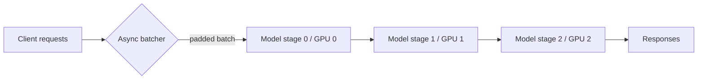

# Distributed Inference at Scale: Make Batching and Partitioning Work Together


**A practical look at asynchronous sequence batching and transformer partitioning for high-throughput serving.**

**TL;DR**
- Asynchronous sequence batching lets a serving system accumulate incoming requests into larger, padded batches, improving accelerator utilization and hiding request-arrival jitter.
- Model partitioning—either across layers (pipeline) or inside a layer (tensor)—spreads memory and compute when a single device cannot hold or execute the model.
- Batching and partitioning solve different problems; production systems usually need both, plus a scheduling layer that keeps them from fighting each other.

---

When a single model call starts taking too long, the usual first instinct is to add hardware. That helps only up to a point. The real gains come from reshaping how work reaches the hardware. In transformer-based inference, two patterns dominate: **asynchronous sequence batching**, which packs small requests into fuller batches, and **model partitioning**, which splits a model across devices. Neither is new, but combining them well is where most of the performance lives.

## Why does single-device inference stall first?

Because one accelerator has hard memory and compute ceilings, and user traffic is bursty. A single GPU or TPU must serialize requests if the model does not fit in memory, or if the batch size needed to saturate its compute units is larger than what synchronous serving can collect. Even when the model fits, head-of-line blocking—where one slow request delays every request behind it—pushes tail latency upward.

Synchronous batching makes this worse. If the server waits until a fixed-size batch is full before it runs inference, short bursts leave requests sitting idle. If it runs whatever is available immediately, the accelerator is underutilized. The gap between arrival time and execution time is the problem an async design is meant to close.

## How can model partitioning help?

Partitioning spreads the model itself. For transformers, this typically takes one of two forms.

**Inter-layer partitioning** slices the stack of transformer blocks into stages and assigns each stage to a different device. A request flows through stage 0, then stage 1, and so on. This is pipeline parallelism. To keep throughput high, micro-batches—smaller slices of a batch—enter the pipeline one after another so that every device has work while earlier micro-batches are still propagating forward.

**Intra-layer partitioning** splits the matrices inside a single layer, such as the attention projection weights or the feed-forward network, across multiple devices. Each device owns a shard of the computation; the partial results are combined with an all-reduce or all-gather. This is tensor parallelism. It is most effective when devices are linked with fast interconnects, because every layer now requires a collective communication step.

The choice between the two depends on the bottleneck. If the model does not fit in one device’s memory but layer-local communication is expensive, inter-layer partitioning is usually simpler. If a single layer is too large to fit or one layer’s compute dominates, intra-layer partitioning is more attractive. Many large deployments use a hybrid: tensor parallelism inside a single node, pipeline parallelism across nodes.



## How does asynchronous sequence batching increase throughput?

Batching increases throughput because the fixed cost of loading weights and launching kernels is amortized across many inputs. For sequence models, the catch is that inputs have different lengths. They must be padded or packed to the same length, so shorter sequences pay the cost of the longest one in the batch. Batching improves utilization only when the padding overhead stays smaller than the gain from running one larger matrix operation instead of many small ones.

Asynchronous batching decouples request submission from execution. A small scheduler collects arriving requests in a queue, then forms a batch based on either a size cap or a time budget. If the queue reaches the size cap quickly, the scheduler dispatches immediately. If traffic is sparse, the time budget guarantees that a request does not wait forever. The result is steadier device utilization and lower latency under variable load.

Here is a minimal illustration of the pattern. The values are intentionally small; a real system would use larger caps, optimized padding, and a proper inference backend.

```python
import asyncio
import time
from typing import List

class AsyncSequenceBatcher:
    def __init__(self, model, pad_id: int = 0,
                 max_batch: int = 8, max_wait_s: float = 0.01):
        self.model = model
        self.pad_id = pad_id
        self.max_batch = max_batch
        self.max_wait_s = max_wait_s
        self.queue = asyncio.Queue()

    async def submit(self, input_ids: List[int]):
        future = asyncio.get_event_loop().create_future()
        await self.queue.put((input_ids, future))
        return await future

    async def runLoop(self):
        while True:
            batch = [await self.queue.get()]
            deadline = time.monotonic() + self.max_wait_s

            # Fill the batch until size or time runs out.
            while len(batch) < self.max_batch:
                timeout = deadline - time.monotonic()
                if timeout <= 0:
                    break
                try:
                    item = await asyncio.wait_for(self.queue.get(), timeout=timeout)
                    batch.append(item)
                except asyncio.TimeoutError:
                    break

            inputs, futures = zip(*batch)
            max_len = max(len(seq) for seq in inputs)
            padded = [seq + [self.pad_id] * (max_len - len(seq)) for seq in inputs]

            # The actual dispatch to the partitioned or replicated model.
            outputs = self.model(padded)

            for future, output in zip(futures, outputs):
                future.set_result(output)
```

In this sketch, `model` can be a single GPU model, a model replicated across workers, or a multi-stage partitioned model. The batcher does not care; its job is only to turn a stream of uneven arrivals into full, evenly shaped batches.

## What happens when you combine both?

Partitioning and batching are complementary, but they do not automatically reinforce each other. Pipeline partitioning introduces stage latency; it works best when batches keep every stage busy. Tensor partitioning adds communication; it works best when batches are large enough to hide the collective overhead. If the batcher dispatches tiny batches too aggressively, it undermines both.

A common arrangement is:

1. **Request routing**: route similar-length sequences together so padding waste stays low.
2. **Async batching**: collect requests at each model replica or stage.
3. **Data parallelism**: replicate the partitioned model across multiple nodes, with each replica consuming its own batch stream.
4. **Pipeline or tensor parallelism**: split each replica only when the model will not fit or a single device is saturated.

This layering keeps each technique in the place where it helps. Batching improves utilization at every replica. Partitioning expands the largest model a replica can run. Data parallelism scales the number of replicas. The orchestration layer is what prevents them from colliding.

## Where teams usually trip up

The biggest mistake is treating batch size as a fixed tuning knob. Under heavy load, a larger batch improves throughput. Under light load, the same batch size hurts latency because requests wait for the batch to fill. Async batching with a latency deadline is a simple way to make the system adaptive.

Another common issue is ignoring communication topology. Tensor parallelism across slow network links often costs more than it saves. Pipeline bubbles can be reduced but not eliminated; they matter most when the batch is small or the stage count is high. Understanding these constraints is more useful than chasing a single “optimal” configuration.

## Topics

`Machine Learning` `Distributed Systems` `Inference Optimization` `Transformer Models` `Model Partitioning` `Asynchronous Batching` `MLOps` `High-Throughput Serving`