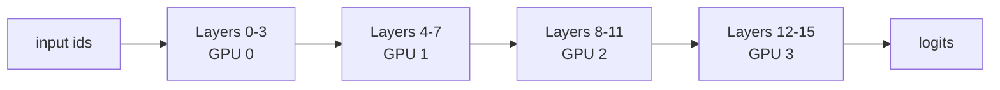
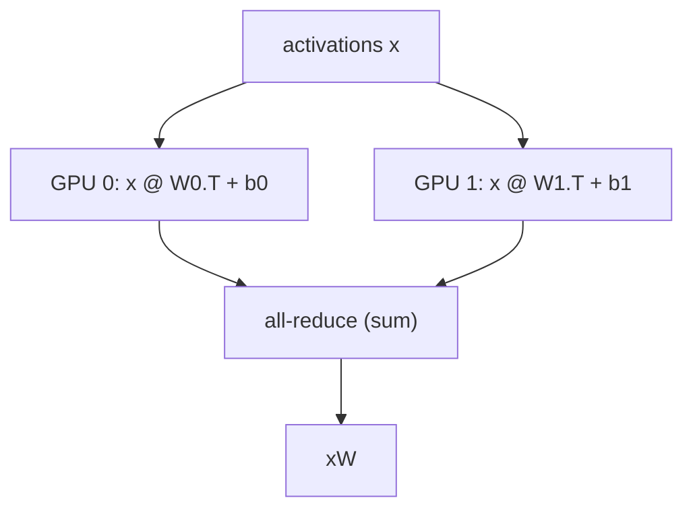

# Distributed Inference at the Latency Edge: Coordinate Tensors, Not Just Layers


*Pipeline sharding with `device_map` solves memory pressure, but low-latency inference needs deliberate tensor-level coordination.*

**TL;DR**
- `device_map` from Hugging Face Accelerate is a layer-wise pipeline-parallelism tool for models that exceed single-GPU memory; it does not split individual operators.
- In latency-sensitive evaluation engines, activation transfer between GPUs can dominate wall-clock time; tensor parallelism within layers requires custom kernels and collective communication.
- Pick layer-wise sharding for memory-bound offline throughput; prefer tensor-parallel serving frameworks for interactive p99 latency.

Teams running large language models as real-time evaluation engines hit the GPU memory wall before they hit the compute wall. A judge model, a reward model, or a safety classifier may have tens of billions of parameters, and once activations, KV cache, and optimizer states are counted, a single card is no longer enough. Hugging Face Accelerate’s `device_map` is often the first stop: one argument spreads a model across GPUs. But `device_map` does not slice tensors inside a layer; it assigns whole layers to devices in a pipeline. That distinction controls whether inference stays within a latency budget.

## Why does `device_map="auto"` feel like tensor slicing?

Because it partitions the model across devices, but it does so at layer boundaries, not inside individual weight matrices.

In Accelerate, `device_map` builds a dictionary that maps each named module or parameter to a device. When you pass `device_map="auto"`, the library calls `infer_auto_device_map` to fit contiguous blocks of layers into the `max_memory` budget of each GPU. The forward pass then becomes a relay race: an activation arrives on GPU 0, layers 0-3 run, the tensor moves to GPU 1, layers 4-7 run, and so on. The neurons inside any one linear layer all live on the same device.

That design makes it simple to load models that would not fit on a single card. It also explains why the following pattern is correct, while splitting a single `nn.Linear` weight from its bias across two GPUs is not:

```python
from transformers import AutoModelForCausalLM, AutoTokenizer
import torch

model_id = "org/LargeEvaluator-7B"  # illustrative model name

tokenizer = AutoTokenizer.from_pretrained(model_id)
model = AutoModelForCausalLM.from_pretrained(
    model_id,
    torch_dtype=torch.bfloat16,
    device_map="auto",
    max_memory={
        0: "20GiB",
        1: "20GiB",
    },
)
```

Here `max_memory` pins the per-GPU budget so the dispatcher knows how many layers to place on each card. The dispatcher will keep each transformer block intact; it will not, for example, put the query projection matrix on GPU 0 and the key projection matrix on GPU 1 unless those are separate modules whose sizes fit the plan. For a standard PyTorch module, weight and bias must reside on the same device, because the forward kernel expects a single device context.



This pipeline layout solves the memory problem. But it introduces a new variable: cross-device activation movement.

## When does layer-wise sharding break down for real-time inference?

When the time spent moving activations between GPUs becomes comparable to the time spent computing them.

For a single request, pipeline parallelism keeps most GPUs idle. Only the GPU holding the currently executing layer is busy; the others wait for the activation tensor to arrive. The request’s latency is the sum of per-layer compute plus the sum of device-to-device transfers. On a multi-GPU node those transfers may travel across NVLink, but if the topology forces PCIe or, worse, inter-node networking, the transfer cost can dominate. Batching can raise throughput by filling the pipeline, yet batching also increases each request’s wait time and memory pressure; for an interactive evaluation engine, that tradeoff often violates the p99 latency budget.

Tensor parallelism is the alternative. Instead of placing whole layers on different devices, it splits the weight matrices of an individual layer and runs the same layer on multiple GPUs simultaneously. A row-sharded linear layer, for instance, computes partial outputs on each GPU and then uses an all-reduce to sum them. That keeps all devices working on the same token at the same time, which is what latency-sensitive systems need.



The catch is that tensor parallelism is not a configuration flag inside `device_map`. It needs custom kernels, aligned tensor sharding, and collective operations such as `all_reduce`. Frameworks like Megatron-LM, DeepSpeed, vLLM, and Text Generation Inference provide these primitives and schedule the communication so it overlaps with compute.

```python
# Illustrative tensor-parallel matmul; assumes W is row-sharded across GPUs.
import torch
import torch.distributed as dist

dist.init_process_group("nccl")
local_rank = dist.get_rank()

# Each GPU holds a shard of the weight matrix.
local_output = x.to(local_rank) @ local_weight.T + local_bias
dist.all_reduce(local_output, op=dist.ReduceOp.SUM)  # collect partial sums
```

This snippet is intentionally schematic. Real tensor-parallel inference also fuses the all-reduce with the next operation, manages KV-cache sharding, and chooses layouts so the reduction happens once per layer rather than once per parameter.

So how do you pick between the two patterns? Start with the binding constraint. If the model simply does not fit on one GPU and request latency is flexible, `device_map` with layer-wise placement is the pragmatic path. Pin your memory budget explicitly with `max_memory`, and measure per-request latency before and after sharding. If the evaluation engine must answer within a tight window and you have multiple GPUs on the same node, move to a tensor-parallel serving framework; the communication cost of the all-reduce is usually lower than the serial transfer cost of pipeline bubbles. If the model is too large even for one node, combine pipeline parallelism across nodes with tensor parallelism inside each node, but treat that as a last resort for latency-sensitive paths.

One thing both patterns demand is an honest latency budget. For an evaluation engine, the total time includes tokenization, model forward passes, possibly batched prefill and decode phases, and post-processing. Splitting the model only affects the forward pass. A common mistake is to optimize the forward pass while ignoring the cost of moving tensors between CPU, network, and GPU. The most useful measurement is end-to-end p99 latency under representative traffic, not a micro-benchmark of a single layer.

## Topics
- Distributed inference
- Model parallelism
- Tensor parallelism
- Hugging Face Accelerate
- GPU memory optimization
- Low-latency ML serving
- `device_map`