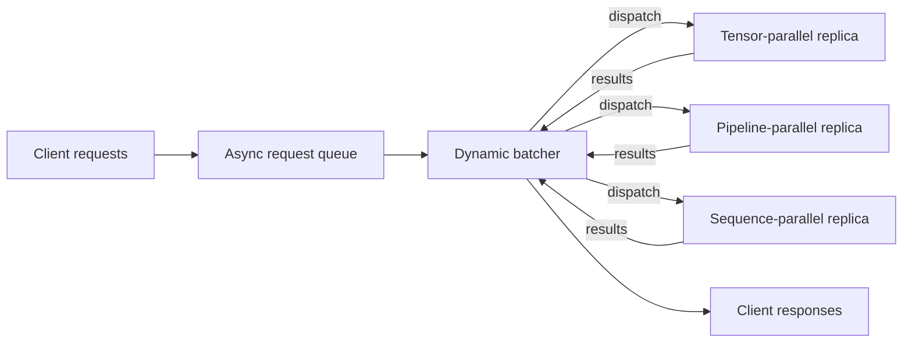

# Faster Inference Without Bigger Clusters: Asynchronous Sequence Batching in Distributed LLM Serving


*How serving-scheduler design, not just model-parallel placement, determines real-time throughput.*

**TL;DR**
- Asynchronous sequence batching keeps GPU batches full continuously instead of waiting for fixed-size groups, raising throughput under bursty traffic.
- Model-parallel placement (pipeline, tensor, sequence) and tools like `device_map` reduce per-device memory, but they are independent from the scheduling loop that keeps those devices busy.
- A lightweight async scheduler can combine dynamic batching with device placement; the example below shows the shape of that pattern.

Real-time evaluation engines occupy an awkward spot in the ML stack. Users expect millisecond-level responses, while modern LLMs need wide, dense batches to keep tensor cores fed. Throwing more GPUs at the problem helps only up to a point. After that, latency and cost are dictated less by peak FLOPs than by how requests are grouped, queued, and routed onto the available hardware. Distributed inference splits a model — or replicas of it — across a fleet, but the fleet still needs a scheduler. Asynchronous sequence batching is one of the simplest scheduler patterns that meaningfully improves both throughput and tail latency without requiring a larger cluster.

## Why does naive batching waste GPU cycles?

Naive batching usually means collecting a fixed number of requests, padding them to the longest sequence, running one forward pass, and returning. The logic is simple; the waste is not. First, there is queuing delay. If only a handful of requests have arrived when the collection window closes, the batcher either waits for more (latency rises) or dispatches a partial batch (compute units idle). Second, there is padding waste: short sequences travel alongside zero-fill tokens that still consume memory bandwidth and compute. Both problems intensify when traffic is bursty, which is exactly the pattern most real-time evaluation engines see.

A GPU hits its rated throughput when tensor cores operate on wide matrices. Two padded sequences leave most of that width unused. So the bottleneck is often not how many FLOPs the hardware can perform, but how consistently the scheduler can supply FLOPs to it. Model parallelism — pipeline parallelism across layers, tensor parallelism across attention heads, or sequence parallelism along the context dimension — reduces per-device memory pressure and lets teams fit larger models. It does not, however, solve the scheduling problem on its own. That is where asynchronous sequence batching enters.

## What does asynchronous sequence batching actually change?

Asynchronous sequence batching decouples the client request path from the GPU forward-pass loop. Requests arrive into a thread- or process-safe queue. A scheduler continuously dequeues them, forms a batch as soon as either a size limit is hit or a short timeout expires, and dispatches that batch to the model. Meanwhile, completed work is pushed back to waiting clients without blocking new arrivals. The pattern is sometimes called dynamic batching or in-flight batching; the core idea is the same — do not let the GPU sit idle while requests pile up just outside the dispatch gate.

In a distributed setup, the scheduler also decides which model replica or parallel group receives each batch. A `device_map` might place embeddings on `cuda:0`, the first half of transformer layers on `cuda:0`, the second half on `cuda:1`, and the language-model head on `cuda:1`. Tools like this tell you where weights live. The batcher tells you when work moves through them. The two concerns are complementary: the map defines placement; the scheduler defines dispatch timing.



The diagram is intentionally high-level. Production serving stacks add continuous batching at the token-generation level, KV-cache management, prefill/decode splitting, and request prioritization. Those layers matter, but they all sit downstream of the same choice: whether the scheduler waits for a full static batch or keeps the pipeline moving with whatever has arrived.

## A scheduler skeleton

The code below is not a production inference engine. It is a minimal, honest sketch of how an async batcher bridges an incoming request stream with a model that has been placed across devices. The `device_map` here is illustrative placement metadata; the forward pass is stubbed out so the scheduling logic stays visible.

```python
import asyncio
import time
from typing import Any, Dict, List, Tuple

class AsyncSequenceBatcher:
    def __init__(
        self,
        model,
        device_map: Dict[str, str],
        max_batch_size: int = 8,
        max_wait_s: float = 0.01,
    ):
        self.model = model
        self.device_map = device_map
        self.max_batch_size = max_batch_size
        self.max_wait_s = max_wait_s
        self.request_queue: asyncio.Queue[Tuple[str, Any]] = asyncio.Queue()
        self.pending_responses: Dict[str, asyncio.Future] = {}

    async def submit(self, request_id: str, inputs: Any) -> Any:
        """Caller awaits a result without blocking the dispatcher loop."""
        future = asyncio.get_event_loop().create_future()
        self.pending_responses[request_id] = future
        await self.request_queue.put((request_id, inputs))
        return await future

    async def run(self):
        while True:
            batch: List[Tuple[str, Any]] = []

            # Always wait for at least one request.
            first = await self.request_queue.get()
            batch.append(first)
            deadline = time.monotonic() + self.max_wait_s

            # Fill the batch up to the limit before the short timeout fires.
            while len(batch) < self.max_batch_size:
                timeout = max(0.0, deadline - time.monotonic())
                try:
                    item = await asyncio.wait_for(
                        self.request_queue.get(), timeout=timeout
                    )
                    batch.append(item)
                except asyncio.TimeoutError:
                    break

            request_ids, inputs = zip(*batch)
            print(f"Dispatching {len(batch)} requests on {self.device_map}")

            # In a real system this forward pass would respect device_map
            # placement, move tensors, and run pipeline/tensor/sequence stages.
            outputs = self.model(list(inputs))

            for rid, out in zip(request_ids, outputs):
                if rid in self.pending_responses:
                    self.pending_responses.pop(rid).set_result(out)

# ----- illustrative usage -----
async def main():
    device_map = {
        "embeddings": "cuda:0",
        "transformer_layers_0_11": "cuda:0",
        "transformer_layers_12_23": "cuda:1",
        "lm_head": "cuda:1",
    }

    batcher = AsyncSequenceBatcher(model=lambda x: x, device_map=device_map)

    async def client(i: int):
        return await batcher.submit(f"req-{i}", f"sample text {i}")

    asyncio.create_task(batcher.run())
    results = await asyncio.gather(*[client(i) for i in range(20)])
    print(len(results), "responses returned")

asyncio.run(main())
```

The values — batch size of 8, a 10 ms wait cap — are illustrative. Production systems tune these knobs against measured queue depth distributions and GPU kernel latencies. The point is structural: clients submit and wait asynchronously; the batcher owns the timing; the model owns the placement.

## When async batching is not enough

Async sequence batching raises throughput under variable load, but it is not a free latency win. A 10 ms wait budget still adds 10 ms to the smallest request. Long sequences can dominate a batch, forcing small effective batch sizes or extra padding. Tensor parallelism adds inter-GPU communication; pipeline parallelism adds pipeline bubbles between stages; sequence parallelism helps long contexts but complicates attention kernels. Teams running distributed inference usually measure these tradeoffs end-to-end rather than in isolation.

The best architecture is the one matched to the traffic shape. Bursty, short-context traffic benefits from dynamic async batching. Steady, long-context traffic may prefer careful static batching with sequence parallelism. The real win comes from treating scheduling and placement as separate, composable concerns instead of assuming a bigger model or more GPUs will paper over a bad batching strategy.

## Topics

Machine Learning Engineering · Distributed Inference · LLM Serving · Dynamic Batching · Asynchronous Batching · Model Parallelism · Tensor Parallelism · Pipeline Parallelism · Sequence Parallelism · Real-Time ML Systems · GPU Scheduling