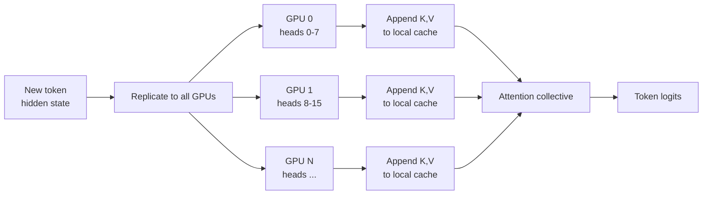

# KV Cache Sharding Isn’t a Distributed Hash Table
*What tensor-slice coordination means for transformer inference, and a builder pattern that keeps distributed shards consistent.*


**TL;DR**
- In LLM serving, the “KV cache” is a tensor of cached attention keys and values, not a generic Redis-style key-value store.
- Distributed inference shards that tensor across heads, sequence positions, or layers; coordinating those slices is what determines whether attention stays correct and memory stays balanced.
- A fluent factory/builder for cache layout lets teams encode the sharding strategy, eviction order, and block allocation in one place instead of scattering topology assumptions through the inference engine.

---

## Why does a plain KV store fail for transformer inference?

Because the two things share a name but almost nothing else. In classical systems engineering, a KV cache maps opaque keys to opaque blobs: a request hash to a JSON document, a session ID to a serialized object. The store does not care what is inside the value. In transformer inference, the KV cache is a dense tensor with structural meaning: for every layer, every attention head, and every token position in a sequence, we keep a key vector and a value vector. During autoregressive generation each new token appends one more K/V pair to that tensor, and the attention mechanism mixes those vectors across sequence positions under a causal mask.

That difference changes everything. A tensor has shape, device placement, and ordering constraints. If GPU 0 owns attention heads 0–7 and GPU 1 owns heads 8–15, a newly computed key vector for head 5 must land on GPU 0 and be inserted at exactly the right sequence index. A generic key-value store has no notion of heads, sequence positions, or tensor-parallel placement, so it cannot route the update. The result is either a routing miss or, worse, a silent shape mismatch that corrupts attention logits.

The “next-generation” part of KV cache architecture is therefore not a bigger hash table. It is a cache manager that understands the tensor layout and coordinates slices across devices.

---

## What does tensor-slice coordination actually coordinate?

Four things, all at once:

1. **Ownership.** Which device owns each slice of the KV tensor: a range of attention heads, a chunk of the sequence, or a set of layers.
2. **Append semantics.** When a new token is computed, how its K/V vectors are written into the existing cache on every relevant device without rewriting the entire history.
3. **Attention correctness.** How each device reads the slices it needs so the softmax over the full prefix produces the same result as a single-device run.
4. **Memory lifecycle.** How blocks are allocated, pre-empted, and reclaimed when batch composition or sequence length changes under memory pressure.

In decoder-only models, causal masking prevents attending to future tokens, but the full prefix still participates in attention. That means every GPU holding a KV slice must agree on which sequence positions are populated. If one shard thinks the cache ends at position *k* while another thinks it ends at *k+1*, the attention denominator will diverge across shards and the generated token will be wrong. Ownership and append semantics are not optimization details; they are correctness requirements.

---

## A builder pattern for the cache layout

A clean way to keep these requirements in one place is a fluent factory that builds a cache *configuration* object, separate from the runtime cache manager. The configuration captures the model shape, the parallelism strategy, and the memory policy. The coordinator consumes that configuration to translate logical `(layer, head, position)` coordinates into physical `(device, block, offset)` locations.

```python
from dataclasses import dataclass
from typing import Literal

@dataclass(frozen=True)
class KVCacheConfig:
    num_layers: int
    num_heads: int
    head_dim: int
    max_seq_len: int
    block_size: int           # positions per paging block
    parallelism: Literal["head", "sequence", "pipeline"]
    num_shards: int
    eviction: Literal["fifo", "lru"]

    def heads_per_shard(self) -> int:
        if self.parallelism != "head":
            raise ValueError("head-parallel assumption violated")
        assert self.num_heads % self.num_shards == 0
        return self.num_heads // self.num_shards


class KVCacheConfigBuilder:
    def __init__(self):
        self._values = {
            "num_layers": 80,
            "num_heads": 64,
            "head_dim": 128,
            "max_seq_len": 32768,
            "block_size": 16,
            "parallelism": "head",
            "num_shards": 8,
            "eviction": "lru",
        }

    def for_model(self, *, num_layers: int, num_heads: int, head_dim: int):
        self._values.update(
            {"num_layers": num_layers, "num_heads": num_heads, "head_dim": head_dim}
        )
        return self

    def sharded(self, *, parallelism: str, num_shards: int):
        self._values.update({"parallelism": parallelism, "num_shards": num_shards})
        return self

    def with_blocks(self, block_size: int, eviction: str):
        self._values.update({"block_size": block_size, "eviction": eviction})
        return self

    def build(self) -> KVCacheConfig:
        return KVCacheConfig(**self._values)


class KVCacheCoordinator:
    def __init__(self, config: KVCacheConfig):
        self.config = config

    def shard_for(self, layer: int, head: int, position: int) -> int:
        if self.config.parallelism == "head":
            return head // self.config.heads_per_shard()
        if self.config.parallelism == "sequence":
            return position // ((self.config.max_seq_len // self.config.num_shards) + 1)
        if self.config.parallelism == "pipeline":
            return layer // ((self.config.num_layers // self.config.num_shards) + 1)
        raise ValueError(f"unknown parallelism: {self.config.parallelism}")
```

The builder is deliberately boring. Boring is the point. By the time the runtime calls `shard_for`, the sharding rules have already been validated at construction time, so the coordinator does not need to re-derive policy in the hot path.

---

## How the slices stay consistent during decoding

The diagram below shows the flow for a single new token in a head-parallel deployment. The hidden state is replicated to all GPUs because every GPU needs the same token to append its local heads. After appending K/V vectors to their local cache slices, the GPUs participate in an attention collective that gathers or computes the full attention output across shards.



The key invariant is that the append happens *before* the attention collective. If a GPU participates in attention while another GPU is still writing its slice, the prefix length seen by each shard will differ. Warehouse systems call that eventual consistency; in a single decoding step it is a correctness bug. Good coordination therefore pairs the block allocator with a small barrier: all shards append, then all shards read.

---

## When is this worth the complexity?

Not every inference deployment needs a custom coordinator. Head parallelism works well for most batch-decoding scenarios: each GPU holds a disjoint set of heads, communication is limited to attention collectives, and cache management stays simple. Sequence parallelism becomes attractive when context length exceeds what fits comfortably on one device, but it trades memory savings for an all-to-all exchange of KV slices before attention. Pipeline parallelism adds the lowest communication overhead for throughput, yet it forces KV cache blocks to travel with the micro-batch as it crosses stage boundaries, which complicates pre-emption and recomputation.

The builder pattern is most useful when the serving stack needs to switch between these modes without rewriting the engine each time. A config object that encodes `parallelism`, `num_shards`, and `block_size` lets the same runtime run head-parallel on eight GPUs in one environment and sequence-parallel in another, with only the coordinator’s shard-routing logic changing.

---

## Topics

`kv-cache` · `distributed-inference` · `transformer-serving` · `tensor-parallelism` · `machine-learning-systems` · `attention` · `llm-inference`