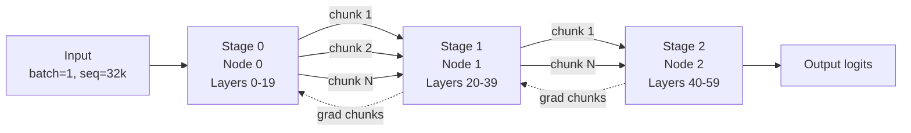

# Multi-Node Pipeline Parallelism for Ultra-Long Context Inference


Ultralong contexts expose memory and communication bottlenecks that a single node cannot hide; chunked tensor allocation turns monolithic inter-node activation transfers into a stream the network can actually absorb.

**TL;DR**
- For very long contexts, activation and KV-cache memory scale as `batch × sequence × hidden × layers`, quickly exceeding single-GPU capacity; pipeline parallelism splits layers across nodes so each GPU holds only a fraction of the model.
- Without chunking, a downstream pipeline stage waits for one huge activation tensor before it can start work, creating head-of-line blocking and memory spikes; chunked allocation streams activations and gradients in smaller pieces.
- Chunk size is a tuning knob: large enough to keep InfiniBand/NVLink full, small enough to limit staging memory and pipeline bubbles; verify with `ib_write_bw` and `nvidia-smi topo` first.

Large language models keep stretching context windows, and inference teams now routinely handle tens or hundreds of thousands of tokens per request. That scale changes the cost structure. The dominant constraint is no longer raw FLOPs for a single forward pass; it is the memory required to store model weights, the KV cache, and the intermediate activations while data moves through the network. Pipeline parallelism (PP) addresses the first problem by dividing layers across devices, but it introduces a new one: every hidden state must cross a network link between stages. How that traffic is structured determines whether the system scales or stalls.

## Why does a single node stop being enough for ultra-long context?

Memory demand grows multiplicatively with sequence length.

For a transformer layer running inference, a rough rule of thumb is that resident memory includes model weights, the KV cache, and the current layer’s activation buffer. Weights are fixed, but the KV cache scales as `2 × num_layers × batch × seq_len × hidden_dim × element_size` (one K and one V vector per token per layer), and activations scale as `batch × seq_len × hidden_dim × element_size` per stage. Double the sequence length and those buffers double. Double batch as well and they double again. A single GPU that comfortably runs a 70 B model at 4 096 tokens can run out of high-bandwidth memory at 64 000 or 128 000 tokens even if the workload is otherwise latency-tolerant.

Pipeline parallelism solves this by partitioning the model’s layers into stages and assigning each stage to a different node. Each GPU then stores only its slice of the weights, only its slice of the KV cache, and only the activations currently passing through its slice. The cost is communication: every forward activation and every backward gradient must travel across the network between consecutive stages.

## How pipeline parallelism spreads the load

In pipeline parallelism, the model is sliced vertically by layer, not horizontally by parameter matrix. Stage 0 might hold layers 0–19, stage 1 might hold layers 20–39, stage 2 might hold layers 40–59, and so on. During inference, an input batch enters stage 0; stage 0 computes the activations for its layers and sends them to stage 1; stage 1 computes and sends to stage 2. For training, the gradient flow reverses.

Because stages are independent, multiple microbatches can be in flight at once. This is the classic pipeline bubble trade-off: more microbatches improve stage utilization but increase the number of in-flight activations and the time the last batch waits for the pipeline to drain. Multi-node PP magnifies the effect of the bubble because the link between nodes—usually InfiniBand, sometimes NVLink if two GPUs share the same box—is slower and higher-latency than on-chip SRAM or intra-node HBM access.

## Why does one giant activation tensor hurt pipeline throughput?

A single stage can easily produce an activation tensor measured in hundreds of megabytes when the context is long. Sending that tensor as one `send/recv` or one all-gather operation creates three problems at once.

First, it inflates peak memory. The receiving stage must allocate a buffer large enough for the entire tensor before doing anything useful. Second, it serializes work: stage *i+1* sits idle until the last byte of stage *i*'s output arrives. Third, it makes the network momentarily busy with one long transfer rather than keeping a steady stream of work in flight, which reduces the opportunities to overlap communication and computation.

Chunked tensor allocation addresses all three issues by splitting the activation into smaller contiguous blocks that are sent, received, and consumed incrementally. The receiver needs only a chunk-sized staging buffer, and if the consumer can operate on partial sequences—common in transformer layers that process tokens position-wise or in fixed-size blocks—it can begin computation while later chunks are still in transit.

## Chunked tensor allocation in practice

The chunking pattern is conceptually simple: flatten the activation tensor, cut it into blocks, and send each block separately. The code below shows the idea with `torch.distributed` point-to-point calls. Real frameworks such as Megatron-LM, DeepSpeed, or vLLM hide this inside optimized communication kernels, but the same invariant applies: each chunk should be contiguous in memory and the receiver should know the full shape in advance.

```python
import torch
import torch.distributed as dist

def chunked_send(src: torch.Tensor, dst_rank: int, group,
                 max_chunk_bytes: int = 8 * 1024 * 1024):
    """Stream a large activation tensor to the next pipeline stage."""
    flat = src.view(-1).contiguous()
    total = flat.numel()
    chunk_size = max(1, max_chunk_bytes // flat.element_size())
    pos = 0
    while pos < total:
        end = min(pos + chunk_size, total)
        dist.send(flat[pos:end], dst=dst_rank, group=group)
        pos = end

def chunked_recv(dst: torch.Tensor, src_rank: int, group,
                 max_chunk_bytes: int = 8 * 1024 * 1024):
    """Reconstruct a large activation tensor from the previous stage."""
    flat = dst.view(-1).contiguous()
    total = flat.numel()
    chunk_size = max(1, max_chunk_bytes // flat.element_size())
    pos = 0
    while pos < total:
        end = min(pos + chunk_size, total)
        dist.recv(flat[pos:end], src=src_rank, group=group)
        pos = end

# Example dimensions: batch=1, seq=32768, hidden=8192, bf16 => ~512 MB
activations = torch.empty(1, 32768, 8192, dtype=torch.bfloat16, device="cuda")

group = dist.new_group([0, 1])
if dist.get_rank() == 0:
    activations.normal_()
    chunked_send(activations, dst_rank=1, group=group)
else:
    chunked_recv(activations, src_rank=0, group=group)
```

The 8 MiB chunk size in the example is illustrative. It divides the 512 MB tensor into roughly 64 chunks—small enough that the receiving stage never needs more than 8 MiB of staging memory at once, large enough that the per-message framing overhead does not dominate the transfer. Below, the diagram shows how the chunks flow through a three-stage pipeline.



## How large should each chunk be?

Chunk size is the main tuning knob after the cluster topology is fixed. The goal is to keep the network pipe full without increasing memory pressure or pipeline bubbles.

A useful heuristic is the bandwidth-delay product: bandwidth × round-trip latency gives the minimum in-flight data needed to saturate a link at full speed. For example, if a link delivers 10 GB/s and the node-to-node round-trip time is a few microseconds, the bandwidth-delay product is on the order of tens of kilobytes; any chunk much smaller than that leaves the pipe partially empty. In practice, pipeline frameworks use chunks from hundreds of kilobytes up to a few megabytes, because transformer layers often operate on fixed token blocks and because larger chunks amortize NIC doorbell and kernel-launch overhead.

The upper bound is memory. If a chunk is too large, the receiver’s staging buffer and the time spent blocked on the first chunk both grow. It also hurts latency: stage *i+1* cannot start until it has received a complete chunk. The right size is usually found by sweeping over powers of two on a representative workload and measuring both throughput and peak activation memory.

## Verifying cluster bandwidth before you tune

Do not guess the network behavior. Synthetic tests give the baseline that all later chunk-size math depends on.

Start with intra-node topology. `nvidia-smi topo -m` shows which GPUs are connected by NVLink and which fall back to PCIe. For multi-node links, run `ib_write_bw` between representative node pairs to measure unidirectional throughput, and `ib_write_lat` to measure round-trip latency. If you have GPU-direct RDMA enabled (for example, through `nv_peer_memory`), also run GPU-to-GPU bandwidth tests to confirm that activations move directly from device memory to the NIC without extra host copies.

Compare the measured numbers with the hardware spec. A 100 Gbps InfiniBand link yields roughly 12 GB/s raw; after packet headers and protocol overhead, teams typically see a somewhat lower effective throughput. If the measured value is far below expectation, the problem is usually a missing driver flag, MTU mismatch, or the CPU being forced into the copy path. Fix the network first; tuning chunk sizes is meaningless if the link is not performing close to spec.

## What chunked PP does not solve

Chunked allocation improves memory and network utilization, but it does not reduce the total amount of work. Each transformer layer still has to execute somewhere, and every pipeline hop adds wall-clock latency. That makes PP primarily a throughput-and-capacity technique, not a latency-optimization technique. For low-latency serving, teams usually combine PP with tensor parallelism inside the node, data parallelism across request batches, and sometimes expert parallelism for sparse models. Chunking is one piece of that larger design.

Pipeline parallelism also does not erase the pipeline bubble. More stages mean more bubbles per forward pass unless the microbatch count scales with them. For inference, where backward passes may not exist, the bubble is smaller; for training, schedule-aware schemes such as interleaved 1F1B or zero-bubble variants matter as much as chunk size.

## Topics

`pipeline-parallelism`, `distributed-inference`, `large-language-models`, `long-context`, `gpu-memory`, `infiniBand`, `nvlink`, `chunked-tensor-allocation`, `pytorch`, `distributed-systems`