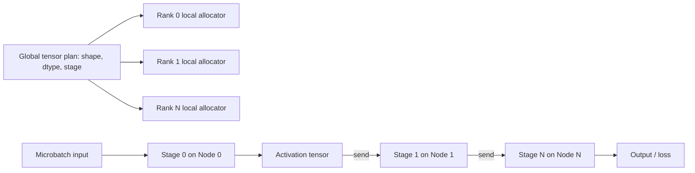

# Multi-Node Pipeline Parallelism: How to Reason About Inter-Node Tensor Allocation


**A practical pattern for scheduling activations and parameters across pipeline stages without oversubscribing memory.**

**TL;DR**
- Pipeline parallelism splits a model into stages across nodes, but the throughput gains disappear if the tensor allocation plan cannot keep up with the data flow.
- A hierarchical allocation pattern—global shape schedule + per-node local buffer pools—lets each node reserve only the tensors it needs for its current stage and microbatch.
- Pre-allocating communication buffers at the right granularity keeps cross-node copies bounded and makes peak memory predictable.

Multi-node pipeline parallelism maps different layers of a model onto different machines. Each machine runs one stage of the forward (and backward) pass, and microbatches stream through the pipeline to keep every GPU busy. The benefit is clear: a model that does not fit on one accelerator can still serve or train at high throughput. The cost is that activation tensors, gradients, and sometimes parameters must now move across the network. If those tensors are allocated reactively or duplicated unnecessarily, the pipeline stalls before the hardware runs out of compute.

This post looks at the specific architectural problem of inter-node tensor allocation and walks through a distributed allocation pattern that keeps memory bounded and communication explicit.

## Why does naive tensor allocation fail at scale?

Because it treats remote memory and remote communication as afterthoughts.

In a single-node workload, the allocator can grow buffers on demand and reshuffle them within one address space. Across nodes, that assumption breaks. If every stage allocates a worst-case full-batch activation tensor “just in case,” the aggregate GPU memory footprint scales with the number of nodes rather than the amount of work in flight. If nodes allocate receive buffers on demand, the allocation itself blocks the next stage and creates bubble in the pipeline. And if stages disagree on tensor shape, dtype, or layout, the runtime must insert extra copies or communication rounds—precisely the overhead that pipeline parallelism is supposed to amortize.

The symptom is usually the same: throughput flattens or even drops as nodes are added, while GPU utilization stays low because the pipeline is waiting on memory or network bookkeeping rather than doing math.

## What does a distributed allocation pattern look like?

A global scheduler decides *what shape each tensor has at each stage*, and each node allocates only the local buffers that match its assigned slice of the pipeline.

The pattern has three layers:

1. **Global stage plan** — one logical map from `(stage, microbatch)` to tensor shape, dtype, and device. This is the source of truth.
2. **Per-node memory budget** — each node receives the slices it owns and pre-allocates activations, parameters, and communication buffers accordingly.
3. **Communication primitives** — activations move between pre-allocated buffers; no dynamic allocation happens on the critical path.

This separation is what makes the system scalable. The scheduler can reason about the whole pipeline (sequence length, batch splits, pipeline depth), while each node only has to solve a much smaller local allocation problem.



## Implementation pattern

The following Python sketch uses PyTorch distributed send/recv to show the core idea: each rank allocates only the local tensors described by its stage plan, then passes the activation to the next rank in a pre-allocated receive buffer. The values are clearly illustrative.

```python
import torch
import torch.distributed as dist

dist.init_process_group("nccl")
WORLD_SIZE = dist.get_world_size()
RANK = dist.get_rank()

torch.cuda.set_device(RANK)

HIDDEN = 1024
MICROBATCH = 4

def local_plan(rank, world_size):
    if world_size != 2:
        raise ValueError("This example assumes a two-stage pipeline.")

    if rank == 0:
        # Stage 0 owns the first layer weights and the input activation buffer.
        return {
            "stage": 0,
            "activations": (MICROBATCH, HIDDEN),
            "weights": (HIDDEN, HIDDEN),
        }
    else:
        # Stage 1 owns the second layer weights and a receive buffer.
        return {
            "stage": 1,
            "activations": (MICROBATCH, HIDDEN),
            "weights": (HIDDEN, HIDDEN),
        }

plan = local_plan(RANK, WORLD_SIZE)

# Allocated once, reused across microbatches.
 act = torch.empty(plan["activations"], dtype=torch.float16, device="cuda")
W = torch.empty(plan["weights"], dtype=torch.float16, device="cuda")

# Forward pass with explicit inter-node handoff.
if RANK == 0:
    act.normal_(0, 0.02)          # stand-in for a real input microbatch
    h = torch.matmul(act, W)      # stage 0 compute
    dist.send(h, dst=1)           # hand activation to stage 1
elif RANK == 1:
    dist.recv(act, src=0)         # write directly into pre-allocated buffer
    out = torch.matmul(act, W)    # stage 1 compute
    print(f"Rank {RANK} produced activation shape {out.shape}")
```

A few things worth noting:

- **No global tensor is ever materialized.** Rank 0 never allocates the stage 1 weights, and rank 1 never holds the stage 0 weights.
- **The receive shape is known in advance.** `dist.recv` writes straight into `act`, so there is no intermediate copy or resizing on the critical path.
- **Buffers are reusable.** In a real training loop, the same `act` buffer would be used for every microbatch passing through that stage; only the number of in-flight microbatches changes the pool size.

## Operational considerations

Getting the allocation pattern right is only half the battle. A few practical details usually determine whether it stays efficient:

**Bound memory by pipeline depth, not batch size.** A common mistake is to allocate a buffer for every microbatch in the epoch. The right pool size is the number of microbatches that can be in flight at once, which depends on the pipeline schedule (e.g., GPipe, PipeDream, or a 1F1B variant) and the activation checkpointing strategy.

**Keep shapes static.** Dynamic shapes force reallocation and force the communication layer to exchange metadata before sending data. Most production systems pad or bucket inputs so that every microbatch has one of a small set of known shapes.

**Account for backward-flowing tensors.** Activations travel forward, but gradients travel backward. The stage plan must include both directions so that receive buffers exist on both sides of every link. Gradient reduce-scatter or all-reduce operations also need dedicated buffers if they are not fused into the peer-to-peer transfers.

**Respect device affinity.** Allocating a tensor on CPU and then moving it to GPU for each communication round is expensive. The plan should pin allocations directly on the target device and reuse device-side communication buffers.

## Takeaways

Multi-node pipeline parallelism is not just a partitioning problem; it is a scheduling and memory-management problem. The split only works if every node knows exactly which tensors it owns, what shape they are, and where they go next.

A hierarchical allocation strategy—global shape schedule, per-node local pools, pre-allocated communication buffers—keeps memory predictable, avoids on-demand allocation stalls, and keeps the data moving. The exact same idea shows up in production training frameworks, but the core pattern is small enough to reason about directly: plan globally, allocate locally, communicate into already-reserved memory.

*This post was written with the assistance of an AI language model.*

## Topics

Multi-node pipeline parallelism · distributed tensor allocation · PyTorch distributed · GPU memory management · model parallelism · high-throughput inference · distributed systems · machine learning engineering