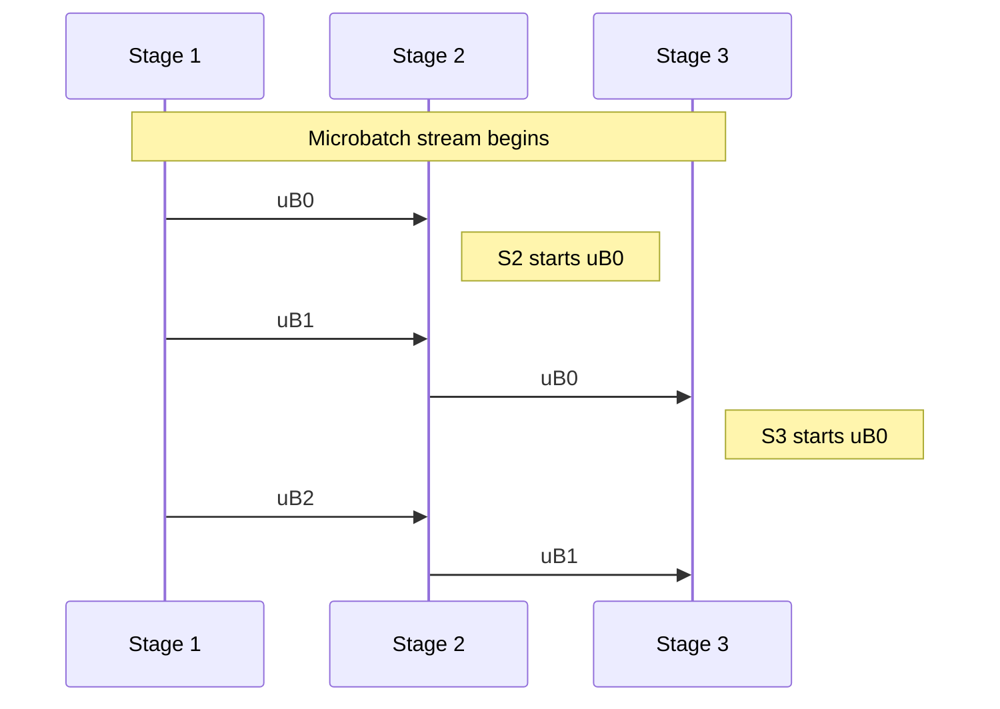

# Pipeline Parallelism at Scale: Separating Stages, Not Just Tasks
*A practical look at multi-node pipeline stages, microbatching, and the async coordination patterns that keep them busy.*


**TL;DR**
- Pipeline parallelism splits a *single* workload into sequential stages running on different nodes; it is not the same as replicating the whole workload (task parallelism) or splitting one batch across workers (data parallelism).
- Asynchronous sequence batching keeps the pipeline full by streaming small microbatches between stages rather than waiting for one full batch to finish before starting the next.
- Real multi-node pipeline parallelism needs a network transport between stages, bounded buffers for backpressure, and enough in-flight microbatches to cover the slowest stage.

## What pipeline parallelism actually is

In a long-running processing pipeline—transforming raw events into features, or running an LLM’s forward pass across many layers—the work usually has natural boundaries. Some stages are CPU-bound, others are memory-bound, and a few may wait on external state. Pipeline parallelism (PP) assigns each stage to a different set of nodes. Stage *n* hands a partially processed unit of work to stage *n+1* and immediately starts the next unit.

Task parallelism (TP) is different: it runs independent copies of the *entire* pipeline on separate nodes. Data parallelism is different too: it splits one batch into shards and runs the *same* stage on many workers. Teams often combine PP with TP or data parallelism, but the building blocks need to be understood separately first.

## When does pipeline parallelism win over task parallelism?

Pipeline parallelism wins when a single job is too large for one node and its stages have uneven resource profiles. If one stage needs a GPU and another needs only a CPU, replicating the whole pipeline wastes GPUs. Splitting the stages lets each stage scale to the hardware it actually needs.

The trade-off is latency. In pure task parallelism, a unit of work flows through one full pipeline on one node; adding more nodes increases throughput without inflating per-unit latency much. In pure pipeline parallelism, a unit must traverse every stage sequentially across the network, so end-to-end latency grows with the number of stages. The throughput gain comes from occupancy: while one microbatch is finishing at the last stage, other microbatches are busy at earlier stages.

A common pattern is therefore *hybrid* parallelism: split the model or pipeline into a few large stages (PP), then replicate the heaviest stage across several workers (data/TP). The right split depends on how much data moves across each cut point and how fast the interconnect is.

## Why does microbatching matter more than larger batches?

In the simplest pipeline, every stage must wait for the previous stage to finish an entire batch before it can start. That creates *pipeline bubbles*: idle time at every downstream stage while the upstream stage works. Asynchronous sequence batching reduces those bubbles by dividing the sequence into many small *microbatches* and letting them flow independently.



Even though each microbatch still passes through every stage in order, the stages overlap. If stage 2 is four times slower than stage 1, a full-batch pipeline would leave stage 2 idle while stage 1 finishes; with microbatching, stage 2 starts as soon as its first unit arrives.

## Why naive `asyncio.gather` is not multi-node pipeline parallelism

The most common misconception is that launching many `asyncio.create_task` calls in Python equals pipeline parallelism. It does not. Gathering a list of independent tasks is **single-node async concurrency**—useful, but closer to cooperative multitasking or data parallelism than to distributed PP.

A faithful single-process *model* of multi-node PP uses queues between stages, so each stage pulls the next microbatch as soon as it is ready:

```python
import asyncio

async def stage_worker(name, in_q, out_q, process_time):
    """Pull microbatches from in_q, process, push to out_q."""
    while True:
        microbatch = await in_q.get()
        if microbatch is None:          # sentinel: drain and propagate
            if out_q is not None:
                await out_q.put(None)
            break

        # Real systems do compute/IO here; we sleep to simulate uneven stages.
        await asyncio.sleep(process_time)
        await out_q.put((name, microbatch))


async def source(out_q, data):
    for microbatch in data:
        await out_q.put(microbatch)
    await out_q.put(None)              # tell stage 0 to shut down


async def sink(in_q):
    out = []
    while True:
        payload = await in_q.get()
        if payload is None:
            break
        out.append(payload)
    return out


async def main():
    # Five stages, each with different latency in seconds.
    stage_latencies = [0.01, 0.04, 0.02, 0.03, 0.01]

    # Bounded queues between stages simulate backpressure from finite buffers.
    queues = [asyncio.Queue(maxsize=2) for _ in range(len(stage_latencies) + 1)]

    # Sequence of 16 microbatches, two items each.
    microbatches = [[j for j in range(i, i + 2)] for i in range(0, 32, 2)]

    tasks = [asyncio.create_task(source(queues[0], microbatches))]
    for idx, latency in enumerate(stage_latencies):
        tasks.append(
            asyncio.create_task(
                stage_worker(idx, queues[idx], queues[idx + 1], latency)
            )
        )
    tasks.append(asyncio.create_task(sink(queues[-1])))

    results = await asyncio.gather(*tasks)
    return results[-1]


if __name__ == "__main__":
    processed = asyncio.run(main())
    print(f"processed {len(processed)} microbatches")
```

This example demonstrates the *shape* of a pipeline: bounded queues, per-stage workers, and a sentinel to drain. In production, each `Queue` becomes a network channel—gRPC, ZeroMQ, NATS, or RDMA—and each `stage_worker` runs on its own node or pod.

## How do you keep the pipeline full?

A pipeline is only as fast as its slowest stage, but a slow stage does not have to stall everyone else if there is enough work in flight. The rule of thumb is simple: keep at least enough microbatches queued to cover the latency of the slowest stage plus normal tail latency.

Backpressure prevents the faster stages from exhausting memory. Bounded queues are one form of backpressure; credit-based flow control is another. Without it, a fast producer at stage 1 could dump thousands of microbatches on a slow stage 2 and crash the node.

Ordering is another concern. If microbatches can leave a stage out of order—because one shard of data parallelism finished earlier than another—you need a reorder buffer before the next PP handoff. Data-parallel microbatches inside a stage can be unordered; pipeline handoffs between stages usually must be ordered.

Finally, failure handling changes dramatically across nodes. A single-process `asyncio` task can be restarted by the same event loop. A multi-node stage failure requires checkpointing, in-flight microbatch retries, and deterministic split points so that a replacement node can resume from the last committed output.

## What hardware constraints should shape the split?

The choice between more task parallelism and more pipeline parallelism comes down to interconnect and message size.

| Dimension | Task / Data Parallelism | Pipeline Parallelism |
|---|---|---|
| What is replicated | Same stage or full job | Different stages |
| Typical communication | All-reduce on large tensors | Point-to-point microbatch handoffs |
| Interconnect pressure | High bandwidth, low latency | Moderate bandwidth, tolerates higher latency |
| Latency | Lower per-unit | Higher per-unit, but higher occupancy |
| Scalability limit | Amdahl’s law, collective cost | Pipeline bubble and stage imbalance |

If your interconnect is fast and symmetric— InfiniBand in an HPC cluster, or a tightly coupled GPU fabric—data and task parallelism are attractive. If your stages differ in resource needs and the network between them is more relaxed, pipeline parallelism is often the cheaper way to scale.

## The bottom line

Multi-node pipeline parallelism is not a syntax change in an async framework. It is an architectural decision to decompose a job into communicating stages, each running on its own node, with enough in-flight microbatches to hide latency and enough backpressure to stay stable. Asynchronous sequence batching is the technique that makes that occupancy possible. Use it with a real transport, bounded buffers, and a clear-eyed view of the latency you are trading for throughput.

## Topics

Pipeline Parallelism · Distributed Systems · Data Engineering · Asyncio · Scalability · Microbatching