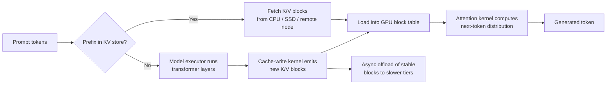

# Rethinking KV Cache Placement for Distributed LLM Serving


**How tiered, prefix-aware KV caching changes the memory–latency trade-off in high-throughput inference.**

**TL;DR**
- In long-context or high-batch inference, the KV cache often dominates memory use; squeezing it all into GPU HBM limits batch size and inflates cost.
- Tiering the KV cache across GPU, host DRAM, NVMe, and remote nodes—similar to the architecture LMCache explores—lets the attention kernel reuse historical K/V blocks without keeping every token resident on the accelerator.
- The win is not automatic: it depends on prefix reuse, interconnect/storage bandwidth, and a clean logical-to-physical block mapping.

## Why does KV-cache locality stop being a free lunch?

Because the cache grows with every generated token, and keeping the entire working set on the GPU eventually collides with the hard ceiling of HBM.

In a typical transformer serving stack, the **model executor** runs the transformer layers, the **cache-write kernel** stores freshly computed key and value tensors into a block table, and the **attention kernel** later reads those historical K/V pairs through a logical-to-physical mapping. That mapping is straightforward when everything fits in device memory. As soon as prompts stretch to tens or hundreds of thousands of tokens, or as batches compound the per-sequence footprint, the accelerator spends less time computing and more time either (1) evicting useful blocks, (2) recomputing K/V pairs from earlier tokens, or (3) waiting for memory.

Teams running long-context inference often see this show up as a step change rather than a gentle slope: a configuration that comfortably serves 4k-token contexts becomes memory-bound near 64k tokens, and batch size has to shrink even though there is still compute headroom. The problem is not the model weights; it is the per-token activation state that attention must keep addressable.

A natural response is to share K/V state across requests, because many workloads reuse prefixes: system prompts, tool definitions, retrieved documents, or multi-turn conversation histories. If those prefix blocks could live outside HBM and be fetched only when needed, the GPU could dedicate more capacity to the unique suffixes that actually change per request.

## How does a tiered KV cache change the data path?

The core idea is to decouple KV-cache storage from the model executor. Instead of a single monolithic GPU-resident cache, the system treats K/V blocks as a tiered object store that the attention kernel can query by logical block address.



The flow differs from a conventional vLLM-style setup in one important way: a miss in the GPU block table does not always mean “recompute from scratch.” It can mean “resolve from a host-side or remote cache,” the same way a CPU cache hierarchy resolves a miss from L2 instead of recomputing the value.

This is the architecture pattern that LMCache implements alongside an inference engine. The executor still produces K/V tensors for new tokens; a connector moves those tensors between GPU and host; and a storage backend keeps evicted or prefix blocks accessible on DRAM, NVMe, or across the network. Attention then reads from the logical mapping, which may now point to blocks that are local, remote, or temporarily swapped in. System-level evaluations—such as those pairing high-bandwidth NVMe devices like Samsung’s PM1753 family with the KV-cache path—explore how much of the working set can shift from scarce HBM to cheaper, denser tiers before transfer latency dominates.

## What does the lookup-and-update path look like in code?

The production implementations are substantial, but a minimal sketch captures the pattern: blocks are hashed by their content and layer, stored in a hot GPU pool, and spilled to a slower tier under pressure. The cache write path and attention read path both operate on block addresses, not raw token positions.

```python
import torch
from collections import OrderedDict

BLOCK_SIZE = 16          # tokens per logical block
NUM_LAYERS = 32
NUM_HEADS = 8
HEAD_DIM = 128
DTYPE = torch.bfloat16

# shape for one K/V block: (num_layers, 2, num_heads, block_size, head_dim)
BLOCK_SHAPE = (NUM_LAYERS, 2, NUM_HEADS, BLOCK_SIZE, HEAD_DIM)


def block_hash(layer_idx: int, slot_idx: int, token_ids: tuple) -> int:
    """A real system hashes the content, position range, and layer."""
    return hash((layer_idx, slot_idx, token_ids))


class TieredKVStore:
    def __init__(self, max_gpu_blocks: int = 2_000):
        self.max_gpu_blocks = max_gpu_blocks
        # GPU-resident LRU pool: block_hash -> (k_block, v_block)
        self.gpu = OrderedDict()
        # Slower tier (host memory in this sketch; could be NVMe or remote node)
        self.host = {}

    def write(self, layer_idx: int, slot_idx: int,
              token_ids: tuple, k_block: torch.Tensor, v_block: torch.Tensor):
        key = block_hash(layer_idx, slot_idx, token_ids)
        self.gpu[key] = (k_block, v_block)
        self.gpu.move_to_end(key)

        # Evict to host memory if we exceed the GPU budget.
        while len(self.gpu) > self.max_gpu_blocks:
            evicted_key, (k, v) = self.gpu.popitem(last=False)
            self.host[evicted_key] = (k.cpu(), v.cpu())

    def read(self, layer_idx: int, slot_idx: int,
             token_ids: tuple) -> tuple[torch.Tensor, torch.Tensor] | None:
        key = block_hash(layer_idx, slot_idx, token_ids)
        if key in self.gpu:
            self.gpu.move_to_end(key)
            return self.gpu[key]

        if key in self.host:
            k, v = self.host.pop(key)   # promote back to GPU
            k, v = k.cuda(), v.cuda()
            self.gpu[key] = (k, v)
            return k, v

        return None   # cache miss; caller must recompute or fetch from remote


# --- illustration: a prefix is reused by two requests ---
store = TieredKVStore()
prefix = tuple(range(64))      # 64 shared prompt tokens

# Write the first 4 blocks (64 tokens / 16 tokens per block)
for slot in range(4):
    k = torch.randn(BLOCK_SHAPE, dtype=DTYPE, device="cuda")
    v = torch.randn(BLOCK_SHAPE, dtype=DTYPE, device="cuda")
    store.write(layer_idx=0, slot_idx=slot, token_ids=prefix, k_block=k, v_block=v)

# A later request asks for an already-materialized block.
reused_kv = store.read(layer_idx=0, slot_idx=2, token_ids=prefix)
```

The important detail is the separation of concerns. The transformer layer still does exactly what it did before; the cache layer owns placement, eviction, and lookup. That separation is what lets operators tune block size, eviction policy, and offload target without touching the model code.

## When is this pattern not the right optimization?

It is not a universal win.

If context lengths are short and prefixes are rarely shared, the overhead of hashing, transferring, and rematerializing blocks can exceed the cost of simply recomputing attention inside a compact GPU cache. The tiered approach also adds failure modes: a slow remote KV node can stall the attention kernel if the prefetch window is too small, and inconsistent block tables across replicas can lead to silent correctness issues. Implementations therefore rely on careful versioning of prefix hashes and deterministic tokenization.

Teams see the clearest returns when two conditions hold: (1) a substantial fraction of requests reuse long prefixes, and (2) the offload tier can deliver blocks faster than the time it would take the model to recompute them. In other cases, the simpler path—batch more aggressively and keep the cache local—often wins.

## Where does this leave the serving stack?

KV-cache architecture is becoming a systems problem as much as a modeling problem. The attention mechanism itself has not changed; what has changed is the need to keep its state accessible across a hierarchy of memory and even across nodes. Patterns like LMCache do not replace the model executor or attention kernel—they insert a placement layer between them, giving operators control over how K/V blocks map to hardware.

The next round of gains will come from tighter integration: better prefetch schedules that overlap block migration with generation, smarter eviction policies that understand which prefixes are likely to be reused, and storage backends that match the bandwidth profile of the accelerator interconnect. None of that shows up in a model card, but for high-throughput serving it is often the difference between a deployment that fits and one that does not.

## Topics

`Large Language Models` · `LLM Inference` · `KV Cache` · `Distributed Systems` · `vLLM` · `Memory Tiering` · `LMCache` · `High-Throughput Serving` · `Attention Mechanisms` · `Model Serving Infrastructure`