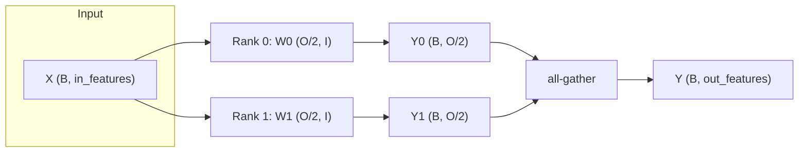

# Tensor Slicing in Distributed Inference: How to Coordinate Model Parallelism Without the Bottlenecks

*A practical look at splitting layers across devices, and why the split axis matters more than the split itself.*

**TL;DR**
- Distributed inference only scales if tensor slicing is aligned with the layer's communication pattern; slicing the wrong dimension turns a local computation into a cross-device shuffle.
- A clean pattern is row/column-wise weight sharding: each device computes a partial result, then a single collective (all-gather or all-reduce) reconstructs the full activation.
- The technique is not automatically faster—if the model fits on one GPU, data parallelism is usually simpler and lower-overhead than model parallelism.

## The problem with "just split it"

Modern serving stacks often hit a memory wall before they hit a throughput wall. A dense transformer block can easily exceed GPU memory at long sequence lengths, and even when it fits, a batch of large tensors can push the inferencing pipeline out of cache. Distributed inference attacks this by spreading work across multiple devices, but spreading is the easy part. The hard part is *tensor slicing coordination*—deciding which dimension of each tensor lives where, and how the pieces get stitched back together.

This pattern shows up whenever a single layer is too large for one device. Two common cases are a fully-connected layer whose weight matrix does not fit in memory, and a wide embedding table that has to be partitioned across ranks. In both cases, the model is split rather than the data batch. That is model parallelism, and it is fundamentally different from the more familiar data-parallel pattern where every rank holds a full copy of the model.

## Why does tensor slicing coordination matter?

Because an innocent choice of split axis can silently reshape the cost model of an inference pipeline from "compute-bound" to "bandwidth-bound and possibly incorrect." Consider a dense linear layer:

```
Y = X @ W^T + b
```

Assume `W` has shape `[out_features, in_features]`. If two ranks each hold half of the output neurons, the weight matrix is sliced along the first dimension:

- Rank 0 holds `W_0` with shape `[out_features/2, in_features]`
- Rank 1 holds `W_1` with shape `[out_features/2, in_features]`

Both ranks receive the same input `X` and compute partial outputs `Y_0` and `Y_1`. The final activation is obtained by concatenating the partial outputs along the feature dimension. This is an **all-gather** pattern, and it is communication-optimal for this particular split.

Now imagine the same weight matrix had been sliced along the input dimension instead:

- Rank 0 holds `W_0` with shape `[out_features, in_features/2]`
- Rank 1 holds `W_1` with shape `[out_features, in_features/2]`

Each rank only sees half of the input features. To compute `Y = X @ W^T`, the ranks must first synchronize a partial matrix-vector product and then **sum the partial results with an all-reduce**. The output volume is smaller than in the all-gather case, but the communication pattern is different and the resulting gradients, if you were training, would need a matching reduce-scatter.

Teams running distributed inference often see latency jump when they mix these two styles inside the same layer stack without keeping track of which axis is sharded. The result can be an unnecessary all-reduce followed by an unnecessary all-gather, or worse, silently transposed activations that downstream layers cannot consume.

## What does a correct slicing pattern look like?

The split is chosen so that each device computes a local shard and only one collective is needed to reconstruct the global tensor. For a layer sliced along the output dimension, that collective is an all-gather.

The flow below shows a batch `X` being broadcast to both ranks, each rank multiplying by its weight shard, and the partial outputs being gathered.



This is column-style splitting if you think of `W^T`, or row-style splitting if you think of `W`. The naming matters less than the invariant: **one axis is sharded, the other is duplicated, one collective resolves the missing axis.**

## Illustrative implementation: sharded linear layer

The code below is an intentionally simplified sketch, not a full serving engine. It shows how to initialize a two-rank process group, shard a linear layer along the output dimension, run the local forward pass, and gather the result.

```python
import os
import torch
import torch.distributed as dist


def init_distributed():
    rank = int(os.environ["RANK"])
    local_rank = int(os.environ["LOCAL_RANK"])
    world_size = int(os.environ["WORLD_SIZE"])

    device = torch.device(f"cuda:{local_rank}" if torch.cuda.is_available() else "cpu")
    dist.init_process_group("nccl", rank=rank, world_size=world_size)
    return rank, world_size, device


class ShardedLinear:
    """
    A linear layer sharded along the output-feature dimension.
    Each rank owns weight[out_start:out_end, :].
    """
    def __init__(self, in_features: int, out_features: int, device):
        self.device = device
        self.world_size = dist.get_world_size()
        self.rank = dist.get_rank()

        if out_features % self.world_size != 0:
            raise ValueError("out_features must be divisible by world_size")

        shard_size = out_features // self.world_size
        self.out_start = self.rank * shard_size
        self.out_end = self.out_start + shard_size

        # Realistic but illustrative dimensions
        self.weight = torch.randn(shard_size, in_features, device=device) * 0.02
        self.bias = torch.zeros(shard_size, device=device)

    def forward(self, x: torch.Tensor) -> torch.Tensor:
        # x has shape (B, in_features) and is identical on every rank
        local_out = torch.matmul(x, self.weight.t()) + self.bias
        # local_out shape: (B, out_features / world_size)

        # Allocate a receive buffer on every rank
        output_list = [
            torch.empty_like(local_out) for _ in range(self.world_size)
        ]

        dist.all_gather(output_list, local_out)

        # Reassemble along the feature dimension
        return torch.cat(output_list, dim=-1)

    def __call__(self, x: torch.Tensor) -> torch.Tensor:
        return self.forward(x)


if __name__ == "__main__":
    rank, world_size, device = init_distributed()

    batch, in_features, out_features = 32, 768, 4096
    layer = ShardedLinear(in_features, out_features, device)

    x = torch.randn(batch, in_features, device=device)
    y = layer(x)
    assert y.shape == (batch, out_features), y.shape

    if rank == 0:
        print(f"rank {rank}: output shape {y.shape}")

    dist.destroy_process_group()
```

The script would be launched with:

```bash
torchrun --nproc_per_node=2 sharded_linear.py
```

A few things worth noticing. The input `x` is not split; it is duplicated on every rank. That is the defining cost of this form of model parallelism. You save memory on the weight matrix and the local output activation, but you do not save memory on the input activation. For very wide layers or very large weights, that trade-off is favorable. For small layers, it is not.

## Where does this pattern fall short?

Model parallelism is not a free performance win. If the whole model fits comfortably on a single GPU, a data-parallel setup—where each rank processes a different micro-batch and the weights stay replicated—usually has lower communication overhead and simpler failure handling. Tensor slicing coordination pays off in three specific situations:

- **Memory pressure on weights:** the model or a particular layer cannot fit in one device's memory.
- **Sequential bottlenecks:** pipeline parallelism shards layers across stages, and within each stage you still need tensor slicing to keep the stage's memory footprint under control.
- **Long-context inference:** the KV cache itself becomes a large tensor that can be sharded by sequence position or by head.

Outside those cases, adding collectives often increases latency rather than decreasing it. Teams also underestimate the cost of the backward pass if they later retrain or fine-tune. A layer that required an all-gather in the forward pass may need a reduce-scatter in the backward pass, and the gradient buffers can double the memory needed for activations.

## Putting it into practice

If model parallelism is the right tool, the implementation usually starts with three decisions:

1. **Choose the sharded axis per layer.** Prefer sharding the output dimension of linear layers because it maps cleanly to an all-gather and leaves the input gradient local.
2. **Match collectives to splits.** Track whether each tensor is sharded, duplicated, or partially reduced. Mismatched collectives are the most common source of subtle shape errors.
3. **Overlap communication with compute.** In production frameworks, the gather of the next layer can often be pipelined with the compute of the current layer rather than blocking the forward pass.

Finally, profile before optimizing. The bottleneck in distributed inference is frequently not the matrix multiplication itself but the point-to-point or collective communication between devices. A layer that looks expensive in isolation can become cheap if the sharding avoids a cross-node transfer somewhere else.

## Conclusion

Tensor slicing coordination is the difference between distributed inference that scales and distributed inference that merely runs on more hardware. The key idea is simple—shard one dimension, duplicate the other, and finish with a single collective—but the consequences of getting the axis wrong ripple through latency, memory, and correctness. For layers that cannot fit on one device, output-dimension sharding with an all-gather is a clean, explainable pattern. For everything else, data parallelism is usually the safer starting point.

## Topics

`distributed-systems` `machine-learning-inference` `model-parallelism` `pytorch` `tensor-slicing` `gpu-inference` `system-design` `performance-engineering`