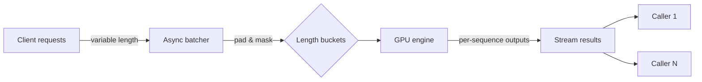

# Asynchronous Sequence Batching: A Practical Pattern for Distributed LLM Inference


**Group variable-length sequences dynamically, dispatch them asynchronously, and keep GPU clusters fed without hard synchronous barriers.**

**TL;DR**
- LLM serving workloads have bursty arrivals, variable sequence lengths, and autoregressive token generation; a fixed synchronous batch dump leaves GPUs idle when requests wait for a full batch and wastes cycles when one long sequence dominates.
- Asynchronous sequence batching decouples request arrival from execution: a scheduler accumulates compatible sequences, forms a padded batch up to a capacity limit or timeout, and returns results back to each caller as soon as its slice finishes.
- The pattern trades slight dispatch latency for higher throughput and steadier GPU utilization, especially when paired with length bucketing, per-sequence attention masking, and backpressure.

## Why Does Naive Batching Waste GPU Cycles?

LLMs are batch-friendly in theory. Matrix multiplications grow more efficient with larger tensors, and a single forward pass for 16 or 32 sequences amortizes Python overhead, CUDA kernel launch latency, and weight-loading bandwidth across the whole group. In practice, however, serving traffic rarely lines up with a clean batching model.

Requests arrive at irregular intervals. Prompt lengths vary from a few dozen tokens to several thousand. Autoregressive generation means each request also emits a variable number of output tokens. If a service waits for a fixed batch size before launching any work, short or bursty traffic stalls behind the last straggler. If it launches every request as it arrives, the GPU processes many small matrix operations and spends more time in dispatch overhead than in useful computation.

The classic fixed-size synchronous batcher solves the throughput side at the cost of tail latency. A sequence that happens to be shorter than the maximum still sits until the batch fills. A sequence that happens to be longer than the bucket gets truncated or routed elsewhere. Meanwhile, the GPU is busy, but a meaningful fraction of its work is padding, bookkeeping, and barrier synchronization.

Teams running distributed inference often see this tension show up as an oscillation: p99 latency spikes when the batcher holds requests too long, and throughput drops when it releases half-empty batches too early.

## The Core Idea: Separate Request Arrival from Execution

Asynchronous sequence batching treats request arrival and GPU execution as two independent loops connected by a queue.

Requests arrive over the network and are placed in a queue. A scheduler watches that queue and forms a batch under two conditions: either enough compatible sequences have accumulated, or a short timeout has expired. The batch is padded and masked so the model can process all sequences in one forward pass, even though they have different lengths. The forward pass runs on the GPU. As each sequence completes its own number of generation steps, its results are returned to the original caller without waiting for the entire batch to finish.

This requires three mechanisms that synchronous batching can ignore:

1. **Length bucketing.** Sequences are grouped by length range so padding does not dominate the tensor. A request of 60 tokens and a request of 2,000 tokens should not share the same batch slot.
2. **Per-sequence attention masking.** The model must compute attention only over real tokens for each sequence, ignoring the padded positions.
3. **Dynamic, per-sequence completion.** In generation workloads, each sequence stops when its own end-of-sequence token appears. The scheduler must return results individually rather than at the batch boundary.

Below is a high-level view of the data flow. Requests enter from many clients; the batcher groups compatible sequences; the engine executes one masked forward pass; and results stream back as each sequence completes.



## How Do Request Latencies Stay Predictable Without Synchronous Barriers?

The key is that the service exposes asynchronous, caller-bound futures rather than blocking until a global batch releases.

Consider a simplified Python batcher. It owns an `asyncio` queue and runs a background loop that drains the queue whenever a batch is full or a small timeout fires. Callers submit requests and receive coroutine futures. The GPU worker consumes shaped batches and resolves one future per sequence.

```python
import asyncio
from dataclasses import dataclass
from typing import List, Optional
import numpy as np

@dataclass
class Request:
    sequence: np.ndarray          # 1-D int array of token ids
    max_new_tokens: int
    future: asyncio.Future        # result delivered here
    request_id: int


class AsyncSequenceBatcher:
    def __init__(
        self,
        engine,                    # callable: padded batch -> list of outputs
        max_batch_size: int = 8,
        max_wait_ms: float = 5.0,
        max_sequence_length: int = 2048,
    ):
        self.engine = engine
        self.max_batch_size = max_batch_size
        self.max_wait_s = max_wait_ms / 1000.0
        self.max_sequence_length = max_sequence_length
        self.queue: asyncio.Queue[Request] = asyncio.Queue()
        self._task = asyncio.create_task(self._scheduler_loop())

    async def submit(
        self,
        sequence: np.ndarray,
        max_new_tokens: int,
    ) -> np.ndarray:
        future = asyncio.get_event_loop().create_future()
        req = Request(sequence, max_new_tokens, future, id=hash(sequence.tobytes()))
        await self.queue.put(req)
        return await future

    def _bucket_length(self, length: int) -> int:
        # Buckets of 256-token buckets keep padding bounded.
        bucket = ((length - 1) // 256 + 1) * 256
        return min(bucket, self.max_sequence_length)

    async def _scheduler_loop(self):
        while True:
            batch: List[Request] = []
            first_arrival = asyncio.get_event_loop().time()

            while len(batch) < self.max_batch_size:
                elapsed = asyncio.get_event_loop().time() - first_arrival
                timeout = max(0.0, self.max_wait_s - elapsed)
                try:
                    req = await asyncio.wait_for(self.queue.get(), timeout=timeout)
                except asyncio.TimeoutError:
                    break
                if req.sequence.shape[0] > self.max_sequence_length:
                    req.future.set_exception(ValueError("sequence too long"))
                    continue
                batch.append(req)

            if batch:
                await self._execute_batch(batch)

    async def _execute_batch(self, batch: List[Request]):
        # Pad to the longest sequence in the bucket.
        lengths = [r.sequence.shape[0] for r in batch]
        padded_length = self._bucket_length(max(lengths))
        padded = np.zeros((len(batch), padded_length), dtype=np.int64)
        attention_mask = np.zeros((len(batch), padded_length), dtype=np.float32)

        for i, req in enumerate(batch):
            seq_len = req.sequence.shape[0]
            padded[i, :seq_len] = req.sequence
            attention_mask[i, :seq_len] = 1.0

        # Engine returns one result per request, even if generation lengths differ.
        outputs = self.engine(padded, attention_mask=attention_mask)

        for req, result in zip(batch, outputs):
            if not req.future.done():
                req.future.set_result(result)
```

Several details keep the design honest. The `max_wait_ms` parameter bounds how long a single request waits for stragglers; it should be set near the network round-trip noise floor, not at the full p99 generation time. The bucket size determines padding waste—256-token buckets are a reasonable starting point, but the right number depends on the observed length distribution. The engine contract is important: it must return one output per input and must not fail the whole batch because one sequence triggered an edge case.

## Engineering Trade-Offs and Gotchas

Like any throughput-versus-latency knob, asynchronous sequence batching has sharp edges.

**Padding overhead.** Bucketing reduces but does not eliminate padding. If a batch contains one 1,900-token sequence and seven 200-token sequences, every position beyond 200 tokens is wasted compute and memory. Tight bucketing and, where the model supports it, attention masking keep the damage bounded.

**Memory pressure.** Dynamic batching means batch size is not fixed. A burst of long sequences can push GPU memory past its limit unless the scheduler also enforces a token budget rather than just a sequence count. A safe implementation counts total tokens in the candidate batch and caps it before padding.

**Backpressure.** An unbounded `asyncio.Queue` can absorb memory on the host during traffic spikes. In production, teams expose queue depth, shed or defer requests beyond it, and propagate pressure upstream so that callers retry instead of timing out.

**Result ordering.** Because sequences complete independently, the order of returned futures is decoupled from the order of arrival. Downstream clients—especially those that issue parallel beam searches or chunked context windows—must correlate results by `request_id`, not by position.

## When This Pattern Shines

Asynchronous sequence batching is most valuable in workloads with high variance: mixed prompt lengths, mixed generation lengths, and traffic that arrives in bursts rather than steady streams. Chat endpoints, code-completion APIs, and retrieval-augmented pipelines all fit this profile. In contrast, static-shape inference—audio spectrograms or fixed-resolution embeddings—usually benefits more from a static batch size.

The pattern also pairs naturally with distributed deployments. Multiple GPU workers can each run their own async batcher, and a lightweight router can direct new requests to the worker with the shortest projected queue. No global synchronization is required; each worker schedules its own tensor cores.

## Topics

Distributed Systems, LLM Inference, MLOps, GPU Optimization, Python Asyncio, High-Throughput Serving, Machine Learning Infrastructure, Sequence Modeling