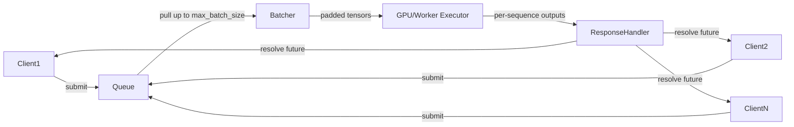

# Asynchronous Sequence Batching for Distributed Inference


*Decoupling request arrival from model execution in real-time evaluation engines*

**TL;DR**
- Synchronous batching ties every client’s latency to the slowest request in the batch and leaves GPU cycles on the table whenever demand is uneven.
- Asynchronous sequence batching accepts requests continuously, forms executable micro-batches, and returns each response as soon as its sequence completes.
- The core design is a small scheduling loop—request queue, batcher, executor, completion callbacks—which production systems extend with bucketing, padding control, and continuous batching.

Real-time evaluation engines sit behind search ranking, recommendation, content moderation, and safety classifiers. In all of these settings, request arrival is bursty and individual sequences differ in length. The way those requests are assembled and fed to a GPU is often the dominant factor in p99 latency and throughput. The pattern that usually wins is not a bigger synchronous batch; it is **asynchronous sequence batching**: a scheduling layer that separates *when a request arrives* from *when it is executed*.

## Why does synchronous batching fail at scale?

**Direct answer:** it couples every client’s completion time to the slowest member of the batch and to the rate at which enough matching requests arrive.

A traditional synchronous pipeline waits until it has `batch_size` requests, pads them to a common length, runs forward inference, then returns all responses at once. If one request carries a long sequence, every other request in the batch waits for it. If traffic dips, the scheduler either runs a partially empty batch (wasteful) or stalls until the batch fills (slow for everyone already queued). The result is a latency tail that grows with load and a GPU that sits idle during the gaps.

Teams running distributed inference often see this show up as a whiplash between throughput and responsiveness. Push batch size up and the p99 latency climbs because every request is gated by the longest sequence. Push batch size down and GPU utilization drops because there is not enough parallel work to saturate the tensor cores.

## What is asynchronous sequence batching, really?

**Direct answer:** it is a scheduling pattern that accepts requests asynchronously, gathers them into executable micro-batches, runs inference, and returns each response independently as soon as its sequence is done.

The key move is decoupling the client-facing API from the execution loop. Requests arrive at their own pace and are parked in a queue. A separate batcher either waits a bounded amount of time (`max_wait_ms`) or collects up to `max_batch_size` requests, whichever comes first. Each request is represented by a future or callback that resolves when its individual result is ready. The model executor no longer cares which responses belong to which clients; it only sees padded tensors and a mapping back to futures.

This gives the system three degrees of freedom it did not have before:

1. **Bounded waiting** — requests never wait indefinitely for a batch to fill.
2. **Variable sequence lengths** — the batcher can group similar-length sequences into buckets instead of padding every request to the global maximum.
3. **Overlapped I/O and compute** — the network layer keeps accepting and queuing requests while the previous batch is still on the GPU.

## A minimal scheduler

The snippet below captures the pattern in pure Python. In a real engine, `execute()` would forward a padded tensor to a GPU kernel or a remote worker; here, it is mocked to keep the structure visible.

```python
import asyncio
import numpy as np
from dataclasses import dataclass, field

@dataclass
class InferenceRequest:
    req_id: str
    tokens: np.ndarray
    future: asyncio.Future = field(default_factory=asyncio.get_event_loop().create_future)

class AsyncBatchingScheduler:
    def __init__(self, engine, max_batch_size=8, max_wait_ms=5):
        self.engine = engine
        self.max_batch_size = max_batch_size
        self.max_wait = max_wait_ms / 1000.0
        self.queue = asyncio.Queue()

    async def submit(self, req_id: str, tokens: np.ndarray) -> np.ndarray:
        request = InferenceRequest(req_id=req_id, tokens=tokens)
        await self.queue.put(request)
        return await request.future

    async def run(self):
        while True:
            batch = []
            deadline = asyncio.get_event_loop().time() + self.max_wait

            while len(batch) < self.max_batch_size:
                timeout = deadline - asyncio.get_event_loop().time()
                if timeout <= 0:
                    break
                try:
                    req = await asyncio.wait_for(self.queue.get(), timeout=max(timeout, 0.001))
                    batch.append(req)
                except asyncio.TimeoutError:
                    break

            if batch:
                # Stack padded sequences and run one engine call.
                padded = self._pad(batch)
                outputs = await self.engine.execute(padded)

                for req, output in zip(batch, outputs[:len(batch)]):
                    req.future.set_result(output)

    def _pad(self, batch):
        max_len = max(len(r.tokens) for r in batch)
        return np.stack([
            np.pad(r.tokens, (0, max_len - len(r.tokens)))
            for r in batch
        ])

# Mock engine. In production this delegates to a GPU worker pool.
class Engine:
    async def execute(self, padded_batch):
        await asyncio.sleep(0.005)  # Simulated inference
        return padded_batch * 2.0
```

The important detail is not the `asyncio` boilerplate; it is that every client receives its own future while the executor works on shared tensors. This same structure scales from a single process to a distributed service: replace the local queue with a request router, and keep the future pattern for returning results.

## The architecture at a glance



## Practical concerns: padding, bucketing, and backpressure

Asynchronous batching is only the skeleton. Production behavior depends on what happens inside the batcher.

- **Padding waste.** If one sequence in a batch has 512 tokens and the rest have 16, most of the attention/linear algebra work is spent on padding tokens. Bucketing sequences by length approximate lengths (e.g., 1–32, 33–64, 65–128) and running separate batches keeps padding closer to zero.
- **Max-wait tuning.** A very short `max_wait_ms` keeps latency low but raises the number of under-filled batches. A very long `max_wait_ms` improves throughput but reintroduces the stall problem. The right value is usually set from latency targets under real traffic, not from static rules.
- **Backpressure.** An unbounded queue will eventually consume all available memory. A bounded queue with explicit rejection (HTTP 503 or queue-depth metric) is safer than silent growth. The scheduler should also expose queue depth, wait time, and batch utilization so operators can tune `max_batch_size` and `max_wait_ms` together.
- **Completion ordering.** Because responses are returned as soon as individual sequences finish, clients may receive results out of order. The scheduler must attach `req_id` to every response so the caller can match it to the original request.

## How do you keep batch efficiency without blocking clients?

**Direct answer:** by collecting just enough work to saturate the GPU, with a strict timeout that prevents any single client from waiting for stragglers.

The micro-batch is the compromise. It is large enough to keep the GPU busy and small enough that the maximum wait time is still acceptable. For example, teams often tune `max_wait_ms` in the 2–10 ms range for interactive use cases, accepting smaller batches during quiet periods and fuller batches during spikes.

Beyond micro-batching, modern inference servers add **continuous batching** (also called in-flight batching). In this variant, new sequences can join a batch that is already running, and completed sequences can leave without waiting for the whole batch to finish. This is especially effective for autoregressive generation, where sequences finish at different step counts. The scheduler described above is the simpler precursor to that model: it separates the request stream from the execution stream, which is exactly the property continuous batching needs.

## Where this pattern fits

Asynchronous sequence batching is a building block, not a complete inference platform. It sits at the boundary between networking and execution. Larger systems layer on top of it:

- **Tensor and pipeline parallelism** for models too large for one GPU.
- **Speculative decoding** to generate tokens faster without increasing batch size.
- **Prefix caching** so that shared prompts do not recompute attention on every request.

The core idea remains the same: do not let the shape of one request dictate the schedule of the others.

## Topics

Distributed Inference, Machine Learning Systems, Real-Time ML, GPU Scheduling, Async/Await, Model Serving, Latency Optimization