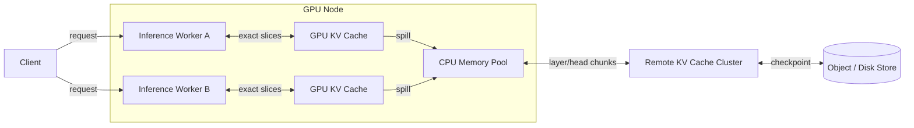

# Beyond Single-Node KV Caches: Coordinate Tensor Slices for Distributed LLM Inference
*A practical look at how layered caching and explicit slice coordination can ease memory pressure in high-throughput serving.*

**TL;DR**
- The KV cache is usually the first memory wall in LLM serving; disaggregating it from compute lets workers share states rather than each hold a full copy.
- A tiered cache—GPU HBM, local DRAM, remote pool—works only when workers request exact tensor slices layer-by-layer instead of whole request buffers.
- Explicit slice coordination, plus deterministic chunk metadata, keeps data movement proportional to what inference actually consumes and avoids redundant recomputation.

In most large language model serving stacks, the KV cache is the dominant consumer of memory long before compute saturates. Autoregressive generation forces every layer to materialize keys and values for every token seen so far, and with prefix-heavy workloads these tensors are duplicated across workers, nodes, and even requests. The result is a familiar pattern: throughput plateaus while GPU memory is full, batch sizes shrink, and the system starts recomputing or evicting context just to keep decoding alive.

Disaggregating the KV cache from the compute nodes that produce and consume it is the usual response. But moving tensors off-chip introduces its own set of problems—how much data to move, who owns which slice, and how to keep parallel workers from seeing stale or inconsistent tensors. This post walks through an architecture pattern that addresses those questions by pairing a tiered KV cache with explicit tensor-slicing coordination.

## Why does KV cache management become the bottleneck at scale?

At scale, GPU high-bandwidth memory fills before ALUs or network links reach their limits. The KV cache grows linearly with batch size and sequence length, and when every inference worker keeps an independent copy, the same tensors are stored many times across tensor-parallel ranks and pipeline stages. Once local memory pressure triggers eviction, the next prefill phase must recompute missing states, which is almost always more expensive than fetching them.

A second problem is burstiness. Many serving workloads are prefix-heavy: multiple requests share long system prompts, cached tool schemas, or prior conversation turns. Without shared storage, each request loads or recomputes the same prefix independently. A shared KV cache removes that duplication, but sharing only helps if the architecture can route the right slice to the right worker at the right time.

## How does tensor-slicing coordination keep workers consistent?

Workers request exact key/value ranges by layer, sequence position, and attention head rather than copying whole request buffers, so data movement stays proportional to what inference actually consumes.

The idea is straightforward: keys and values are not an opaque blob. They have structure—layer index, head index, and sequence position. A coordination layer can treat each `(request_id, layer, seq_range, head_range)` tuple as a chunk with its own metadata and version. When a GPU worker needs to extend a sequence, it asks for the slices that its current forward pass actually touches. It does not pull an entire request context, and it does not assume another worker has the same tensor-parallel layout.

This approach also removes a common source of inconsistency. If two workers own different TP slices of the same layer, exchanging full KV buffers would over-copy data and force expensive reassembly. By contrast, explicit slice coordination lets each worker fetch only its responsible attention-head range, then concatenate locally. The metadata—chunk boundaries, dtype, and a sequence counter or content hash—serves as the single source of truth.

The diagram below shows one possible layout. GPU workers keep hot chunks in HBM, spill to a local CPU memory buffer, and fall back to a shared remote cache before touching durable storage.



Rauma this layout, a chunk is the unit of caching. The CPU memory pool stores recently evicted chunks from its local GPU; the remote cache stores chunks that can be reused by any worker, anywhere in the cluster. Storage holds longer-lived checkpoints, such as reusable prompt embeddings or conversation history.

## A reference implementation pattern

The Python snippet below is not production code, but it captures the core ideas. A `KVChunk` is indexed by request, layer, sequence range, and head range. The store tries local GPU memory first, then local DRAM, then remote, and finally recomputes if no cached slice exists. Prefetching is driven by sequence-position hints rather than full request copies.

```python
from dataclasses import dataclass
from typing import Optional, Tuple

@dataclass(frozen=True)
class ChunkKey:
    request_id: str
    layer_idx: int
    seq_range: Tuple[int, int]       # [start, end) token positions
    head_range: Tuple[int, int]      # [start, end) attention heads

@dataclass
class KVChunk:
    key: ChunkKey
    tensor: object   # place-holder for GPU/CPU tensor handle
    version: int     # monotonic sequence counter or hash

class TieredKVStore:
    def __init__(self, max_gpu_mb: int = 32_000, max_local_mb: int = 128_000):
        self.gpu_cache: dict[ChunkKey, KVChunk] = {}
        self.local_cache: dict[ChunkKey, KVChunk] = {}
        self.remote = None              # remote cache client
        self.max_gpu_mb = max_gpu_mb
        self.max_local_mb = max_local_mb
        self.current_gpu_mb = 0

    def get(self, key: ChunkKey) -> Optional[KVChunk]:
        # 1) local GPU
        if key in self.gpu_cache:
            return self.gpu_cache[key]

        # 2) local CPU-spill pool
        if key in self.local_cache:
            chunk = self.local_cache.pop(key)
            self._place_in_gpu(key, chunk)
            return chunk

        # 3) remote shared cache
        if self.remote:
            chunk = self.remote.lookup(key)
            if chunk:
                self._place_in_gpu(key, chunk)
                return chunk
        return None

    def _place_in_gpu(self, key: ChunkKey, chunk: KVChunk):
        # simple LRU-like eviction to GPU capacity
        while self.current_gpu_mb > self.max_gpu_mb:
            evicted_key, evicted = self.gpu_cache.popitem(last=False)
            self.local_cache[evicted_key] = evicted
        self.gpu_cache[key] = chunk
        self.current_gpu_mb += chunk.tensor.nbytes // (1024 ** 2)

    def prefetch(self, request_id: str, layer_hints: list[Tuple[int, int, int]]):
        """
        layer_hints: list of (layer_idx, seq_start, seq_end) expected soon.
        """
        for layer_idx, s, e in layer_hints:
            key = ChunkKey(request_id, layer_idx, (s, e), (0, 8))
            if key not in self.gpu_cache and key not in self.local_cache:
                # ask remote cache to stage optional chunk
                if self.remote:
                    self.remote.prefetch(key)
```

A few details are intentionally left abstract. Real systems need CUDA memory pools, NVLink/InfiniBand-aware transport, and careful handling of tensor-parallel layouts. The point is that chunk identity and exact slice requests make local, remote, and prefetched caching coherent.

## Decisions that matter

Chunk granularity is the biggest design lever. Smaller chunks reduce wasted movement but inflate metadata and bookkeeping. Larger chunks amortize round trips but can pull heads or positions a worker does not need. In practice, teams often align chunks with transformer layers or attention-head groups so that a single lookup maps cleanly to a forward-pass tensor view.

Eviction policies also need to be workload-aware. A pure LRU approach can evict reusable prompt chunks for short-lived decode state. Many deployments keep hot prefixes pinned, or at least weighted by recomputation cost, so that shared system prompts survive eviction waves.

Finally, prefetching must be conservative. Over-fetching across the fabric wastes bandwidth and can stall decode. Good prefetching is driven by the known sequence structure of a conversation or by batch-level analysis of upcoming layers. The goal is to move a chunk one layer ahead of its consumer, not to mirror the entire KV cache on every worker.

## Topics

`llm-inference` `kv-cache` `distributed-systems` `tensor-slicing` `caching` `high-throughput-serving` `vllm` `model-serving` `disaggregated-inference`