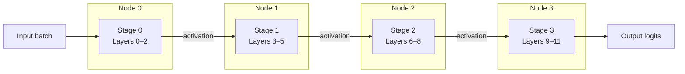

# Inter-Node Tensor Allocation for Distributed Inference: A Practical Guide
*How two-phase partitioning lets teams spread large models across commodity nodes without over-provisioning a single accelerator.*


**TL;DR**
- Two-phase partitioning — inter-layer (pipeline) plus intra-layer (tensor) — is how teams fit models that exceed one GPU’s memory across multiple nodes.
- Inter-node tensor allocation is the scheduling decision that maps each weight shard and activation buffer to a specific worker; a poor mapping turns inference into a network-bound problem.
- The implementation challenge is not splitting tensors but balancing memory, compute, and communication while leaving headroom for batching and failures.

Modern foundation models are larger than the memory of a single accelerator, so distributed inference has moved from a niche optimization to the default architecture. The obvious fix — put different layers on different machines — is only the starting point. Once a model is split, someone has to decide which node owns every weight tensor, every optimizer state buffer, and every intermediate activation. That decision is *inter-node tensor allocation*, and it determines whether the cluster runs efficiently or spends most of its time waiting on the network.

Distributed inference is not unique to cloud data centers. Teams are also asked to run large models across edge and cloud nodes, where bandwidth, memory, and compute are skewed. In those environments, a one-size-fits-all split is usually worse than running a smaller model on one device.

## Why does resource utilization break on a single accelerator?

A single large GPU loaded with the full model is simple to reason about, but it is rarely efficient. Peak memory usage comes in bursts — during attention materialization, large fully-connected layers, or big batch sizes — so the device must be provisioned for the worst moment. Outside those bursts, compute units sit idle, and the capital spent on the oversized accelerator is wasted. Larger chips are also harder to source, fail as a single unit, and cannot scale beyond their own memory wall.

Spreading work across smaller nodes solves the memory problem, but it introduces a new problem: communication. Every split surface is a place where tensors must be serialized, sent over a network, and reconstructed. The goal of two-phase partitioning is to place those surfaces where the cost is lowest.

Inter-layer partitioning assigns contiguous blocks of layers to different nodes. This is essentially pipeline parallelism: node *i* computes layers 0–2, node *i+1* computes layers 3–5, and so on. It keeps each node’s memory footprint roughly proportional to the depth it owns. Intra-layer partitioning splits individual weight tensors — for example, the rows of an attention projection or the columns of a feed-forward layer — across nodes. This is tensor parallelism: it reduces per-node memory further and can lower latency for a single forward pass, but it adds collective communication such as all-reduce operations.

The diagram below shows a 12-layer model split into four pipeline stages. The activations flow from node to node, while the weights inside each feed-forward network are sharded across the same four nodes.



A good mental model is to treat the model as a data-flow graph. Nodes in the graph are operations; edges are tensors. Inter-node tensor allocation colors each tensor with a node ID. The fewer high-bandwidth edges that cross node boundaries, the faster the system runs.

## What separates a good allocation from a bad one?

A good allocation minimizes expensive cross-node data movement while keeping memory, compute, and network demand balanced across workers. A bad allocation splits the wrong tensors — for instance, a tiny bias vector shared across every shard — and saturates a slow link with control traffic. The difference often shows up not in throughput but in tail latency; for example, teams frequently see p99 latency roughly double when a critical activation path crosses an oversubscribed inter-rack link instead of staying within the same host.

Three factors dominate practical allocation decisions.

**1. Communication volume.** Splitting a weight matrix along its input or output dimension changes how much data must be exchanged. Tensor-parallel splits that require all-reduce over a fast NVLink mesh are cheap; the same splits over a 25 Gbps Ethernet link may consume most of the inference budget. The allocator must know the topology, not just the tensor shapes.

**2. Memory balance.** Different layers have very different profiles. Embedding tables are memory-heavy but compute-light; transformer attention layers create large activation buffers that scale with sequence length; feed-forward networks hold most of the parameters. An allocator that treats every layer as identical will overload one node while the others wait.

**3. Pipeline bubbles and batching.** Inter-layer partitioning introduces pipeline fill and drain delays. Micro-batching can hide some of that latency, but only if the scheduler can feed small batches through the stages fast enough. Tensor allocation therefore cannot be separated from batching policy.

The following code sketch shows a two-phase allocator for a transformer-style stack. It produces a placement map rather than a full runtime, because in production the runtime layer — RPC, collective communication, checkpoint loading — is usually handled by a framework such as PyTorch Distributed, vLLM, or Ray Serve. The placement map is what those runtimes consume.

```python
import torch
import torch.nn as nn

class TransformerStage(nn.Module):
    """
    One pipeline stage. A full model would be a sequence of these.
    """
    def __init__(self, hidden_dim: int, ffn_dim: int, num_heads: int):
        super().__init__()
        self.attn = nn.MultiheadAttention(hidden_dim, num_heads, batch_first=True)
        self.ff = nn.Sequential(
            nn.Linear(hidden_dim, ffn_dim),
            nn.GELU(),
            nn.Linear(ffn_dim, hidden_dim),
        )

    def forward(self, x: torch.Tensor) -> torch.Tensor:
        attn_out, _ = self.attn(x, x, x, need_weights=False)
        x = x + attn_out
        return x + self.ff(x)


def two_phase_allocation(stages, num_nodes):
    """
    Returns:
      inter_layer: mapping stage_id -> node_id (pipeline parallelism)
      intra_layer: parameter names inside a stage that are tensor-sharded
    """
    inter_layer = {
        stage_id: stage_id % num_nodes
        for stage_id in range(len(stages))
    }

    # Within each node, shard the large FFN weights across devices.
    intra_layer = {
        "ff.0.weight": num_nodes,   # up-projection
        "ff.2.weight": num_nodes,   # down-projection
    }

    return inter_layer, intra_layer


# Build 12 stages across 4 nodes.
stages = [
    TransformerStage(hidden_dim=4096, ffn_dim=11008, num_heads=32)
    for _ in range(12)
]
num_nodes = 4

inter_plan, intra_plan = two_phase_allocation(stages, num_nodes)

# Derive per-tensor placements: (host_node, tensor_shard_id).
placements = {}
for stage_id, host_node in inter_plan.items():
    for param_name, shard_count in intra_plan.items():
        for shard_id in range(shard_count):
            key = f"stage.{stage_id}.{param_name}:{shard_id}"
            placements[key] = (host_node, shard_id)

# Example lookup: stage 0's up-projection shard 0 lives on Node 0.
print(placements["stage.0.ff.0.weight:0"])   # -> (0, 0)
```

In practice, the `two_phase_allocation` function is rarely hard-coded. It is driven by a cost model built from a profiling pass: per-layer latency, per-layer memory at a target batch size, and measured bandwidth between node pairs. The profiler output is fed into a greedy or integer-linear-programming allocator that searches for a placement with the lowest expected execution time.

## The parts the code does not show

The allocator above omits the hard details. First, activations are not static: sequence length, batch size, and padding all change the size of intermediate tensors. A partition that balances memory at batch size one may fail at batch size eight. Second, failures matter. If one node in a tensor-parallel group goes away, the whole forward pass stalls until a replacement is promoted or the request is rerouted. Allocations therefore need redundancy margins, especially when edge nodes have spotty connectivity.

Third, heterogeneity is common. Cloud nodes may have A100s with NVLink; edge nodes may have consumer GPUs on Wi-Fi. A uniform split across unlike nodes is usually suboptimal. Production allocators often pin memory-bound layers on high-memory hosts and compute-bound layers on fast hosts, then verify the network paths between them.

Fourth, weight loading and checkpoint sharding must match the runtime allocation. If checkpoint *A* is stored as one monolithic file but the runtime expects 16 shards, the first request pays a heavy resharding cost. Teams usually pre-shard checkpoints to the allocation plan so each node fetches only its own parameters.

Finally, scheduling and allocation are coupled. A pipeline-parallel system with four stages has four times the in-flight batch capacity of a single node, but only if the scheduler can keep every stage fed. If stage 2 is slower than the others, the whole pipeline backs up. The allocator should leave headroom on the slowest stage or reduce its load.

## Wrapping up

Inter-node tensor allocation is ultimately a scheduling problem dressed up as a model-parallelism problem. Splitting weights is straightforward; deciding where each tensor lives so that memory, compute, and communication stay balanced is not. Teams that treat allocation as a first-class concern — profiling real workloads, accounting for network topology, and leaving margins for batching and failures — get the cost benefits of distributed inference without the latency surprises.

## Topics

Distributed Inference, Model Parallelism, Tensor Allocation, LLM Serving, Systems Engineering, PyTorch Distributed