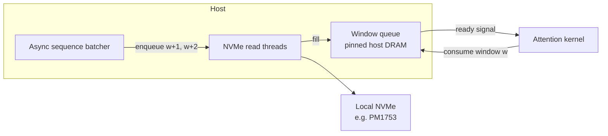

# KV Cache Over Slow Storage: Asynchronous Sequence Batching and Friends


*A prefetch-oriented pattern for reading long-context KV state from local NVMe without stalling the GPU.*

**TL;DR**
- For long-context inference, the KV-cache read path is usually I/O-bound over local storage; sequential bandwidth is plentiful, random read latency is not.
- Asynchronous sequence batching prefetches contiguous KV windows ahead of the attention step, so the GPU consumes host-resident data instead of blocking on flash.
- Quantization, packing, and layout conversion amplify the technique by shrinking the bytes that cross the storage/PCIe bus; use them only when they match the real access pattern.

---

## Why does long-context attention stall the KV-cache read path?

Because attention is all-to-all: every new token has to read every retained key, and every stored value has to be available when its corresponding attention weight is applied. In small-context settings the entire KV cache fits in HBM, so the bottleneck is compute. Once the context outgrows GPU memory, serving systems spill KV tensors to CPU DRAM, remote memory, or local NVMe. At that point the read path becomes a storage problem.

Local NVMe devices—using a representative high-performance drive such as the Samsung PM1753 as an example—deliver enormous sequential throughput. The same hardware is far weaker at random small reads. A naive KV-cache loader that fetches one layer, one head, or one token at a time turns the read pattern into a flurry of tiny, non-contiguous accesses. That is exactly the opposite of what the storage is good at. The result is GPU under-utilization: the tensor cores finish the current window and then idle while the next chunk trickles in.

The fix is not “read faster.” It is to reshape the read pattern so the device can stream data sequentially, and to hide the latency of those streams behind useful GPU work.

## What does asynchronous sequence batching actually do?

It treats the retained context as a one-dimensional stream, slices it into contiguous windows, and prefetches each window into a host-memory ring buffer before the attention kernel asks for it. The work is asynchronous because the loader runs on separate I/O threads or event loops while the GPU attends to the window that arrived earlier.

The contract is simple:

1. **Split** the full sequence into windows of `W` tokens.
2. **Prefetch** one or more upcoming windows into pinned host DRAM.
3. **Present** each ready window to the attention backend as if it were already resident.
4. **Evict** the oldest window when the buffer is full.

This pattern works well with paged attention or vLLM-style block tables because each physical page can be mapped to a window. The sequence dimension becomes a prefetch queue; the storage device sees large, sequential reads; and the GPU sees only DRAM latency, not NVMe latency.



The key metric to watch is not peak bandwidth; it is stall time per window. A good implementation keeps the prefetch queue at least half full across the whole forward pass.

## How do quantization, packing, and layout conversion fit?

They fit as *compression* and *alignment* passes on the data that moves through the windows. Each one is useful only when it matches both the storage path and the kernel that consumes the KV data.

### Quantization

Moving from FP16/BF16 to INT8 or FP8 halves the bytes read from NVMe and transferred over PCIe. The caveat is accuracy. Per-channel or per-token scales must be stored with the weights, and the dequantization has to happen on the GPU before the dot product. If the model tolerates 8-bit KV storage, this is usually the highest-leverage optimization.

### Packing

Packing means storing metadata adjacent to the data it describes: scales next to quantized blocks, or multiple small tensors in contiguous cache lines. It reduces TLB misses and improves vectorized load efficiency. It does not reduce bytes on disk by itself; it makes the bytes that are already there cheaper to move through the memory hierarchy.

### Layout conversion

K and V caches are often stored in a token-major layout—for example, `[layers, heads, tokens, head_dim]`. For attention kernels that operate head-by-head, a head-major or block-major layout such as `[layers, heads, head_dim, tokens]` is friendlier. Reordering once at write time or during I/O avoids repeated scatter-gather inside the kernel.

### Low-dimensional projection

Projection is the most situational of the four. It builds a compact representation of KV state—say, a learned or PCA-compressed sketch—and keeps the full tensor on storage. It can act as a pre-filter for retrieval or as a secondary tier. Because projection is lossy, it is typically used for coarse selection, not as a substitute for the KV cache needed by exact attention.

## Implementation sketch

The code below is illustrative, not production-ready. It shows a batched window loader that quantizes, packs, transposes layout, and prefetches the next window while the GPU works on the current one.

```python
import asyncio
import numpy as np


class QuantizedKVWindow:
    """One contiguous window of KV state stored as INT8 + scale."""
    def __init__(self, k_int8: np.ndarray, v_int8: np.ndarray,
                 scales: np.ndarray, layout: str):
        self.k_int8 = k_int8
        self.v_int8 = v_int8
        self.scales = scales
        self.layout = layout            # 'token_major' or 'head_major'


class AsyncSequenceBatcher:
    def __init__(self,
                 seq_len: int = 32768,
                 window_tokens: int = 2048,
                 num_layers: int = 32,
                 num_heads: int = 8,
                 head_dim: int = 128,
                 prefetch_depth: int = 2):
        self.seq_len = seq_len
        self.window_tokens = window_tokens
        self.num_windows = seq_len // window_tokens
        self.num_layers = num_layers
        self.num_heads = num_heads
        self.head_dim = head_dim
        self.prefetch_depth = prefetch_depth

        self._queue: asyncio.Queue[QuantizedKVWindow | None] = asyncio.Queue(
            maxsize=prefetch_depth
        )

    def _fake_read_from_nvme(self, window_idx: int) -> np.ndarray:
        """Simulate a contiguous NVMe read for one window."""
        shape = (
            self.num_layers,
            self.num_heads,
            self.window_tokens,
            self.head_dim,
        )
        return np.random.randn(*shape).astype(np.float32)

    def _quantize(self, x: np.ndarray) -> tuple[np.ndarray, np.ndarray]:
        """Per-token INT8 quantization (axis=2)."""
        scale = np.max(np.abs(x), axis=2, keepdims=True) / 127.0
        scale = np.where(scale == 0, 1.0, scale)
        x_int8 = np.round(x / scale).astype(np.int8)
        return x_int8, scale.squeeze(axis=2).astype(np.float16)

    def _pack(self, x_int8: np.ndarray, scales: np.ndarray) -> np.ndarray:
        """Place scales next to each block so one DMA read fetches both."""
        # x_int8 shape: (L, H, W, D)
        # scales shape: (L, H, W)
        return np.ascontiguousarray(
            np.concatenate([
                x_int8.reshape(-1),
                scales.reshape(-1),
            ])
        )

    def _layout_convert(self, x_int8: np.ndarray) -> np.ndarray:
        """Token-major -> head-major: (L, H, W, D) -> (L, H, D, W)."""
        return np.transpose(x_int8, (0, 1, 3, 2))

    async def _load_window(self, window_idx: int) -> QuantizedKVWindow:
        # In a real system this is an awaitable NVMe read, not a sleep.
        raw_k = self._fake_read_from_nvme(window_idx)
        raw_v = self._fake_read_from_nvme(window_idx)

        k_int8, k_scale = self._quantize(raw_k)
        v_int8, v_scale = self._quantize(raw_v)

        k_packed = self._pack(self._layout_convert(k_int8), k_scale)
        v_packed = self._pack(self._layout_convert(v_int8), v_scale)

        return QuantizedKVWindow(
            k_int8=k_packed,
            v_int8=v_packed,
            scales=np.concatenate([k_scale.reshape(-1), v_scale.reshape(-1)]),
            layout="head_major",
        )

    async def _prefetch_worker(self):
        for i in range(self.num_windows):
            window = await self._load_window(i)
            await self._queue.put(window)
        await self._queue.put(None)  # sentinel

    async def stream_windows(self):
        producer = asyncio.create_task(self._prefetch_worker())
        while True:
            window = await self._queue.get()
            if window is None:
                break
            yield window
        await producer


# Example: consume windows while the next ones are being fetched.
async def main():
    batcher = AsyncSequenceBatcher(window_tokens=2048, prefetch_depth=2)
    async for w in batcher.stream_windows():
        print(f"window layout={w.layout}, k_bytes={w.k_int8.nbytes}")
        # GPU attention consumes w here, overlapping with next window load.


if __name__ == "__main__":
    asyncio.run(main())
```

The `asyncio.Queue` back-pressure ensures the prefetcher stops when memory is full. In production, the queue is replaced by pinned host buffers, an `io_uring`/libaio read loop, and a page table that maps each window to the correct GPU-visible block.

## When should teams use this pattern?

Asynchronous sequence batching is most valuable when three conditions are true:

1. The context length exceeds GPU HBM, so KV state must live outside it.
2. The storage tier is fast at sequential reads but weak at random reads.
3. The attention backend can consume context windows in a streaming fashion instead of demanding the full sequence up front.

If those conditions hold, add quantization first; it usually gives the biggest reduction in bytes moved. Then measure whether layout conversion and packing actually reduce kernel time, because a bad layout can erase the I/O savings. Treat low-dimensional projection as an optionalSelection layer, not as a replacement for the KV cache. Combiningall four without measurement is a recipe for silent accuracy regressions and wasted engineering cycles.

## Topics

`kv-cache`, `large-language-models`, `distributed-inference`, `sequence-batching`, `nvme-storage`, `quantization`, `attention-optimization`, `high-throughput-systems`