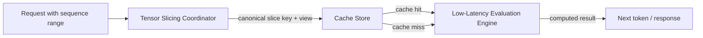

# Low-Latency KV Caches: Coordinate Your Tensor Slices Before You Cache
A pattern for real-time inference that keeps key/value tensor chunks addressable, reusable, and eviction-aware.


**TL;DR**
- In transformer inference, the KV cache saves key/value activations so attention does not have to be recomputed for every token; the hard part is slicing and addressing those tensors at serving time.
- A small *Tensor Slicing Coordinator* layer can normalize slice keys, keep chunk layout predictable, and prevent the cache from storing overlapping or duplicate buffers.
- Pairing that coordinator with an LRU-aware *Cache Store* and a stateless *Evaluation Engine* gives the engine a fast hit path and makes per-slice eviction straightforward.

In transformer-based serving, the KV cache is the workhorse that makes autoregressive decoding affordable. Instead of recomputing key and value tensors for every previously seen token, the engine stores them and reuses them as the sequence grows. That storage layer is simple in principle—a logical key maps to a tensor buffer—but it gets complicated as soon as workloads scale. Requests arrive with different sequence lengths, are batched together with padding, and are split across multiple workers or devices. Each worker may need only a slice of the full KV tensor: a specific sequence range, a subset of attention heads, or a batch position.

The real design problem is not *whether* to cache; it is how to make the unit of caching match the unit of work. When those two drift, the cache becomes a source of latency rather than a remedy.

## Why does tensor slicing become a bottleneck?

Because uncoordinated slicing turns one logical tensor into many physically distinct buffers, and the evaluation engine pays for the duplication.

A transformer KV cache is typically a four-dimensional tensor: batch, number of heads, sequence length, and head dimension. During decoding, the engine appends new key/value vectors to the sequence-length dimension and then reads back contiguous ranges—say positions `[0:p]` for prefill work or `[p:s]` for newly generated tokens. Without a coordinator, each service worker may construct its own view of the same logical slice, materialize a fresh copy to ensure contiguity, or even pad a shorter sequence to the current batch maximum.

The symptoms are easy to recognize. Memory bandwidth climbs because the same bytes are copied multiple times. Cache hit rates drop because semantically identical ranges are keyed differently; `[0:128]` and `[0:127]` should not be separate entries, but without canonicalization they often are. Tail latency grows because the evaluation engine must reconcile shapes before it can run the matrix multiplications it was built for. The root cause is not the cache itself—it is the absence of a single authority that decides how tensors are partitioned and how those partitions are named.

## What does a low-latency evaluation engine need from the cache?

It needs stable canonical keys, predictable layout, and a hit path that is little more than a lookup and a hand-off.

The engine should be able to ask for slice `(batch, head, seq_start:seq_end, head_dim)` and receive either a valid buffer or a clean miss. It should not have to reason about padding, reordering, or whether another worker has already materialized the same bytes. That responsibility belongs to the coordinator.

A well-designed cache contract also makes eviction decisions easy. If every cached object is a bounded slice with a known logical extent, the system can evict the least-recently-used slice without worrying that it is discarding half of a tensor that other slices still reference. The engine stays focused on compute; the coordinator and cache store stay focused on data placement.

## A three-part architecture

The pattern separates concerns into three components:

1. **Tensor Slicing Coordinator** — owns the slice schema, produces canonical keys, and hands out tensor views that the rest of the stack can rely on.
2. **Cache Store** — maps canonical keys to buffers, handles eviction at slice granularity, and enforces copy-versus-view semantics.
3. **Low-Latency Evaluation Engine** — consumes slices, performs the actual forward-pass work, and may write results back to the cache.

The coordinator sits between the request and the cache. It translates sequence ranges into normalized keys, so two requests asking for the same logical slice receive the same key. The store treats those keys as the single source of truth.



The evaluation engine never invents a key; it only operates on what the coordinator provides. That separation is what keeps the hot path short.

## An illustrative implementation

The example below is intentionally two-dimensional to keep the idea readable. A production version would use multi-dimensional slice keys—`(batch, head, seq_start, seq_end, head_dim)`—but the contract is the same. The coordinator splits a `1000 × 1000` tensor into `100 × 100` chunks and yields a canonical key with each chunk. The cache is keyed by slice coordinates, not by shape, so two chunks with the same dimensions but different positions are stored separately.

```python
import numpy as np
from collections import OrderedDict
from typing import Iterator, Optional, Tuple

# Canonical key: (row_start, row_end, col_start, col_end)
SliceKey = Tuple[int, int, int, int]


class TensorSlicingCoordinator:
    def __init__(self, tensor: np.ndarray, chunk_size: int):
        self.tensor = tensor
        self.chunk_size = chunk_size

    def iter_keys_and_chunks(self) -> Iterator[tuple[SliceKey, np.ndarray]]:
        n_rows, n_cols = self.tensor.shape
        cs = self.chunk_size
        for i in range(0, n_rows, cs):
            i_end = min(i + cs, n_rows)
            for j in range(0, n_cols, cs):
                j_end = min(j + cs, n_cols)
                key = (i, i_end, j, j_end)
                # Return a view; the cache decides whether to copy.
                yield key, self.tensor[i:i_end, j:j_end]


class CacheStore:
    def __init__(self, capacity: int = 128):
        self.capacity = capacity
        self.cache: OrderedDict[SliceKey, np.ndarray] = OrderedDict()

    def store(self, key: SliceKey, value: np.ndarray) -> None:
        # Move to the end on every access; evict from the front.
        self.cache[key] = value
        self.cache.move_to_end(key)
        while len(self.cache) > self.capacity:
            self.cache.popitem(last=False)

    def retrieve(self, key: SliceKey) -> Optional[np.ndarray]:
        if key not in self.cache:
            return None
        self.cache.move_to_end(key)
        return self.cache[key]


class LowLatencyEvaluationEngine:
    def __init__(self, cache: CacheStore):
        self.cache = cache

    def evaluate(self, key: SliceKey, chunk: np.ndarray) -> float:
        cached = self.cache.retrieve(key)
        if cached is None:
            # In a real engine this would be attention/MLP work on the slice.
            result = float(np.sum(chunk))
            # Copy the view so the cached buffer survives the source tensor.
            self.cache.store(key, chunk.copy())
            return result
        return float(np.sum(cached))


# Example usage
tensor = np.random.rand(1000, 1000).astype(np.float32)
coordinator = TensorSlicingCoordinator(tensor, chunk_size=100)
engine = LowLatencyEvaluationEngine(CacheStore(capacity=64))

for key, chunk in coordinator.iter_keys_and_chunks():
    result = engine.evaluate(key, chunk)
```

Notice that the `CacheStore` never uses `chunk.shape` as a key. Two chunks of the same shape but different logical positions are distinct cached objects, which is exactly what serving requires. The coordinator also guarantees that the key is derived from coordinates, not from object identity or runtime metadata, so the same logical slice always collides in the cache.

## Design decisions that matter

**Canonicalize keys once.** Every slicing decision—padding removal, head grouping, sequence batching—should be resolved by the coordinator. If the engine or the cache store starts adjusting boundaries, key drift reappears and reuse drops.

**Choose chunk granularity deliberately.** Smaller slices improve reuse and parallelize better across workers, but they inflate metadata and can fragment memory. Larger slices reduce per-key overhead, yet they waste capacity when a request needs only a small sub-range. The right size usually follows the serving batch shape and the sequence-length distribution rather than the model dimension alone.

**Decide copy-versus-view semantics explicitly.** In the example, the store receives a copy of the chunk. In a production KV cache, the coordinator may hand out views into a larger page-allocated buffer, but then the eviction policy must be page-aware so removing one slice does not invalidate others that share physical storage. PagedAttention-style systems solve exactly this problem by mapping logical slices to physical blocks.

**Keep the hit path lock-free or sharded.** The cache lookup sits in the critical path of every token generated. A single global lock around the key-to-buffer map will dominate latency at high concurrency. Most implementations shard the map by slice key or use lock-free structures for the hot read path, reserving locks only for eviction.

**Evict at the same granularity you compute.** If the engine evaluates attention one sequence block at a time, cache and evict one block at a time. Evicting a larger tensor region than the engine consumes leaves useful data behind; evicting smaller pieces than the engine consumes forces recombination.

## Closing thought

An efficient KV cache is less a storage trick than a coordination trick. The tensors are already there; the question is whether the serving system can name them, chunk them, and hand them to the evaluation engine without ceremony. Add a thin coordinator that owns slice semantics, a cache store that respects those semantics under pressure, and an engine that trusts both, and the cache stops being a latency footgun and becomes the predictable accelerator it was meant to be.

## Topics

Machine Learning, Large Language Models, Transformer Inference, KV Cache, Tensor Slicing, Low-Latency Systems, Distributed Inference, Caching Strategies