# Multi-Node Pipeline Parallelism for Long-Context Inference: Scaling Memory Beyond a Single Box


**Pipeline parallelism shards layers across nodes so sequence memory can scale horizontally, but the real wins come from how micro-batches keep the pipeline full.**

**TL;DR**
*   Tensor parallelism replicates weights across devices but keeps memory pressure local, so ultra-long contexts eventually exhaust per-device KV cache; pipeline parallelism partitions layers across nodes, expanding effective memory capacity.
*   SGLang's chunked pipeline parallelism keeps most pipeline stages busy by processing many sequence chunks concurrently, reducing the "bubble" time that kills naive pipeline schedules.
*   This pattern excels at high-throughput batch serving; it is a poor fit when every additional millisecond of single-request latency matters, because each stage adds one network hop.

Long-context inference has a simple capacity problem: the KV cache grows with both sequence length and layer count, and a single device can hold only so much. Teams regularly hit the point where a model fits in aggregate cluster memory but not on any one node. Tensor parallelism (TP) was built to solve a different problem—speeding up one layer by splitting its matrices across many GPUs. It does not partition the memory responsibility in the same way. Every TP rank still materializes the KV cache and activations for every layer it owns. Add more TP ranks and you get faster matrix math, but eventually you run into the same per-device HBM ceiling.

Pipeline parallelism (PP) changes the equation by assigning contiguous layer ranges to different nodes. Each node holds only a slice of the network, so its memory footprint is a fraction of the whole model. Combine PP with TP—say, TP within a node and PP across nodes—and you can serve models and contexts that no single box could sustain.

## Why does tensor parallelism run out of room on long contexts?

Because it parallelizes computation, not memory responsibility. In TP, every layer is sliced across ranks, and each rank carries an equal share of the weights, activations, and KV cache for the layers under its care. Sequence length multiplies that cache linearly. A 128K context can require tens of gigabytes of KV state per layer, and every TP participant pays that cost for the layers it hosts.

Teams usually respond by adding TP ranks. That works until it does not: more ranks mean more all-reduce bandwidth, higher noise sensitivity, and eventually a hard cap set by the largest available GPU's memory. At some point the only lever left is buying a bigger accelerator; that is not a strategy.

PP is the alternative. In a two-stage pipeline, stage 0 might own layers 0–39 and stage 1 might own layers 40–79. Stage 0 never allocates KV state for stage 1's layers; it only forwards activations across the inter-node link. The memory cost per node drops roughly with the number of stages, so eight nodes can hold roughly eight times the model-and-context state that one node can. The tradeoff is latency: every token must traverse every stage.

## How does chunked pipeline parallelism keep the pipeline full?

By breaking one large forward pass into many micro-batches that are in flight at the same time. A naive pipeline sends one batch through stage 0, then stage 1, then stage 2, and so on. While stage 1 is working, stage 0 sits idle. The empty slots in that schedule are called pipeline bubbles, and they can waste most of the cluster's compute.

Chunked pipeline parallelism splits the input sequence into smaller chunks and schedules them so that stage 1 can start computing on chunk A while stage 0 is already processing chunk B. With enough chunks—usually several times the number of stages—most nodes stay busy. SGLang's implementation does this for both prefill and decode phases, overlapping communication of activations for one chunk with compute on the next. The result is higher throughput and better memory scaling than either pure TP or unchunked PP could deliver on its own.

```mermaid
gantt
    title Chunked Pipeline Through 4 Stages
    dateFormat X
    axisFormat %s
    
    section Stage 0
    C1 :0, 1
    C2 :1, 2
    C3 :2, 3
    C4 :3, 4
    C5 :4, 5
    section Stage 1
    C1 :1, 2
    C2 :2, 3
    C3 :3, 4
    C4 :4, 5
    C5 :5, 6
    section Stage 2
    C1 :2, 3
    C2 :3, 4
    C3 :4, 5
    C4 :5, 6
    C5 :6, 7
    section Stage 3
    C1 :3, 4
    C2 :4, 5
    C3 :5, 6
    C4 :6, 7
    C5 :7, 8
```



The diagram above is a toy schedule, but it captures the idea: five chunks keep the last stage busy almost immediately and the middle stages stay occupied throughout the pass.

## Wiring it together: a realistic launch pattern

SGLang exposes PP through the same `--pp` flag it uses for TP. On two nodes with eight GPUs each, a common configuration is TP 8 within each node and PP 2 across the two nodes. The launch commands look like this:

```bash
# Node 0
python -m sglang.launch_server \
  --model-path meta-llama/Meta-Llama-3.1-405B-Instruct \
  --tp 8 \
  --pp 2 \
  --nccl-init-addr 10.0.0.1:5000 \
  --node-rank 0 \
  --nnodes 2

# Node 1
python -m sglang.launch_server \
  --model-path meta-llama/Meta-Llama-3.1-405B-Instruct \
  --tp 8 \
  --pp 2 \
  --nccl-init-addr 10.0.0.1:5000 \
  --node-rank 1 \
  --nnodes 2
```

The `--tp 8` divides each stage across the local NVLink fabric. The `--pp 2` places stage 0 on node 0 and stage 1 on node 1, connected by InfiniBand or comparable RDMA. Chunks flow from node 0 to node 1 during prefill, and token-by-token activations flow the same way during decode. The scheduler batches enough chunks in parallel that neither node waits long between micro-batches.

## What to watch in production

Inter-node bandwidth becomes a first-class concern. PP sends activations, not gradients, so bandwidth demands are smaller than in training pipelines, but they are still steady. InfiniBand is usually worth it; Ethernet backbones can work for narrower models or smaller batch sizes, though latency outliers tend to widen.

Checkpointing also changes shape. Each PP stage owns a distinct weight shard, so a checkpoint is a set of files, one per stage. Restoring a failed stage means reloading its slice; restoring an entire pipeline means orchestrating all slices. Failure domains expand with stage count, so teams often pair multi-stage pipelines with stage-local retry logic or redundant routing paths.

Scheduling is another subtle point. Decode iterations are small, but they happen many times. If stage 0 finishes early in one iteration and stage 1 starts late, the gap is pure latency. Batching many requests and many chunks is what amortizes that cost. For workloads that cannot tolerate batching—single streaming requests with strict per-token budgets—pure PP may not be the right tool, and a shallower TP configuration may serve users better despite its memory limits.

## When this pattern fits

Multi-node chunked PP pays off when serving throughput matters more than the latency of any individual request, and when the model or context simply does not fit under a single node's memory ceiling. Document understanding, long-form coding agents, and batched retrieval-augmented generation all fit this profile. They process long sequences, they arrive in batches, and they can absorb the small per-stage overhead in exchange for the ability to run at all.

The broader lesson is that parallelism strategies are not interchangeable. TP optimizes the speed of one layer; PP optimizes how many layers fit in a cluster. Used together, they let teams scale context length and batch size beyond what either method can do alone.

## Topics

`Pipeline Parallelism` · `Tensor Parallelism` · `Long-Context Inference` · `SGLang` · `Distributed Inference` · `KV Cache` · `LLM Serving` · `Multi-Node Training` · `High-Throughput AI`