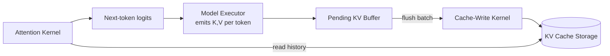

# Decoupling KV Cache Writes from Attention with Asynchronous Sequence Batching


## A pattern for reducing launch overhead and memory churn in low-latency inference engines

**TL;DR**
- Autoregressive inference spends a surprising amount of time on cache housekeeping—per-token KV appends, index updates, and cache coherence barriers—not just on matrix math.
- Asynchronous sequence batching buffers pending KV writes and flushes them as a group, letting the model executor and attention kernels run with fewer round trips to cache state.
- The pattern trades a small, bounded amount of staleness for lower kernel-launch overhead and more predictable memory access; it is most valuable under continuous batching and high request concurrency.

---

Most of the engineering effort around transformer serving is focused on what happens inside the attention kernel: faster GEMMs, better flash-attention schedules, lower-precision weights. But a quiet, persistent fraction of latency comes from the edges of the computation—where the model executor hands off new keys and values, where the cache manager appends them to sequence storage, and where the next attention step reads them back. These handoffs are not free. When every generated token triggers its own write-read cycle, small overheads compound.

This post looks at one architectural response: asynchronous sequence batching for the KV cache. The goal is not to describe a breakthrough algorithm; it is to separate the *production* of KV tensors from their *materialization* in cache memory, so that writes can be grouped and attention reads can proceed against a consistent, recently flushed view.

## Why does synchronous KV-cache access become a bottleneck?

The short answer is that per-token cache operations generate a large number of small, dependent memory movements and synchronization events.

In a typical autoregressive step, the model executor runs the transformer layers and emits a new key and value vector for each active sequence. The cache-write kernel then appends those vectors to the sequence’s slot in KV storage, updates metadata such as sequence length or block-table entries, and ensures the new data is visible. Only then does the attention kernel read the updated history and produce the next token’s logits. That chain is conceptually simple, but it creates several pressure points:

- **Kernel launch overhead.** Each append is a small GPU kernel or memory copy. At batch sizes of tens or hundreds of sequences, the launch queue becomes crowded with tiny operations.
- **Memory fragmentation.** If the cache is not pre-allocated, repeated per-token appends cause reallocation, copying, and non-contiguous access patterns for the attention kernel.
- **False serialization.** The model executor may sit idle while a write is fenced, even though the next layer’s compute does not depend on that particular cache entry yet.

These effects are easy to miss in micro-benchmarks on a single sequence. They show up when a real-time evaluation engine is running continuous batching across many heterogeneous sequence lengths, where some sequences produce one token per step and others produce several.

## What does asynchronous sequence batching actually change?

It converts per-token KV-cache updates into batched, scheduled transfers that are flushed at predictable boundaries—such as just before an attention read—rather than immediately after every token.

Instead of writing every `(key, value)` pair to its final location the moment it is produced, the model executor deposits it in a small per-sequence pending buffer. The write kernel drains those buffers in groups, coalescing contiguous memory appends and updating metadata once per batch. The attention kernel still sees up-to-date history because it triggers a flush of the relevant sequences before reading.

The key invariant is straightforward: a sequence’s KV history is consistent *at attention time*. Between attention steps, small windows of laziness are acceptable because no other consumer needs the data. This separation gives the scheduler room to:

- Coalesce writes from multiple sequences into a single memory operation.
- Align flushes with natural barriers, such as layer boundaries or batch scheduling ticks.
- Hide transfer latency behind the model executor’s compute for the current step.

The tradeoff is bounded staleness and slightly more bookkeeping. A pending buffer that grows too large can increase worst-case latency and memory footprint, so production implementations usually cap buffer size and force a flush when the attention kernel is invoked.



## A concrete implementation sketch

The following Python example is intentionally simplified. It does not use pinned memory, CUDA streams, or a real block table; instead, it isolates the pattern itself: buffering writes, flushing them as a batch, and guaranteeing consistency before attention reads.

```python
import torch
from collections import defaultdict
from typing import Tuple, Dict, List

class AsyncKVCache:
    def __init__(self, hidden_dim: int, max_seqs: int = 64):
        self.hidden_dim = hidden_dim
        self.max_seqs = max_seqs
        # Buffered writes per sequence: small, cheap to append
        self.pending: Dict[int, List[Tuple[torch.Tensor, torch.Tensor]]] = defaultdict(list)
        # Materialized KV history per sequence
        self.cache: Dict[int, Tuple[torch.Tensor, torch.Tensor]] = {}

    def enqueue_write(
        self,
        seq_id: int,
        key: torch.Tensor,   # shape: (1, 1, hidden_dim)
        value: torch.Tensor, # shape: (1, 1, hidden_dim)
    ) -> None:
        """Stage a KV pair instead of writing it immediately."""
        self.pending[seq_id].append((key, value))

    def flush(self, seq_ids: List[int] = None) -> None:
        """Materialize pending KV entries as batched writes."""
        targets = seq_ids if seq_ids is not None else list(self.pending.keys())
        for seq_id in targets:
            if not self.pending[seq_id]:
                continue
            keys, values = zip(*self.pending[seq_id])
            batched_k = torch.cat(keys, dim=1)   # (1, n, hidden_dim)
            batched_v = torch.cat(values, dim=1)

            if seq_id in self.cache:
                old_k, old_v = self.cache[seq_id]
                self.cache[seq_id] = (
                    torch.cat([old_k, batched_k], dim=1),
                    torch.cat([old_v, batched_v], dim=1),
                )
            else:
                self.cache[seq_id] = (batched_k, batched_v)

            self.pending[seq_id].clear()

    def read(self, seq_id: int) -> Tuple[torch.Tensor, torch.Tensor]:
        """Attention reads through a consistent view of history."""
        self.flush([seq_id])
        return self.cache[seq_id]

    def step(
        self,
        seq_ids: List[int],
        query: torch.Tensor,
        new_kv: List[Tuple[torch.Tensor, torch.Tensor]],
    ) -> torch.Tensor:
        """One simplified decoding step."""
        for seq_id, (k, v) in zip(seq_ids, new_kv):
            self.enqueue_write(seq_id, k, v)

        histories = [self.read(seq_id) for seq_id in seq_ids]
        # In a real engine, this is where the attention kernel consumes
        # each (query, K_history, V_history) triplet.
        return query  # placeholder for attention output

# Illustrative dimensions
HIDDEN_DIM = 128
cache = AsyncKVCache(hidden_dim=HIDDEN_DIM, max_seqs=8)

# Simulate two decode steps for sequence 42
for _ in range(2):
    k = torch.randn(1, 1, HIDDEN_DIM)
    v = torch.randn(1, 1, HIDDEN_DIM)
    query = torch.randn(1, 1, HIDDEN_DIM)
    cache.step([42], query, [(k, v)])
```

A production version replaces the `torch.cat` append with a block-table allocator, writes into pre-reservedPhysical pages, and issues the flush on a dedicated CUDA stream so the attention kernel can be enqueued before the copy finishes. The skeleton, however, stays the same.

## Mapping the pattern to model and attention kernels

The model executor, cache-write kernels, and attention kernels each keep their distinct responsibilities, but their coupling changes.

- **Model executor.** It continues to compute per-layer keys and values. What changes is the destination: pending buffers rather than the canonical cache. This lets it push work faster because it no longer waits for a cache-sync fence on every token.
- **Cache-write kernels.** They become batch aggregators. Their job is to turn a list of small tensors into a few large, aligned copies and to keep metadata coherent. This is where most of the latency win comes from.
- **Attention kernels.** They read history exactly as before, but through a thin consistency layer that flushes relevant buffers first. From the kernel’s perspective, the data layout is unchanged.

## Where the pattern starts to pay off

Teams running real-time evaluation engines usually notice the benefit in two places. First, tracing shows fewer tiny CUDA kernels per decode step and a smaller share of time spent in memory-management code. Second, p99 latency becomes more stable across heterogeneous batch sizes because cache writes no longer spike when several long sequences advance in the same scheduling tick.

The pattern is not a universal win. Systems with very short sequences, strict per-token latency requirements, or small batch sizes may see little improvement; the added buffer logic can even add latency. It also does not reduce the fundamental memory bandwidth of attention reads—that remains a separate problem for quantization, pruning, and paged-attention work.

Use asynchronous sequence batching when the bottleneck is the *mechanics* of cache updates, not the size of the KV cache itself.

## Topics

`kv-cache` · `llm-inference` · `low-latency-systems` · `continuous-batching` · `transformer-serving` · `attention-kernels`