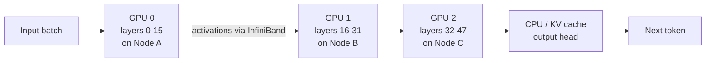

# Distributed Inference at Scale: Untangling Tensor Placement from Data Parallelism

_Model-parallel tensor allocation is the missing piece when one GPU can no longer hold the whole model._

**TL;DR**
- `device_map` is a model-parallelism primitive: it assigns layers or tensors to specific devices, unlike data-parallel strategies that replicate the full model on each GPU.
- Inter-node inference adds network latency between devices, so a placement plan must account for link bandwidth and memory balance, not just layer count.
- Most teams start with auto-placement, then refine with a manual map based on measured per-layer memory and activation sizes.

When a single transformer exceeds the memory of one accelerator, the usual tricks stop working. Batch aggregation, kernel fusion, and lower-precision dtypes help, but they cannot make a 70-billion-parameter model fit into 24 GB of VRAM. At that point the question becomes not *how* to run inference, but *where* to put each tensor so that the cluster behaves like one coherent machine.

The confusion often starts with terminology. Frameworks advertise “distributed strategy” as if it were one universal dial. In practice, distributed inference has two distinct modes. Data parallelism replicates the same weights across many devices and splits the request batch; each GPU performs an identical forward pass on a different slice of inputs. Model parallelism keeps one copy of the weights but splits the computation graph across devices, so no single card holds the entire model. The `device_map` pattern belongs to the second camp.

## Why does simply adding GPUs fail to speed up inference?

It fails because replication only helps when the model already fits on one device. Once you need model parallelism, throwing more GPUs at the problem without a placement plan merely creates new communication bottlenecks. Each layer’s output activations must travel from the device that computed them to the device that owns the next layer. If that hop crosses a network link rather than an NVSwitch or a PCIe switch, latency accumulates fast. The result is often worse throughput than a smaller, quantized model running on a single card.

Teams running distributed inference often see p99 latency roughly double when a tensor placement forces traffic across nodes instead of keeping it inside one NVLink domain. That is not a hardware failure; it is a placement failure. The goal of a `device_map` is to express the physical topology of the cluster directly in the model’s execution plan.

The original draft mixed this idea with `tf.distribute.MirroredStrategy`, which is misleading. MirroredStrategy replicates variables across devices for synchronous data-parallel training; it does not accept a dictionary that assigns individual layers to specific GPUs. For layer-wise placement, frameworks like Hugging Face Accelerate, PyTorch distributed, and vLLM’s pipeline-parallel scheduler expose the primitive under names such as `device_map` or `pipeline_parallel_size`.

## What does a `device_map` actually do?

It maps named modules to compute devices. Each entry in the map says, “these weights, and the forward pass for these layers, live on this GPU.” During inference the runtime keeps the weights pinned and streams only activations between stages.

A realistic multi-node setup might look like this:



The weights stay put. The data moves. That distinction matters because weights are large and static, while activations are smaller but generated every token. A good map therefore minimizes the cross-device traffic for activations while keeping the weight footprint under each device’s memory limit.

Here is an illustrative example using the Hugging Face Accelerate convention, which is where the `device_map` pattern appears in common practice:

```python
from transformers import AutoModelForCausalLM, AutoTokenizer
import torch

model_id = "meta-llama/Llama-3.1-8B-Instruct"
tokenizer = AutoTokenizer.from_pretrained(model_id)

# Auto placement across available accelerators and host memory.
model = AutoModelForCausalLM.from_pretrained(
    model_id,
    torch_dtype=torch.bfloat16,
    device_map="auto",
    max_memory={
        0: "20GiB",
        1: "20GiB",
        "cpu": "64GiB",
    },
)

# After loading, inspect where each layer landed.
for name, param in model.named_parameters():
    print(f"{name}: {param.device}")
```

Auto-placement is a useful first pass. It uses a greedy algorithm to fit layers into the largest available memory block. For production traffic, however, it is rarely the final answer. Auto-placement does not know your latency objective, your batch size distribution, or whether two nodes share a fast interconnect. Manual maps become necessary once profiling shows a particular layer boundary crossing a slow link.

A manual map might look like this:

```python
desired_device_map = {
    "model.embed_tokens": 0,
    "model.layers.0": 0,
    "model.layers.1": 0,
    # ... continue on same node to avoid inter-node hops ...
    "model.layers.15": 0,
    "model.layers.16": 1,
    "model.layers.17": 1,
    # ...
    "model.layers.31": 1,
    "model.norm": "cpu",
    "lm_head": "cpu",
}
```

Notice the CPU entries. Offloading the output embedding or normalization layer to host memory can keep a marginal model running when GPU memory is exhausted. The trade-off is bandwidth: a CPU stage is fast to execute but slow to transfer into and out of, so it works best for small tensors or low-throughput paths.

## The inter-node part is what makes this hard

Most documentation on `device_map` focuses on a single server with multiple GPUs. That hides the real engineering problem. In a multi-node cluster, the communication pattern changes from PCI Express or NVLink to RDMA over InfiniBand or Ethernet. Point-to-point tensor transfers between pipeline stages now consume network bandwidth that is also shared with checkpointing, logging, and data loading.

A placement that splits a model cleanly in half by layer count is not necessarily split correctly by traffic. Some layers produce much wider activations than others. A large attention output can be many megabytes per token when batch size grows. If that boundary happens to land on the slowest link in the cluster, latency spikes. Teams running high-throughput services usually profile per-layer memory and activation sizes first, then place boundaries where the product of transfer size and link latency is smallest.

Another subtlety is that `device_map` alone is pipeline parallelism, not tensor parallelism. In pipeline parallelism each layer is whole and lives on one device; stages execute sequentially. In tensor parallelism a single layer is sliced across devices, requiring all-reduce or all-gather inside the layer. Pipeline parallelism is easier to map to a `device_map`, but it suffers from pipeline bubbles and throughput limited by the slowest stage. Tensor parallelism avoids some of that latency but demands much faster interconnects. Production systems commonly combine both: tensor parallelism within a node and pipeline parallelism across nodes.

## When should teams reach for a custom device map?

Use it when the model cannot fit on a single GPU and simpler strategies are exhausted. Quantization, pruning, and attention approximations usually reduce memory more cheaply than a distributed placement does. Once those are insufficient, model-parallel placement becomes unavoidable.

A custom map also makes sense when the workload is predictable. If every request generates the same sequence length and uses a fixed batch size, the activation sizes are stable and a hand-tuned map can outperform auto-placement. For bursty or highly variable traffic, auto-placement with a memory ceiling is often safer because it adapts as queue depths change.

Do not expect `device_map` to fix throughput problems caused by attention head contention or inefficient kernels. It is a placement layer, not a compute optimizer. The gains come from fitting the model into memory and from aligning layer boundaries with fast links, not from making individual matmuls faster.

## Topics

- Distributed Inference
- Model Parallelism
- Device Placement
- GPU Memory Optimization
- PyTorch
- Hugging Face Accelerate
- High-Throughput ML Systems
- Inter-Node Communication