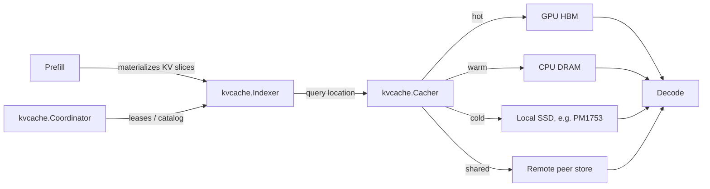

# KV Cache Sharing and Tiering for Real-Time Inference
**Patterns for indexing, storing, and coordinating tensor slices without keeping everything in GPU memory.**


**TL;DR**
- Real-time evaluation engines waste memory and compute when each request keeps its own private KV cache; splitting the cache into portable, addressable tensor slices lets the same prefix state be reused across requests.
- The LMCache pattern—an `Indexer` for slice lookup, a `Cacher` for tiered placement, and a `Coordinator` for ownership metadata—makes it practical to hold hot slices in HBM, warm slices in CPU memory, and cold slices on local SSD or a remote peer.
- Fast local NVMe such as the Samsung PM1753 changes the capacity/ latency trade-off for that cold tier, provided the indexing metadata stays off the request-critical path.

## Why does per-request KV cache allocation push inference latency up?

Because every prompt recomputes its attention keys and values from scratch and parks them in scarce GPU HBM, even when earlier tokens are identical to ones already processed by another request. That duplication inflates time-to-first-token during prefill and leaves less room for batching during decode. The KV cache itself is read-mostly after it is produced; its lifetime is tied to a request, not to a compute graph, so copying or evicting it should not require re-running the model.

Teams running long-context or high-throughput endpoints see this most clearly. A system prompt, a set of JSON tool schemas, or a retrieved document chunk may be identical across thousands of calls. Without a shared slice layer, each call treats those tokens as “new,” re-allocating HBM and recomputing the same K and V matrices. The workload has three clear traits:

- **Prefill writes, decode reads.** Keys and values are produced once for each token position during prefill and then consumed repeatedly during autoregressive decoding.
- **Temporal locality.** Recently used prefixes tend to be reused again soon; reuse distance matters more than exact age.
- **Layer-wise homogeneity.** The cache consists of one K/V pair per layer, so a slice can be indexed by layer and token span.

## How do we keep tensor slices consistent across CPU memory, local SSD, and remote workers?

Treat the KV cache as an immutable set of token-range slices keyed by layer and content address, and let a coordinator own placement metadata while readers pin only the slices they need. Immutability removes the hardest part of cache coherence: once a slice is materialized, no writeback is required. The only mutable state is the mapping from key to location, and that is small enough to keep in fast memory.

A natural slicing scheme divides the cache by layer and token range. For example, a slice for layer 7 covering tokens 0 through 511 is one addressable object. Its key can be `(layer_id, start_pos, end_pos, content_hash)`. On a cache hit, the engine looks up the location and moves the tensor into the GPU. On a miss, it recomputes the slice and registers it with the indexer. This design turns the KV cache from a monolithic per-request buffer into a distributed object store.

### The LMCache component pattern

The LMCache pattern separates concerns into three parts:

| Component | Purpose | Key responsibilities |
|-----------|---------|----------------------|
| `kvcache.Indexer` | Slice lookup | Maps a `(layer, token_range, hash)` key to a concrete storage location; answers hit/miss and version questions. |
| `kvcache.Cacher` | Tiered placement | Decides whether a slice lives in GPU HBM, CPU DRAM, local SSD, or a remote peer; runs eviction between tiers. |
| `kvcache.Coordinator` | Ownership metadata | Tracks which nodes own which slices, handles lease lifetimes, and reconciles the location catalog across workers. |

The diagram below shows how a request flows through those layers.



The decode phase can pull from any tier, but the common case is GPU HBM. CPU memory acts as a budget tier for recovered prefixes, local SSD holds less popular or longer-lived slices, and remote peers provide cross-server reuse. The coordinator keeps the catalog consistent; it does not move tensors on every token, which would be far too slow.

### A concrete slice-management sketch

The code below is intentionally simplified. It shows the shape of the API: a content-addressed indexer, an LRU-aware cacher, and a coordinator that records ownership. Real production code would handle quantization, serialization, error recovery, and memory pinning.

```python
from collections import OrderedDict
from dataclasses import dataclass
import hashlib
from typing import Optional, Tuple

@dataclass(frozen=True)
class SliceKey:
    layer_id: int
    start_pos: int
    end_pos: int
    prefix_hash: bytes  # e.g., SHA-256 of the input token IDs for this span

    def __repr__(self):
        return f"L{self.layer_id}:{self.start_pos}-{self.end_pos}"

class Indexer:
    def __init__(self):
        # key -> (location, owner_version)
        self.catalog: dict[SliceKey, Tuple[str, int]] = {}

    def register(self, key: SliceKey, location: str, version: int):
        self.catalog[key] = (location, version)

    def locate(self, key: SliceKey) -> Optional[Tuple[str, int]]:
        return self.catalog.get(key)

class Cacher:
    def __init__(self, cpu_capacity: int = 16, ssd_capacity: int = 256):
        # Simplified LRU in CPU DRAM as the warm tier
        self.cpu_cache: OrderedDict[SliceKey, object] = OrderedDict()
        self.cpu_capacity = cpu_capacity
        self.ssd_capacity = ssd_capacity
        self.ssd_bytes_used = 0

    def fetch(self, key: SliceKey) -> Optional[object]:
        if key in self.cpu_cache:
            self.cpu_cache.move_to_end(key)
            return self.cpu_cache[key]
        # In a real system: check GPU, then SSD, then remote
        return None

    def store(self, key: SliceKey, tensor: object, byte_size: int):
        while len(self.cpu_cache) >= self.cpu_capacity:
            evicted_key, evicted_tensor = self.cpu_cache.popitem(last=False)
            self._spill_to_ssd(evicted_key, evicted_tensor)
        self.cpu_cache[key] = tensor
        self.cpu_cache.move_to_end(key)

    def _spill_to_ssd(self, key: SliceKey, tensor: object):
        # Placeholder for asynchronous serialization to local NVMe
        self.ssd_bytes_used += 1  # illustrative bookkeeping
        print(f"spill {key} to SSD")

class Coordinator:
    def __init__(self):
        self.owners: dict[SliceKey, str] = {}
        self.version = 0

    def claim(self, key: SliceKey, node_id: str) -> int:
        self.owners[key] = node_id
        self.version += 1
        return self.version

def make_key(layer_id: int, start: int, end: int, token_bytes: bytes) -> SliceKey:
    h = hashlib.sha256(token_bytes).digest()[:8]
    return SliceKey(layer_id, start, end, h)

# Example: a prefix slice for layer 0, tokens 0-127
key = make_key(layer_id=0, start=0, end=127,
               token_bytes=b"system prompt: you are a helpful assistant")
indexer = Indexer()
cacher = Cacher()
coordinator = Coordinator()

version = coordinator.claim(key, node_id="worker-3")
cacher.store(key, tensor={"shape": "1,128,4096"}, byte_size=2 * 1024 * 1024)
indexer.register(key, location="cpu", version=version)

assert indexer.locate(key) == ("cpu", version)
```

The important idea is that the *key* is stable and immutable, while the *location* is metadata that changes as the cacher moves tensors between tiers.

## Where does fast local storage fit in?

The Samsung PM1753 is a useful reference point not because it is itself a KV cache, but because it represents the class of high-bandwidth local NVMe devices that can act as a spillover tier. When a slice’s reuse probability drops, the cacher can serialize it into CPU memory first and then to local SSD. Because read latency from local NVMe is orders of magnitude lower than going back to a remote peer or recomputing the layer from scratch, the cold tier becomes viable for long-lived prefixes.

The design risk is the index path: every lookup that blocks on the coordinator or touches the SSD during decode will erase the latency gains. The practical pattern is therefore:

1. Keep an in-memory catalog of all slice locations hot.
2. Prefetch likely slices into GPU HBM before decode starts.
3. Move evictions to CPU and SSD asynchronously, never on the token-critical path.
4. Fall back to recomputation if a slice has vanished—this is simpler and safer than blocking for a slow recovery.

## Operational considerations

A tiered KV cache is not free. Implementing it means accepting several trade-offs:

- **Serialization cost.** Moving a tensor from GPU to CPU or SSD consumes bandwidth and often requires quantization. FP8 or int8 KV cache can cut this cost, but it changes the model’s numerical behavior and must be validated.
- **Ownership lifetime.** When a request finishes, its slices may still be useful to others. Use reference counting or TTLs so slices are not pinned forever, but do not evict aggressively when prefix reuse is high.
- **Failure handling.** A missing slice is not a correctness failure if the engine can recompute it; it is only a latency failure. Design for recompute fallback from the start.
- **Capacity planning.** The working set of hot prefixes must fit in the fast tiers. Monitor hit rate by layer and by token span, not just aggregate cache hit rate.

## Topics

- KV cache
- LLM inference optimization
- Tensor slicing
- Distributed systems
- LMCache pattern
- Real-time AI workloads
- Local NVMe storage
- Caching architecture
- Memory tiering
- Machine learning systems engineering