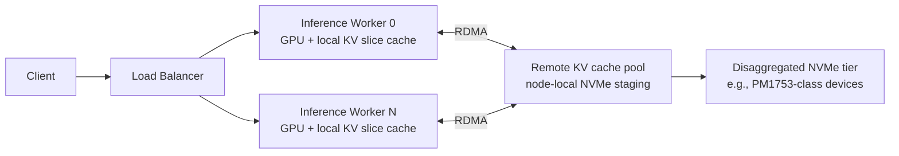

# KV Cache Tensor Slicing in Distributed Inference


**Coordinating key-value tensor placement across GPU workers so real-time inference stays memory-bound, not network-bound.**

<p><strong>TL;DR</strong></p>

- In distributed LLM inference, the KV cache is often larger than the model weights and must follow the right tensor-parallel rank at the right time; poor coordination turns a compute problem into a data-movement problem.
- Treating KV tensors as versioned slices — keyed by request, layer, and rank — lets teams share cache safely across workers without recomputing prefixes or corrupting tensor-parallel state.
- Fast RDMA fabrics and disaggregated NVMe tiers can extend the cache, but they only help when the slicing and routing logic understands the model’s parallelism layout.

Inference clusters do not just serve tokens; they serve tensors that keep growing. In a transformer model, the key-value (KV) cache stores the keys and values computed for every token in a sequence so far. During decoding, those tensors are read back and concatenated with new keys and values for the latest token. The operation is simple in principle, but at production scale the cache can outgrow the model itself. A 70B-parameter model serving 4k-token contexts can easily carry multi-gigabyte KV tensors per request. When that request is distributed across eight GPUs in tensor-parallel configuration, each GPU owns a slice — and every slice must be in the right place before the next attention layer runs.

The goal of a next-generation KV cache architecture is not merely to store more bytes. It is to track, route, and evict tensor slices so that no GPU waits on data it should already have.

## Why does KV cache movement dominate distributed inference latency?

Because the key and value tensors for every layer must either be recomputed or fetched to the GPU that needs them next, and both options hit the memory wall.

Recomputing the full KV state from scratch during autoregressive decoding is prohibitively expensive. Caching is mandatory. But once caching is mandatory, every cache miss becomes a network or PCIe event. In a tensor-parallel deployment, the attention heads for a single layer are split across ranks. A rank that generates a new token needs the KV tensors corresponding to its assigned heads. If those tensors were produced by a different worker — or if they were evicted to make room for another request — the runtime must move them back into device memory. The cost is not the FLOPs of the transfer; it is the serialization, synchronization, and allocation jitter that delay the CUDA kernel launch.

The situation worsens when requests share a prefix. Long-context chat agents, retrieval-augmented generation, and batched code-completion prompts all start from similar system prompts or retrieved documents. Without prefix-aware KV sharing, every worker recomputes the same initial KV slices for every request. With sharing, the first few hundred or thousand tokens are computed once and reused. The architectural challenge is identifying which slice lives where and ensuring that reuse does not violate the tensor-parallel boundary.

## How should a KV cache layer manage tensor slices across workers?

By treating each slice as a versioned, addressable object keyed by request, layer, and tensor-parallel rank, and by routing lookups through a coordination layer that understands the model’s parallelism strategy.

A tensor slice is not an opaque byte blob. It has structure: a request identifier, a layer index, a rank, a sequence range, a dtype, and a shape. The cache layer must know which ranks own which heads, which sequence positions are valid for reuse, and which slices can be evicted without stalling an active decode. Concretely, this means cache keys encode the parallelism layout, and cache lookups are scoped to the worker asking the question.

The following Python sketch shows a minimal tensor-slice cache manager. It is intentionally simplified — real systems use RDMA transfers, pinned host buffers, and asynchronous eviction queues — but it captures the central idea: slices are addressable by their logical coordinates, not by raw memory offsets.

```python
import torch
from collections import OrderedDict
from dataclasses import dataclass

@dataclass(frozen=True)
class KVKey:
    """Logical address of one KV-cache slice."""
    request_id: str
    layer_id: int
    rank: int              # tensor-parallel rank that owns this slice
    seq_range: tuple       # inclusive start, exclusive end

class TensorSliceCache:
    def __init__(self, max_entries: int, device: str = "cpu"):
        self.max_entries = max_entries
        self.device = device
        # OrderedDict gives LRU eviction with O(1) move-to-end.
        self.cache: OrderedDict[KVKey, torch.Tensor] = OrderedDict()

    def get(self, key: KVKey) -> torch.Tensor | None:
        if key not in self.cache:
            return None
        self.cache.move_to_end(key)
        return self.cache[key]

    def put(self, key: KVKey, tensor: torch.Tensor):
        if key in self.cache:
            self.cache.move_to_end(key)
        # In production this would copy to pinned memory or RDMA buffer.
        self.cache[key] = tensor.to(self.device, non_blocking=True)
        while len(self.cache) > self.max_entries:
            self.cache.popitem(last=False)

    def reusable_slices(
        self,
        request_id: str,
        layer_id: int,
        rank: int,
    ) -> list[tuple[tuple, torch.Tensor]]:
        """Return all locally stored slices for a given logical coordinate."""
        return [
            (key.seq_range, tensor)
            for key, tensor in self.cache.items()
            if key.request_id == request_id
            and key.layer_id == layer_id
            and key.rank == rank
        ]
```

The key design detail is `KVKey`. By naming slices through `(request_id, layer_id, rank, seq_range)`, the cache separates storage from placement. The inference engine can ask, “I am rank 3, layer 12, decoding request A at token positions 0..511; do I already have that slice locally?” If yes, the engine avoids a network round trip. If not, it can look up a remote cache or fall back to recomputation. Without that logical addressing, the runtime would have to guess which physical buffer corresponds to which heads.

## What does the architecture look like?

A modern cluster usually layers three tiers: the per-GPU device cache, a node-local staging area, and a remote pool reachable over RDMA. The diagram below shows the flow. Clients enter through a load balancer, which routes requests to inference workers. Each worker holds its own tensor-parallel slice of the model and its corresponding local KV cache. When a slice is missing locally, the worker queries other workers or a remote pool over the RDMA fabric. A disaggregated NVMe tier acts as a cold store for prefixes and evicted slices.



InfiniBand matters here because cache movement is latency-sensitive and bursty. A single prefix lookup can require many small tensor slices from many workers. RDMA lets one worker read another worker’s memory with minimal CPU involvement, which keeps the throughput high and tail latency from ballooning. But RDMA is not a correctness mechanism; it is a transport. Correctness depends on the slicing metadata and on keeping the tensor-parallel layout consistent across cache hits and misses.

Disaggregated storage enters the picture when the working set exceeds GPU and host memory. Devices like the Samsung PM1753 are referenced in cluster designs as high-throughput NVMe tiers that can hold colder cache slices while compute nodes remain stateless. The trade-off is straightforward: local device memory gives microsecond access, RDMA between nodes gives roughly tens of microseconds to a few milliseconds, and NVMe gives higher throughput but higher latency. A well-designed cache manager keeps hot prefixes in GPU memory, warm prefixes in host memory or remote node caches, and long-tail prefixes on NVMe.

## Where does LMCache fit in?

LMCache is one example of an open-source effort that applies these ideas to inference engines. It stores KV tensors outside the inference engine process, allowing workers to share prefixes and evicted slices across nodes. The important point is not the specific tool but the pattern: separating KV-cache management from inference scheduling. When the cache layer owns placement and eviction, the inference engine can focus on scheduling and execution. Teams using this pattern typically see better GPU utilization because less time is spent recomputing shared prefixes, and memory pressure drops because the cache can spill to cheaper tiers.

## What should teams watch out for?

Metadata overhead is the first hidden cost. Every slice needs a key, shape, dtype, version, and ownership information. In a long-context workload, the number of slices can be large, so the metadata store itself must be fast and memory-efficient.

Eviction policy is the second concern. A simple LRU works for homogeneous workloads, but inference workloads are not homogeneous. Decode batches, chunked prefills, and prefix-sharing requests compete for the same memory. A production cache often needs tiered eviction: protect active decode slices, preferentially keep widely shared prefixes, and spill single-request history first.

Finally, correctness across tensor parallelism cannot be an afterthought. If two workers disagree about which rank owns head 17, the attention output is silently wrong. The cache key must encode the parallelism strategy, and lookup paths must reject slices whose metadata does not match the current model configuration.

## Closing

Efficient KV caching in distributed inference is ultimately a coordination problem disguised as a memory problem. The tensors are large, but the real cost is knowing where each slice belongs and getting it there before the next layer starts. A good architecture names slices by their logical coordinates, keeps hot data close to the GPU, spills colder data to RDMA-accessible or NVMe-backed tiers, and never lets cache reuse violate the tensor-parallel boundary. The code sketch and patterns here are a starting point; production systems will add asynchronous prefetch, RDMA-bypass paths, and workload-aware eviction. The underlying principle remains the same: coordinate the slices, and the clusters stay fast.

## Topics

`kv-cache` `distributed-inference` `tensor-parallelism` `llm-serving` `rdma` `disaggregated-storage` `memory-optimization` `real-time-inference`