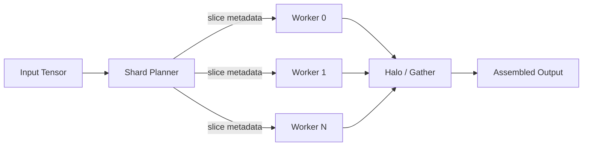

# Tensor Slicing Coordination in Distributed Inference


## Keeping sharded tensors consistent when a single accelerator is not enough

**TL;DR**
- Distributed inference only works when the slicing layer knows where every logical tensor index lives and how its neighbors overlap.
- The coordination problem is less about partitioning the data and more about managing shard boundaries, gather/reduce semantics, and deterministic ordering.
- A small driver that records per-shard metadata and validates boundary stitching can prevent the silent shape-correct but value-wrong errors that dominate large-model serving.

---

Running a modern large model on a single GPU or TPU is often impossible; even when it fits, batching large enough to saturate memory can destroy latency. Distributed inference solves this by spreading weights, activations, or both across a cluster of workers. The catch is that splitting a tensor is easy; making sure every slice, halo, and partial result reaches the right destination at the right time is not. That is the job of tensor slicing coordination.

## Why does tensor slicing coordination matter?

Inference throughput is bounded by the slowest communication step, not the fastest kernel.

In the simplest form of data parallelism, every worker holds a full copy of the model and processes a slice of the batch. The only coordination is averaging gradients during training or aggregating outputs during inference. Once you move to model parallelism or tensor parallelism, the model itself is sliced: each worker owns a subset of weights or a subset of the hidden dimension. An activation tensor is cut along a shard axis, transformed on one or more devices, and then reassembled. If the slicing layer loses track of padding, overlap, or the difference between element-wise and reduction gathers, the result will have the correct shape but the wrong values.

Teams running distributed inference often see p99 latency roughly double when a coordination step blocks on a straggler. That straggler is usually not a slow matmul; it is a worker waiting for a boundary slice that was sent to the wrong rank or gathered before it was ready. Fixing the partition plan without fixing the metadata that describes the partition is the most common root cause.

## What does the coordination layer actually do?

It translates logical tensor coordinates into physical device addresses and resolves the seams between slices.

A useful way to think about this is to separate three responsibilities:

1. **Sharding policy.** Decide which dimension to slice and how many chunks to create. This is driven by the model architecture: slicing the sequence dimension works well for long-context transformers, while slicing the hidden dimension is common for feed-forward layers.
2. **Boundary bookkeeping.** Record which regions overlap, which are padding, and which need to be exchanged before a downstream operation. Overlapping windows are common in convolutional-style workloads; attention-style workloads often need all-gather or reduce-scatter across sequence shards.
3. **Assembly rule.** Define how partial outputs combine into the final logical tensor. This might be a simple concatenation, a sum over replicated regions, or a weighted reduction.



The planner in the middle is small, but everything downstream depends on it. If it assigns the wrong offset to Worker 1, the gather step will join two unrelated pieces of the tensor.

## Why do silent failures outnumber crashes?

Because shape-correct tensors with wrong values are hard to detect.

A crashed worker produces logs and a clear signal. A boundary misalignment usually does not. The tensor retains the expected rank and dtype; only the logits, embeddings, or generated tokens are subtly corrupted. Several patterns cause this:

- **Off-by-one halo widths.** When slices overlap by one token or one spatial unit, the coordinator must know whether to copy, average, or leave that boundary intact. A mismatch between the slicer and the gatherer erases or duplicates information at the seam.
- **Non-deterministic gather ordering.** In frameworks that do not guarantee the order of asynchronous collectives, two workers may write into the same output buffer in different runs. The result is numerically inconsistent across replicas, which is especially painful for batched inference that expects bitwise-identical outputs for repeated requests.
- **Padding that looks like data.** When tensors are padded to a friendly shard size, the coordinator must mask out padding before reduction. Treating padding as zeros during a sum is not always the same as ignoring it during a mean or max.
- **Mixed precision at boundaries.** A boundary slice may be cast to a different dtype for communication and then cast back. If each worker applies the cast independently, rounding can diverge where tensors are joined.

The safest defense is to separate the slicing metadata from the compute code and validate it. A unit test that reassembles a slice and checks against the original tensor catches many of these errors before they reach a multi-node job.

## A pattern for robust slicing

The pattern is a coordinator that owns the partition map and exposes `scatter`, `compute`, and `gather` primitives, leaving the backend-specific ops to the workers.

```python
import torch
import torch.distributed as dist
from dataclasses import dataclass

@dataclass
class ShardSpec:
    rank: int                # which worker owns this shard
    global_offset: tuple      # logical start index in the full tensor
    local_shape: tuple        # shape of the shard stored on this worker
    overlap: tuple            # halo cells on each boundary axis
    reduction: str | None     # "sum", "mean", "cat", or None

class TensorCoordinator:
    def __init__(self, world_size: int, shard_axis: int):
        self.world_size = world_size
        self.shard_axis = shard_axis
        self.shards: dict[int, ShardSpec] = {}

    def plan(self, global_shape: tuple) -> None:
        axis_len = global_shape[self.shard_axis]
        chunk = axis_len // self.world_size
        for r in range(self.world_size):
            start = r * chunk
            stop = axis_len if r == self.world_size - 1 else start + chunk
            overlap_prev = 1 if r > 0 else 0
            overlap_next = 1 if r < self.world_size - 1 else 0
            local_len = stop - start + overlap_prev + overlap_next
            local_shape = list(global_shape)
            local_shape[self.shard_axis] = local_len
            self.shards[r] = ShardSpec(
                rank=r,
                global_offset=[0] * len(global_shape),
                local_shape=tuple(local_shape),
                overlap=(overlap_prev, overlap_next),
                reduction=None,  # inference: usually cat or mean over overlap
            )
            self.shards[r].global_offset[self.shard_axis] = (
                start - overlap_prev
            )

    def local_slice(self, tensor: torch.Tensor, rank: int) -> torch.Tensor:
        spec = self.shards[rank]
        slc = [slice(None)] * tensor.ndim
        slc[self.shard_axis] = slice(
            spec.global_offset[self.shard_axis],
            spec.global_offset[self.shard_axis] + spec.local_shape[self.shard_axis],
        )
        return tensor[tuple(slc)]

    def assemble(self, local_outputs: dict[int, torch.Tensor]) -> torch.Tensor:
        # Example: strip halos and concatenate along the shard axis
        cleaned = []
        for r in sorted(local_outputs):
            spec = self.shards[r]
            t = local_outputs[r]
            slc = [slice(None)] * t.ndim
            slc[self.shard_axis] = slice(spec.overlap[0], t.shape[self.shard_axis] - spec.overlap[1])
            cleaned.append(t[tuple(slc)])
        return torch.cat(cleaned, dim=self.shard_axis)

# Illustrative usage on a single node with four logical workers
if __name__ == "__main__":
    coord = TensorCoordinator(world_size=4, shard_axis=-1)
    global_tensor = torch.randn(2, 1024)
    coord.plan(global_tensor.shape)

    shards = {
        r: coord.local_slice(global_tensor, r) for r in range(coord.world_size)
    }

    # Each worker would run its part of the model here.
    local_results = {r: 2.0 * shards[r] for r in shards}

    assembled = coord.assemble(local_results)
    assert torch.allclose(assembled, 2.0 * global_tensor)
```

This code is deliberately backend-agnostic. It does not replace `torch.distributed` Tensor Parallel or vLLM's model parallelism; it sits next to them and forces the boundary contract to be explicit. In a real deployment, the `local_results` dictionary would be populated by RPC, collective communication, or a pipeline stage scheduler, but the assembly logic would stay the same.

## Closing

Distributed inference is as much a coordination problem as a compute problem. Tensor slicing gets the model to fit across devices, but slicing coordination determines whether the output is correct, repeatable, and fast. The work pays off in predictable latency, fewer baffling accuracy regressions, and the ability to scale past the memory of any single accelerator without guessing where the seams are.

Invest in the metadata layer early. A clear shard specification, validated assembly rules, and tests that reconstruct the full tensor from slices will save far more time than chasing boundary bugs in production.

## Topics

distributed inference · tensor parallelism · model parallelism · machine learning infrastructure · low-latency serving · ML systems · sharding strategies