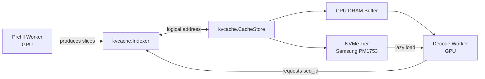

# KV Cache as a Portable, Tiered Asset: Coordinating Tensor Slices for Distributed Inference
*A slice-aware indexing layer lets key-value cache state move across GPU memory, CPU DRAM, and fast local storage without losing semantic identity.*


**TL;DR**
- KV cache state can be treated as a relocatable asset rather than a fixed per-device buffer. By representing each layer or sequence block as an addressable `TensorSlice`, teams can serialize, relocate, and restore cache contents between prefill workers, decode workers, CPU memory, and fast NVMe storage.
- A thin coordination layer made up of `Indexer`, `CacheStore`, and `TensorSlice` metadata decouples cache contents from where they are materialized, enabling session migration, incremental check-pointing, and memory-spill without rebuilding attention state.
- Keep hot state in the fastest tier that needs it right now; keep colder state compressed, indexed, and ready to reload on demand.

In transformer inference, the key-value cache is state. Once prefill has computed keys and values for a prefix, recomputing them for every new token is prohibitively expensive. That makes the KV cache a first-class optimization target: it has to be fast, precise, and—at scale—large. As context length, batch size, and model dimension grow together, even multi-GPU nodes eventually hit a wall.

The natural next step is to stop treating the KV cache as a fixed per-device buffer and start treating it as a shareable, tiered asset. Instead of one monolithic `k_cache` / `v_cache` tensor that lives wherever the model happens to run, the cache is broken into addressable slices. Some slices stay on device for immediate decode. Others move to CPU DRAM as a warm buffer. Still others spill to fast local NVMe, such as the Samsung PM1753, for later retrieval. The goal is not to replace GPU memory; it is to extend the addressable footprint of the cache by giving each slice a stable identity independent of its current location.

## Why does a KV cache need to leave GPU memory?

Because batch, sequence, and model-size growth routinely outpace on-device capacity, and because different phases of inference have different locality needs. Prefill is compute-heavy and tends to run briefly on a specialized worker; decode is memory-bandwidth-heavy and may run for many tokens across a different set of workers. When those phases run on different hosts, the cache has to travel with the request.

Even within a single node, monolithic per-device caches create pressure. Once the working set of long-context conversations nears device memory limits, teams are forced to choose between reducing batch size (lower throughput), quantizing cache entries (possible accuracy loss), or evicting context entirely (higher latency on re-prompt). A portable slice design offers a fourth option: move the slices that are not immediately needed to a lower tier, keep the metadata in a fast index, and pull them back when the same sequence resumes.

The PM1753 matters here as a reference point because a high-throughput PCIe Gen5 NVMe SSD can serve as a local persistence tier that is faster than network storage and cheaper than adding GPU HBM. It is not a replacement for device memory, but it is a practical place to park cache slices that are unlikely to be accessed in the next few decode steps. The pattern also helps reliability: a shareable cache can be check-pointed, migrated away from a failing node, or handed off when a serving instance is scaled down. Without slice-level identity, that handoff requires recomputing attention from scratch, which is often unacceptable for long-context applications.

## How does tensor slicing coordination make the cache portable?

By decomposing the cache into small, metadata-tagged units. Each unit, represented as a `TensorSlice`, records where it belongs semantically—request ID, layer, head group, sequence span, generation version—so that it can be serialized, moved, and reassembled correctly elsewhere. The `Indexer` owns the namespace; the `CacheStore` owns the placement. When a decode worker needs a slice, it asks the `Indexer`, which resolves the logical address to whatever physical location the `CacheStore` is currently using.

The slice size itself is a tradeoff. Smaller slices create finer placement control and smaller serialization units, but they inflate metadata volume. Larger slices reduce metadata overhead, but they waste bandwidth when only a small part of the slice is needed. In practice, slices are often aligned to sequence blocks or layer groups, so a worker can fetch exactly the context window it needs without unmarshalling the entire history.

| Component | Purpose | Implementation notes |
|---|---|---|
| `kvcache.Indexer` | Logical-to-physical map, orchestrates slice coordination | Persistent hash table or in-memory tree keyed by `(request_id, layer, seq_span)` |
| `kvcache.CacheStore` | Placement and retrieval across tiers | DRAM buffer pool with optional spill-to-NVMe; manages eviction and compression |
| `kvcache.TensorSlice` | Addressable cache unit | Lightweight metadata plus a reference to tensor data; supports serialize/restore |



This separation of concerns is the core of the architecture. The `Indexer` should be fast enough to track thousands or millions of slices per node. The `CacheStore` decides whether a slice is resident, evicted, compressed, or currently being fetched from NVMe. The `TensorSlice` provides the common data contract so that any of those locations can interpret the bytes correctly.

### Implementation Pattern

The Python example below is intentionally simplified—no GPU kernels, no lock-free queue, no compression—but it captures the relationships that matter: metadata identity, tiered storage, and round-trip serialization.

```python
import dataclasses
import pickle
from pathlib import Path
from typing import Dict, Optional
import numpy as np


@dataclasses.dataclass
class TensorSlice:
    """Addressable unit of KV cache state."""
    request_id: str
    layer: int
    seq_start: int
    seq_end: int
    data: Optional[np.ndarray] = None
    location: str = "none"  # "dram" | "nvme" | "none"

    def serialize(self) -> bytes:
        payload = {
            "request_id": self.request_id,
            "layer": self.layer,
            "seq_start": self.seq_start,
            "seq_end": self.seq_end,
            "data": self.data,
        }
        return pickle.dumps(payload, protocol=5)

    @classmethod
    def deserialize(cls, raw: bytes) -> "TensorSlice":
        payload = pickle.loads(raw)
        return cls(
            request_id=payload["request_id"],
            layer=payload["layer"],
            seq_start=payload["seq_start"],
            seq_end=payload["seq_end"],
            data=payload["data"],
            location="dram",
        )


class CacheStore:
    """Two-tier store: CPU DRAM with spill-to-NVMe."""
    def __init__(self, nvme_root: Path, max_dram_bytes: int = 8_000_000_000):
        self.dram: Dict[str, np.ndarray] = {}
        self.nvme_root = nvme_root
        self.nvme_root.mkdir(parents=True, exist_ok=True)
        self.max_dram_bytes = max_dram_bytes
        self._current_bytes = 0

    def _key(self, s: TensorSlice) -> str:
        return f"{s.request_id}/layer{s.layer}/{s.seq_start}_{s.seq_end}"

    def store(self, s: TensorSlice) -> str:
        key = self._key(s)
        size = s.data.nbytes if s.data is not None else 0

        if self._current_bytes + size <= self.max_dram_bytes:
            self.dram[key] = s.data
            s.location = "dram"
            self._current_bytes += size
        else:
            path = self.nvme_root / key
            path.parent.mkdir(parents=True, exist_ok=True)
            with open(path, "wb") as f:
                f.write(s.serialize())
            s.location = "nvme"
        return key

    def retrieve(self, s: TensorSlice) -> np.ndarray:
        key = self._key(s)
        if key in self.dram:
            return self.dram[key]

        path = self.nvme_root / key
        restored = TensorSlice.deserialize(path.read_bytes())
        return restored.data


class Indexer:
    """Namespace and lifecycle coordinator."""
    def __init__(self, store: CacheStore):
        self.store = store
        self.slice_map: Dict[str, TensorSlice] = {}

    def add_slice(self, slice_id: str, s: TensorSlice):
        self.store.store(s)
        self.slice_map[slice_id] = s

    def get_slice(self, slice_id: str) -> Optional[TensorSlice]:
        meta = self.slice_map.get(slice_id)
        if meta is None:
            return None
        # Materialize from wherever CacheStore placed it.
        meta.data = self.store.retrieve(meta)
        return meta


# --- Example: moving a slice from prefill output to decode input ---
store = CacheStore(nvme_root=Path("/var/kvcache"), max_dram_bytes=1_000_000_000)
indexer = Indexer(store)

# Prefill produces a KV block for one layer and sequence range.
kv = np.random.randn(8, 4096, 128).astype(np.float16)  # heads, length, head_dim
slice_id = "conv_42_layer7"
block = TensorSlice(
    request_id="conv_42", layer=7, seq_start=0, seq_end=4096, data=kv
)

indexer.add_slice(slice_id, block)

# Later, possibly on another host, decode asks for the same block.
recovered = indexer.get_slice(slice_id)
print(recovered.data.shape)  # (8, 4096, 128)
```

### Operational Tradeoffs

Three practical concerns shape how this pattern is deployed.

**Indexing overhead.** A slice map with millions of entries must be memory-efficient and crash-safe. Rebuilding it from NVMe after a restart can take time, so durable metadata logs or periodic snapshots are usually worth the complexity.

**Tiering policy.** Not every slice belongs on disk. A simple least-recently-used eviction policy will thrash under bursty decode patterns. Most production systems layer a lightweight predictor or request-locality hint on top of the `CacheStore`.

**Serialization format.** The example uses `pickle` for clarity. In production, slices are typically serialized into zero-copy or zero-allocation formats—flat buffers, protocol buffers, or CUDA-host-mapped regions—to avoid interpreter overhead and to support direct device-to-storage paths where the hardware allows it.

## Topics

KV Cache, LLM Inference, Distributed Systems, Tensor Slicing, Memory Tiering, NVMe Storage, Prefill-Decode Separation, Model Serving, Systems Engineering