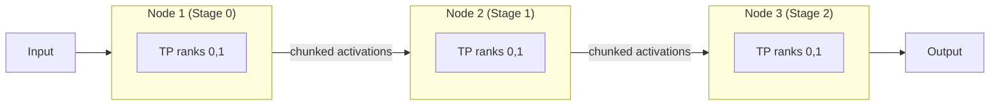

# Multi-Node Pipeline Parallelism for Low-Latency Inference: A Pragmatic Guide


**How tensor slicing coordination and hardware-aware stage placement shape real-time evaluation engines**

**TL;DR**
- Pipeline parallelism splits a model into sequential stages across nodes; it scales throughput but usually adds latency per stage, so it is most useful when the alternative—more tensor parallelism—would saturate the interconnect.
- Tensor slicing coordination keeps stage-to-stage activation transfers aligned with the batch and sequence dimensions, which avoids memory spikes and unnecessary collective operations.
- The right TP/PP split is a function of interconnect bandwidth, batch size, and context length—not a fixed ratio.

Real-time evaluation engines for large language models live in a narrow design space. They need enough memory to hold long contexts, enough compute to run attention and feed-forward layers quickly, and an interconnect fast enough that communication does not dominate the forward pass. No single GPU satisfies all three at scale, so teams combine tensor parallelism (TP) inside a layer with pipeline parallelism (PP) across layers.

Pipeline parallelism is conceptually simple: place early layers on one node, later layers on another, and pass activations between them. In practice, the simplicity disappears the moment the batch size, sequence length, or number of stages grows. The hard part is not the idea; it is the bookkeeping.

## Why does pipeline parallelism add latency even when throughput scales?

Because a forward pass must now travel through a chain of devices instead of one.

In tensor parallelism, a single layer is split across multiple devices. Those devices work in parallel and synchronize with an all-reduce. If the interconnect is fast, the latency cost is small. In pipeline parallelism, each layer group is executed on a different device, and the devices operate sequentially for any single request. That sequential traversal adds end-to-end latency.

The benefit is throughput and memory. Pipeline stages can run on nodes with slower links because they only need point-to-point transfers between neighbors. They also require less all-reduce traffic than a heavily tensor-parallel configuration. For long-context serving with large batches, PP is often the only way to fit the model without paying for an all-NVLink cluster.

The usual mistake is treating PP as a drop-in fix for memory pressure. Adding a stage always increases the critical path. The design question is whether the extra latency is smaller than the latency saved by avoiding a larger TP group.

## How should teams choose between tensor and pipeline parallelism?

The short answer: use TP when the interconnect is fast and PP when it is not.

Tensor parallelism keeps latency low because every layer finishes in roughly one hop. The cost is collective communication. Each layer’s forward pass needs at least one all-reduce, and the volume of that reduction scales with the activation size. On NVLink or InfiniBand, the reduction latency is small. On slower fabric, it becomes the dominant term, and p99 latency can climb sharply as the TP degree grows.

Pipeline parallelism avoids the all-reduce storm by turning communication into point-to-point sends between adjacent stages. Those sends happen once per microbatch and operate on activations rather than gradients. The downside is the bubble: while stage *i* is processing microbatch *k*, stage *i+1* may be idle or processing a different microbatch. Good schedulers—such as interleaved 1F1B and zero-bubble variants—can hide much of this, but they cannot remove the intrinsic sequential dependency between stages for a single request.

A useful heuristic:

- **High-bandwidth interconnect, small batch** → favor TP.
- **Moderate interconnect, large batch or long context** → favor PP, possibly with microbatching to fill the pipe.
- **Neither alone is enough** → combine them: PP across nodes, TP inside a node.

The following diagram shows a model split into pipeline stages, each of which may contain a tensor-parallel subgroup:



Here the vertical TP slices live on the same high-bandwidth node, while the horizontal PP stages communicate across a slower but still adequate fabric.

## What does tensor slicing coordination actually coordinate?

It coordinates what gets sent, when, and in what shape.

When a pipeline stage finishes, it emits activations shaped roughly like `(batch, seq, hidden)` or `(num_tokens, hidden)`, depending on the attention layout. The next stage may need those activations rearranged: chunked by sequence length for context parallelism, split by batch dimension for microbatching, or kept whole if memory allows. Tensor slicing coordination is the layer that performs that split and schedules the transfer so that the receiver can consume the data without an extra copy or reshape.

Key considerations:

- **Alignment with microbatches**: Sending one giant tensor stalls the receiver until the full forward pass is done. Chunking along the batch dimension lets stages overlap computation and communication.
- **Avoiding redundant collectives**: If a tensor is already sharded inside a TP group, the PP transfer should only move the local slice, not a reconstructed full tensor. Re-materializing the full tensor doubles memory and defeats the purpose of the shard.
- **Sequence-length variation**: Real-time evaluation engines often see variable-length requests. A coordination function that assumes a static shape will waste memory on padding or crash on overflow. Dynamic padding and shape metadata are essential.

The code below is not production-grade, but it illustrates the pattern: a pipeline stage finishes its local computation, slices the output by microbatch, and schedules sends to the next stage. The destination rank is computed from the PP grid.

```python
import torch
import torch.distributed as dist

WORLD_SIZE = 8          # 4 PP stages x 2 TP ranks per stage
PP_SIZE = 4
TP_SIZE = 2
pp_rank = dist.get_rank() // TP_SIZE
tp_rank = dist.get_rank() % TP_SIZE
next_pp_rank = (pp_rank + 1) % PP_SIZE
prev_pp_rank = (pp_rank - 1) % PP_SIZE

def forward_stage(local_module, hidden_states, num_microbatches: int):
    """
    local_module: executes this stage's layers on the local TP shard.
    hidden_states: either the model input (stage 0) or activations from prev stage.
    """
    # 1. Run the local layer group on the TP-sharded input.
    out = local_module(hidden_states)          # shape: (B, S, H // TP_SIZE)

    # 2. All-reduce inside the TP group so each rank owns the full activation slice.
    #    (Alternative: reduce-scatter to keep it sharded if the next stage expects that.)
    dist.all_reduce(out, group=tp_group)

    if pp_rank == PP_SIZE - 1:
        return out

    # 3. Split the batch dimension into microbatches for pipelining.
    microbatches = torch.chunk(out, chunks=num_microbatches, dim=0)

    # 4. Send each microbatch to the next PP stage.
    next_dst = next_pp_rank * TP_SIZE + tp_rank
    for mb in microbatches:
        # In practice, use dist.isend / irecv and pair them with compute.
        dist.send(mb, dst=next_dst)

    return None
```

A few details worth noting. First, `all_reduce` inside the TP group is often the right call when the next PP stage expects complete activations. If the next stage instead accepts sharded inputs, use `reduce_scatter` and skip the broadcast step. Second, `dist.send` blocks in this example; a real engine would pair sends with `isend` and schedule them around the backward pass. Third, edge cases—first stage has no incoming activation, last stage has no outgoing—must be handled explicitly to avoid deadlocks.

## Memory, Bubbles, and the Choice of Scheduler

The scheduler matters more than the diagram suggests. A naive round-robin forward pass leaves every downstream stage idle while the first microbatch works its way through, which wastes compute. Interleaved 1F1B improves this by keeping the forward and backward passes tightly coupled, and recent zero-bubble schedules remove more of the idle time by reordering the weight gradient computation.

Teams should also watch memory at stage boundaries. Activations that sit waiting for the next stage consume GPU memory until they are consumed. Chunking by microbatch limits the size of that buffer, but it does not eliminate it. The coordination function should free or reuse buffers as soon as the transfer completes.

## Putting it together

There is no universal PP/TP recipe. The best configuration depends on the hardware budget, the input distribution, and the latency target. Teams running distributed inference often see that moving from 8-way TP to 4-way TP plus 2 PP stages lowers p99 latency when the cross-node fabric is faster than the all-reduce saturation point would suggest. Conversely, adding a third or fourth PP stage usually begins to hurt single-request latency unless the batch is large enough to keep every stage busy.

Tensor slicing coordination is the glue that makes those transitions possible. It determines whether activations arrive in the shape the next stage expects, whether memory stays bounded, and whether the communication time hides inside the compute time.

The goal is not to eliminate every millisecond of overhead; it is to make the overhead predictable and smaller than the compute the system is buying.

## Topics

`machine-learning` · `distributed-systems` · `pipeline-parallelism` · `tensor-parallelism` · `llm-inference` · `low-latency-systems` · `pytorch` · `gpu-computing`