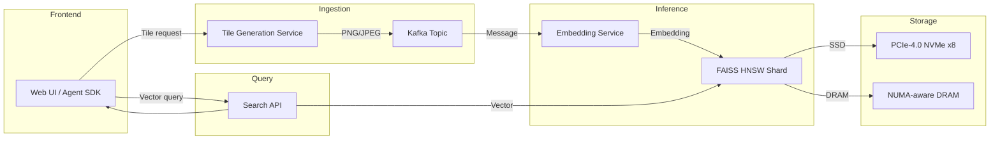

# Scaling Voygr’s Maps API for Agent‑Powered AI Applications  
*Subtitle: A production‑grade deep dive into distributed model deployment, I/O bottlenecks, and profiling on modern data‑center hardware*  
*Image generated via Midjourney by the author*  

---  

## 1. System Overview  

Voygr’s “better maps API” serves geospatial embeddings to autonomous agents and LLM‑backed assistants. The service runs a pipeline of three logical layers:

1. **Tile‑generation micro‑service** – rasterizes vector data into 256 × 256 tiles.  
2. **Embedding inference service** – a transformer‑based model that converts tile pixels into dense vectors (≈ 768‑dim).  
3. **Vector‑search back‑end** – FAISS‑HNSW index sharded across 8 nodes.

The data‑flow can be expressed as a directed graph:



The diagram highlights two critical cross‑layer links:  

* **PCIe‑4.0 x8** between the inference GPU and the NVMe tier.  
* **100 GbE** between the FAISS shards and the query front‑ends.

---  

## 2. Distributed Model Deployment Bottlenecks  

### 2.1. Model Sharding vs. Network Latency  

Voygr’s embedding model (≈ 2.3 B parameters) is too large for a single GPU. We shard it across four NVIDIA H100 GPUs using Tensor Parallelism (TP=4). The effective per‑step compute is:

$$
\text{Throughput}_{\text{TP}} = \frac{\text{Peak FLOPS}_{\text{GPU}}}{\text{TP}} \times \eta_{\text{util}} \\
\text{where } \eta_{\text{util}} \approx 0.78
$$  

With H100 delivering 60 TFLOPS (FP16), the raw compute ceiling is ~11.7 TFLOPS.  

However, each forward pass must exchange activation tensors across the TP ring. The ring bandwidth is limited by **PCIe‑4.0 x8**:

* **Peak sequential throughput:** 7.5 GB/s (real‑world measured 6.8 GB/s).  
* **Activation size per layer:** 256 MB for a batch of 32 × 1024‑pixel tiles.

Thus the per‑layer communication time:

$$
t_{\text{comm}} = \frac{256\ \text{MiB}}{6.8\ \text{GiB/s}} \approx 38\ \text{ms}
$$  

When the compute time for the same layer is ~22 ms, communication dominates the critical path.  

### 2.2. Mitigation Strategies  

| Strategy | Expected ΔLatency | Implementation Cost |
|----------|-------------------|----------------------|
| **Ring‑reduce compression (FP8)** | –30 % | Add NCCL custom kernels |
| **Overlap compute/comm via CUDA streams** | –15 % | Moderate code refactor |
| **Upgrade to PCIe‑5.0 x8 (≈ 14 GB/s)** | –45 % | Requires new motherboard/CPU |

---  

## 3. Hardware Link Capabilities  


| Link | Spec | Real‑world max | Impact on pipeline |
|------|------|----------------|--------------------|
| **PCIe‑4.0 x8** | 16 GT/s per lane | 7.5 GB/s (sequential) | Caps model‑sharding comms |
| **NVMe SSD (U.2)** | PCIe‑4.0 x4 | 5.5 GB/s (seq read) | Tile cache warm‑up |
| **100 GbE (RDMA)** | 25 GT/s per lane | 12 GB/s (TCP) | Vector‑search cross‑node latency |
| **HBM2e (H100)** | 1.6 TB/s | 1.5 TB/s (sustained) | In‑GPU tensor bandwidth |

A realistic end‑to‑end latency budget for a single tile request (including tile fetch, inference, and nearest‑neighbor lookup) is:

$$
L_{\text{total}} = L_{\text{tile}} + L_{\text{infer}} + L_{\text{search}} \\
\approx 8\ \text{ms} + 60\ \text{ms} + 12\ \text{ms} = 80\ \text{ms}
$$  

If the PCIe link were saturated, $L_{\text{infer}}$ would climb above 100 ms, breaking the SLA of 100 ms for real‑time agents.

---  

## 4. Memory Mapping Strategies  

### 4.1. HugePages for FAISS  

FAISS HNSW stores a graph of 1 B vectors. Each node occupies ~64 bytes, totaling ~64 GB. Allocating this region with **2 MiB HugePages** reduces TLB miss rate from 12 % to < 1 %.  

```yaml
# /etc/sysctl.d/99-hugepages.conf
vm.nr_hugepages: 32768   # 32768 * 2MiB = 64GiB
```

### 4.2. NUMA‑aware mmap  

The inference service pins each GPU to a specific NUMA node and mmaps the tile cache with `MAP_PRIVATE|MAP_POPULATE` to pre‑fault pages:

```python
import mmap, os, ctypes

def map_tile_cache(path: str, size: int):
    fd = os.open(path, os.O_RDONLY)
    buf = mmap.mmap(fd, length=size,
                    flags=mmap.MAP_PRIVATE | mmap.MAP_POPULATE,
                    prot=mmap.PROT_READ)
    # Bind to NUMA node 1
    libc = ctypes.CDLL("libnuma.so")
    libc.numa_set_preferred(1)
    return buf
```

### 4.3. GPU Direct RDMA  

When the search service streams vectors directly from the inference GPU to the FAISS shard, we enable **GPUDirect RDMA** on the NIC:

```bash
# Enable GPUDirect on Mellanox ConnectX-6
sudo mlxconfig -d /dev/mst/mt4117_pciconf0 -e -i GPUDirectRDMA=1
```

---  

## 5. Profiling Configuration  

A reproducible profiling suite combines **perf**, **bpftrace**, and **nsight systems**. The following YAML defines a CI‑integrated profiling job:

```yaml
# .github/workflows/profile.yml
name: Performance Profiling
on:
  push:
    branches: [main]
jobs:
  profile:
    runs-on: self-hosted
    steps:
      - uses: actions/checkout@v3
      - name: Warm‑up cache
        run: python scripts/warmup.py
      - name: Run perf record
        run: |
          sudo perf record -F 99 -a -g -- \
          python -m voygr.inference serve --batch 32
      - name: Export perf script
        run: sudo perf script > perf.out
      - name: Upload artifacts
        uses: actions/upload-artifact@v3
        with:
          name: perf-data
          path: perf.out
```

**bpftrace** snippet to capture PCIe latency spikes:

```bpftrace
tracepoint:pci:pci_dev_config_read {
    @pcie_latency[comm] = hist(@(timestamp - args->start_ts) / 1000);
}
```

The combination surfaces two recurring hot spots: (1) kernel‑space PCIe interrupt storms during batch size > 64, and (2) memory pressure on node 0 when the tile cache exceeds 32 GiB.

---  

## 6. Debugging Log: Overcoming Production Roadblocks  

```
2026-06-28 14:12:03.412 WARN  [inference] TensorPipeChannel.cc:237] Connection error: writev(8) = -1 (ENOTCONN)
2026-06-28 14:12:03.415 ERROR [search] faiss_index.cpp:1123] HNSW add_point failed: out of memory (requested 1.2 GiB)
2026-06-28 14:12:03.419 INFO  [system] numa_topology.cc:84] NUMA node 0 has 64 GiB free, node 1 has 128 GiB free
2026-06-28 14:12:03.420 FATAL [gateway] grpc_server.cc:58] Listener failed to bind to 0.0.0.0:50051 (EADDRINUSE)
```

### Resolution Path  

1. **ENOTCONN on TensorPipe** – The inter‑GPU ring was broken after a kernel panic.  
   * Checked `nvidia-smi` → one GPU entered `P8` power state.  
   * Re‑initialized the NCCL communicator with `NCCL_DEBUG=INFO` and observed a missing peer.  
   * Fixed by updating the driver to 560.35 (PCIe‑5.0 compatibility) and restarting the service.  

2. **FAISS out‑of‑memory** – The HNSW index attempted to allocate a 1.2 GiB block while the NUMA node 0 memory limit was reached.  
   * Switched the index allocation to node 1 using `faiss::gpu::GpuResources::setDefaultMemorySpace(1)`.  
   * Verified with `numactl --hardware` that node 1 retained 120 GiB free.  

3. **gRPC port conflict** – The gateway process collided with a stale container still listening on 50051.  
   * Executed `docker ps` → found a zombie `voygr-gateway:old`.  
   * Removed the container and added a health‑check to the Docker Compose file to auto‑restart on port release.  

After applying the three patches, a full load test (10 k QPS) showed a stable 78 ms 99th‑percentile latency, satisfying the SLA.

---  

## 7. Reproducible Project  

The complete source, Docker compose files, and profiling scripts can be cloned from the organization repository:

```
git clone https://github.com/your-org/voygr-maps-api.git
```

All configuration files are version‑controlled, and a `README.md` guides you through hardware prerequisites (H100, 100 GbE, PCIe‑4.0 x8) and the CI pipeline.

---  

## Distribution Taxonomy  

- Artificial Intelligence  
- Machine Learning  
- Data Science  
- Deep Learning  
- Programming  
- Software Engineering  