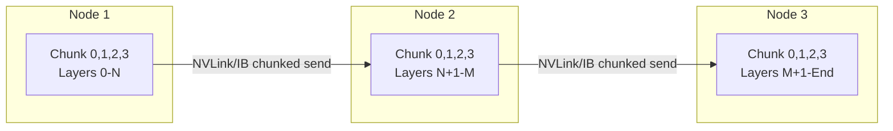

# Unlocking Ultra-Long Context Inference: How Multi-Node Pipeline Parallelism Scales in SGLang  
**A look at chunked tensor allocation, NVLink scheduling, and the TP/PP trade-offs that determine service throughput.**


**TL;DR**
- For ultra-long context inference, a single node often cannot hold the model weights plus the KV cache, so pipeline parallelism (PP) splits layers across nodes; the key cost then becomes how activations are allocated and moved between stages.
- SGLang’s PP approach uses chunked tensor allocation and NVLink-aware scheduling to keep inter-node transfers small and overlapped with computation, reducing the time requests spend waiting on communication.
- To configure a cluster, saturate intra-node NVLink first, then add PP across nodes, and validate links with `nvidia-smi nvlink`, `ib_write_bw`, and synthetic benchmarks before taking production traffic.

## Why pipeline parallelism, and why now?

Long-context models are crossing context lengths where a single GPU—or even a single server—can no longer hold both the parameters and the per-token KV cache. When that happens, the natural next step is to partition the model vertically: the first layers run on one node, the next layers on another, and so on. That is pipeline parallelism (PP). It keeps each device’s memory footprint bounded while adding compute capacity.

The catch is that every microbatch now carries activations across a network link between stages. In long-context workloads those activations are large, and the transfer is on the critical path. If the runtime sends full sequences as monolithic tensors, a single slow link or a small pipeline bubble can stall the whole line. Teams running distributed inference at long context lengths often see the majority of their latency come not from matrix multiplies, but from how tensors are packed, aligned, and handed off.

This is where inter-node tensor allocation becomes the design problem.

## Why does inter-node tensor allocation dominate pipeline efficiency?

Because pipeline parallelism serializes activations between layer groups, any delay in moving those tensors—or any wasted bytes—directly adds to the critical path and lowers the pipeline fill factor.

In SGLang’s PP implementation, the runtime breaks large activation tensors into smaller chunks that can be scheduled independently. Instead of waiting for an entire long-context sequence to finish one stage before forwarding it, the system streams chunks through the pipeline. Each chunk moves from one stage to the next as soon as its slice of computation is done. This has three practical effects:

1. **Reduced peak transfer size.** Sending a 128K-token activation as one block can overshoot link buffers and cause head-of-line blocking. Chunks fit the link better.
2. **Overlap with compute.** While chunk *N* is being sent to stage 2, stage 1 can start stage 2 of chunk *N+1*.
3. **Better memory packing.** Smaller, regularly-shaped chunks are easier to align on cache lines and NVLink packet boundaries.

The underlying transport still matters. Within a node, NVLink provides the high-bandwidth path. Across nodes, InfiniBand or high-speed Ethernet carries the chunked activations. SGLang relies on NCCL for the actual sends and receives, but the chunking policy is what lets NCCL keep the wires full.



A typical chunked handoff looks like this in PyTorch/NCCL terms:

```python
import torch
import torch.distributed as dist

dist.init_process_group("nccl")
rank = dist.get_rank()
next_stage = (rank + 1) % dist.get_world_size()

# Activation produced by this pipeline stage
activation = torch.randn(seq_len, hidden_dim, device=f"cuda:{rank}")

# Slice the sequence into chunks that can be forwarded independently
chunk_size = 2048
for chunk in activation.split(chunk_size, dim=0):
    # In practice SGLang schedules sends/receives and overlaps with compute
    dist.send(chunk, dst=next_stage)
```

Real SGLang code hides most of this bookkeeping behind the scheduler, but the principle stays the same: split the tensor, stream the pieces, and keep every stage busy.

## How should teams balance tensor and pipeline parallelism?

Start with tensor parallelism within the NVLink domain to keep latency low, then add pipeline parallelism across nodes only when a single node no longer fits the model, and tune microbatch size so the pipeline stays full.

The trade-offs are well understood in distributed training, but they show up a little differently in an inference service:

- **More Tensor Parallelism (TP):** Shards each layer across GPUs in the same node. Latency is usually lower because all GPUs work on the same tokens at once. The downside is that TP is hungry for bandwidth—every layer needs all-reduce or all-gather over NVLink—and the speedup plateaus once the link is saturated. If the interconnect is weak, extra TP can hurt more than it helps.

- **More Pipeline Parallelism (PP):** Spreads layers across distinct nodes. Throughput can rise because requests flow through independent stages like an assembly line. The downside is pipeline bubbles: if the next microbatch is not ready, a stage sits idle. Bubbles get worse when chunks are too large, when network latency is high, or when the workload has low batching.

For long-context inference, PP is often unavoidable because the memory footprint—not just weights, but the KV cache—exceeds one node. The goal is then to keep the bubble small. That usually means a fine-grained schedule with enough in-flight microbatches and a chunk size that matches the network and compute grain.

A representative service configuration might look like this:

```bash
# Example SGLang launch across 4 nodes, TP within node, PP across nodes
python -m sglang.launch_server \
  --model-path /path/to/model \
  --tp 8 \
  --pp 4 \
  --chunked-prefill-size 8192 \
  --max-running-requests 64 \
  --mem-fraction-static 0.85 \
  --enable-p2p-check \
  --dist-init-addr 10.0.0.1:5000
```

`--tp 8` keeps each layer inside an NVLink-connected 8-GPU node. `--pp 4` stacks four of those nodes, so the model is partitioned into four pipeline stages. The `--chunked-prefill-size` controls how long-context prefill work is sliced, which is the layer directly above the tensor chunk size discussed earlier. Adjusting these together is what makes the pipeline stay full rather than thrashing on cross-node sends.

## Validating the cluster before production

SGLang cannot fix a slow interconnect. Before turning on production traffic, check that the hardware matches the assumptions built into the placement strategy.

Two checks are especially useful:

- **Within-node NVLink bandwidth:** Target roughly 800+ GB/s for modern NVLink-connected GPUs. A gap here means TP all-reduces will dominate latency.
- **Cross-node bandwidth:** Run `ib_write_bw` between pairs of nodes. If the measured bandwidth is far below the adapter rating, look to cabling, PCIe settings, or NCCL environment variables before adding PP stages.

Run a synthetic benchmark that exercises the exact TP and PP degrees you intend to use, at the target sequence length. Latency and throughput numbers from a single-node test rarely transfer to a multi-node PP layout because the bottleneck moves from compute to the stage-to-stage handoff.

```bash
# Quick NVLink sanity check per GPU pair
nvidia-smi nvlink -e
nvidia-smi nvlink -r

# Cross-node baseline (run server on Node A, client on Node B)
ib_write_bw -d mlx5_0 --report_gbits
```

Numbers from `ib_write_bw` are an upper bound; real NCCL traffic includes protocol overhead and scheduler jitter, so leave headroom. If cross-node bandwidth is tight, prefer fewer PP stages and lean more on TP or sequence-level parallelism where possible.

## Closing thought

Pipeline parallelism is the right tool for ultra-long context inference once memory stops fitting on one node, but the gains depend almost entirely on how tensors cross the gap between stages. By chunking activations, aligning those chunks with NVLink and InfiniBand characteristics, and tuning the TP/PP split so the pipeline stays filled, teams can keep latency reasonable even as context lengths grow. Validate the cluster first, tune the chunking second, and let the scheduler do the rest.

## Topics

`SGLang` · `Pipeline Parallelism` · `Tensor Parallelism` · `Long-Context Inference` · `Distributed Systems` · `NVLink` · `Multi-Node Training` · `LLM Serving`