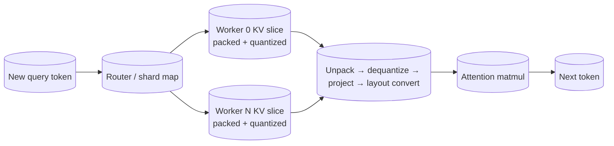

# Efficient Coordination Patterns for Sliced KV Caches in Distributed Inference
*To get the most from quantization, packing, low-rank projection, and layout conversion, treat the KV cache as a distributed storage engine, not just a tensor buffer.*


**TL;DR**
- During decode-phase attention, every new token reads the entire retained KV history once, so KV bandwidth and cache capacity usually matter more than FLOPs per token.
- Slicing the cache across workers by head or sequence block is only half the problem; the real work is coordinating **when** to decompress, unpack, project, and transpose so the attention kernel sees the layout it expects.
- A good architecture keeps cache slices compressed on the storage side, batches the read, then applies a minimal "decode decode" pipeline (unpack → dequantize → project → layout convert) right before the attention matmul.

Teams running large-language-model inference at scale spend a surprising amount of design time on a data structure that looks almost trivial: the key-value (KV) cache. In the decode phase, the model emits one token at a time, and each token attends to every key and value generated so far. That means the working set grows linearly with context length and batch size, while the arithmetic per token barely changes. Once the prompt is processed, inference often becomes memory-bandwidth and cache-coordination bound.

This post looks at the patterns that show up when KV state is sliced across workers, compressed, packed, projected to a lower dimension, or stored in a layout that differs from what the attention kernel expects. The goal is not to pick the single best compression trick; it is to show how to coordinate those tricks so they compose safely on the read path.

## Why does the decode read path dominate inference cost?

Because each decode step performs a full attention pass over every previously computed key and value, so the cost of reading KV state scales with sequence length while the cost of computing the new query stays flat.

For a single request, this is already noticeable. For batched decoding, the effect is sharper: batching helps amortize weight loading and compute, but it also multiplies the active KV footprint. The result is that the dominant engineering question stops being "how fast can we multiply matrices?" and becomes "how cheaply can we bring the right KV slice into the right register at the right time?"

That shift has three practical consequences:

1. **Capacity becomes a hard constraint.** Long-context batches can exceed high-bandwidth memory (HBM) unless the cache is compressed or offloaded.
2. **Bandwidth dominates latency.** Even if the cache fits, reading it back for every token consumes a large fraction of available memory bandwidth.
3. **Layout and alignment matter.** Attention kernels usually want contiguous, head-major blocks of floating-point data. A compressed cache store usually wants packed, sequence-major bytes. The translation between the two is now on the critical path.

## How do compression, packing, and projection change coordination?

They move work from the memory subsystem to the compute pipeline, so the coordination contract between the cache store and the attention kernel has to include the inverse transform for every read.

In other words, the KV cache is no longer just a `[seq, head, dim]` tensor. It becomes a storage format with metadata: scales for quantization, packing widths, projection matrices, and a layout descriptor. Any worker that owns a slice must be able to answer the question, "Given a request for positions `s_start:s_end` and head `h`, produce a contiguous block that the attention kernel can consume."

The four techniques from the original draft each alter that contract:

- **Quantization** maps high-precision values to lower-precision codes and stores per-tensor, per-head, or per-token scaling factors. The read path must multiply by the matching scale.
- **Packing** stores multiple low-bit values in a single byte or machine word. The read path must mask and shift, ideally in vectorized form.
- **Low-dimensional projection** caches a compressed representation `KV · P` instead of the original head dimension `d_head`. The read path must multiply by `Pᵀ` to reconstruct or operate in the projected space.
- **Layout conversion** reorders axes to match the attention kernel, for example from `[seq, packed_bytes]` to `[seq, d_head]`.

The important pattern is that these transformations are not applied at random. They are applied in a strict order on writes and reversed on reads, with the narrowest representation living closest to storage.



The diagram above shows the clean separation of concerns. Workers own compressed slices. The read pipeline performs the "decode decode" step that turns storage blocks into attention-ready tensors.

## A concrete storage-and-read pattern

The sketch below is intentionally small and self-contained. It uses NumPy and imaginary dimensions so the contract is visible, not so it can be dropped into a production serving stack unchanged.

The cache shard stores projected values with per-token, per-head `int8` quantization, packed into `uint8`. On read it unpacks, dequantizes, reconstructs the original head dimension, then returns the layout the attention kernel expects.

```python
import numpy as np

class CompressedKVShard:
    """
    One worker's slice of a head-wise KV cache.
    Stored form: int8 quantized, projected values packed into uint8.
    Read form: float16, original head dimension, sequence-contiguous.
    """
    def __init__(self, max_seq, num_heads, d_head, proj_dim):
        self.d_head = d_head
        self.proj_dim = proj_dim
        # Projection matrix: d_head -> proj_dim, shared for the shard
        self.P = (np.random.randn(d_head, proj_dim) / np.sqrt(proj_dim)
                  ).astype(np.float32)
        # Packed storage: proj_dim int8 values -> proj_dim uint8 bytes
        self.cache = np.zeros((max_seq, num_heads, proj_dim), dtype=np.uint8)
        self.scales = np.ones((max_seq, num_heads), dtype=np.float32)

    def store(self, seq_pos, head, kv):
        """
        kv: np.ndarray of shape (d_head,), float32
        """
        # 1. Low-dimensional projection
        projected = kv @ self.P                # (proj_dim,)

        # 2. Per-token, per-head symmetric int8 quantization
        scale = np.max(np.abs(projected)) / 127.0 + 1e-6
        quantized = np.clip(np.round(projected / scale), -127, 127).astype(np.int8)

        # 3. Packing: here one int8 per byte, so a no-op; for 4-bit, pack two per byte.
        packed = quantized.astype(np.uint8)   # uint8 view is illustrative

        self.cache[seq_pos, head] = packed
        self.scales[seq_pos, head] = scale

    def load_for_attention(self, start, end, head):
        """
        Return a contiguous float16 block of shape (end-start, d_head).
        """
        packed = self.cache[start:end, head]            # (seq, proj_dim)
        scale = self.scales[start:end, head]            # (seq,)

        # 1. Unpack (identity in the 8-bit case)
        q = packed.astype(np.int8)

        # 2. Dequantize using the stored per-token scales
        dequant = q.astype(np.float32) * scale[:, None]  # (seq, proj_dim)

        # 3. Reconstruct original head dimension
        recovered = dequant @ self.P.T                   # (seq, d_head)

        # 4. Layout conversion: ensure sequence-contiguous float16
        return np.ascontiguousarray(recovered.astype(np.float16))
```

The code deliberately shows each transformation as a separate step. In a real engine, these steps are fused into one or two kernels to keep the data in registers or shared memory. But the logical order stays the same: storage is narrow, the attention boundary is wide, and the read pipeline is the contract between them.

## What can go wrong

The coordination pattern is simple in principle and easy to mishandle in practice.

**Mismatched quantization metadata.** If one worker stores per-token scales and another stores per-head scales, a gather that mixes both will silently produce wrong attention weights. The schema has to be part of the shard contract, not an afterthought.

**Projection asymmetry.** A projected cache only works if all consumers of KV state agree on the projection basis. That is usually fine within a single model, but it breaks down if different layers or different microservices expect different representations.

**Read amplification from premature conversion.** Converting layout before filtering by sequence range wastes bandwidth. The right place to transpose is after the sequence slice has been selected.

**Packing alignment.** Sub-byte packing is efficient only if the unpack path aligns with vector widths and the attention kernel's expected bit width. Packing four 4-bit values into a byte saves memory, but unpacking must be vectorized or the CPU cost can exceed the memory savings.

These failure modes all point to the same design rule: keep the cache store dumb and regular, and make the read pipeline responsible for transforming data into the attention kernel's dialect.

## Topics
KV cache optimization, distributed inference, tensor slicing, quantization, low-rank projection, memory bandwidth, LLM serving, attention decoding