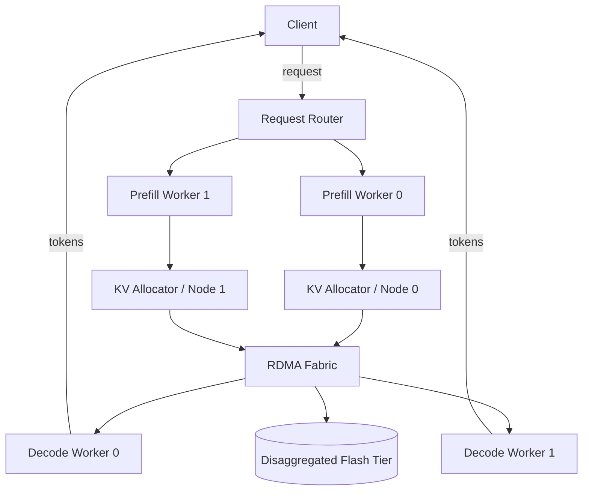

# Inter-Node KV Cache Placement: A Pattern for Distributed LLM Inference


*A placement-aware allocator is usually the simplest way to keep cross-node KV traffic from dominating serving latency.*

**TL;DR**
- Once a KV cache outgrows a single node, the dominant cost becomes *where* each KV block lives, not how it is computed.
- A small routing layer that co-locates KV blocks with the workers that consume them—while enforcing per-node memory budgets—eliminates most cross-node traffic without a heavy distributed transaction protocol.
- The pattern generalizes across RDMA fabrics and disaggregated flash tiers, and it can be encoded in a few hundred lines of allocation logic.

## Why does single-node KV cache management stop scaling?

Single-node KV cache managers work beautifully until total context state exceeds node-level high-bandwidth memory or until concurrent requests multiply. At that point the cache has to be sharded across GPU nodes, and sharding makes placement the dominant engineering problem. Every decode step needs the KV tensors produced during prefill; if those tensors live on the wrong node, the serving path pays for an RDMA round trip—often several microseconds plus serialization overhead—before it can emit the next token. Under batching, those round trips compound.

The workload signatures that push teams toward inter-node allocation are predictable: large context windows, many simultaneous sequences, and tight token-level latency budgets. Disaggregated serving architectures—where prefill and decode run on different workers—make the issue sharper, because KV tensors now cross a network boundary by design. The network fabric matters, but the fabric cannot fix a placement policy that repeatedly sends tensors to the wrong node.

A realistic deployment pattern looks like this:



The prefill worker materializes KV blocks, the allocator places them, and the decode worker fetches only what it needs. The design goal is to make the common case—decode reading recently prefilled KV—local to the decode worker’s node.

## How should tensors be placed across nodes?

Co-locate KV blocks with the worker that will consume them next, and fall back to remote or disaggregated storage only when a node has exhausted its memory budget. This rule sounds obvious, but it is easy to violate when the system treats allocation as a global free-list instead of an affinity decision.

In practice, the placement problem decomposes into three rules:

1. **Affinity over utilization.** A request that starts on prefill node *A* and continues on decode node *B* should have its KV blocks created on *B* if at all possible. The prefill worker can stream compute results straight to the consumer node, rather than writing them locally and copying later.
2. **Memory budgets, not exact packing.** Each node should reserve headroom—typically 10–20% of available HBM—for burst batches, metadata, and fragmentation. An allocator that fills nodes to 100% will thrash on the first long-context request.
3. **Block granularity.** KV caches are easier to move and evict when managed in fixed-size blocks rather than variable-length tensors. A block can represent a few hundred to a few thousand tokens; allocation then becomes a count of blocks, and fragmentation stays bounded.

The following Python sketch captures these rules. It is not a production scheduler, but it does show the routing logic and memory bookkeeping that sit between the request router and the workers.

```python
import math
from typing import Optional

class KVBlockRouter:
    def __init__(self, node_ids, memory_bytes: int, block_bytes: int):
        self.node_ids = node_ids
        self.block_bytes = block_bytes
        self.capacity = {nid: memory_bytes for nid in node_ids}
        self.used = {nid: 0 for nid in node_ids}
        self.affinity = {}                 # request_id -> preferred decode node
        self.reserved_headroom = 0.15        # keep 15% of node memory free

    def _node_available(self, node) -> int:
        headroom = int(self.capacity[node] * self.reserved_headroom)
        return self.capacity[node] - headroom - self.used[node]

    def _blocks_needed(self, num_tokens: int, tokens_per_block: int = 1024) -> int:
        return max(1, math.ceil(num_tokens / tokens_per_block))

    def assign_prefill(self, request_id: str, num_tokens: int,
                       candidate_nodes: list[int]) -> Optional[int]:
        blocks = self._blocks_needed(num_tokens)
        memory = blocks * self.block_bytes

        viable = [
            n for n in candidate_nodes
            if self._node_available(n) >= memory
        ]
        if not viable:
            return None

        # Prefer the candidate with the most remaining space; this keeps
        # clusters balanced while still honoring affinity.
        chosen = max(viable, key=lambda n: self._node_available(n))
        self.used[chosen] += memory
        self.affinity[request_id] = chosen
        return chosen

    def assign_decode(self, request_id: str,
                      decode_nodes: list[int]) -> Optional[int]:
        preferred = self.affinity.get(request_id)

        # If the preferred node is already in the decode pool, decode there.
        # Otherwise pick the decode node that still has slack for growth.
        candidates = (
            [preferred] if preferred and preferred in decode_nodes
            else decode_nodes
        )
        viable = [n for n in candidates if self._node_available(n) > 0]
        if not viable:
            return None
        return max(viable, key=lambda n: self._node_available(n))

    def release(self, request_id: str, num_tokens: int):
        if request_id in self.affinity:
            blocks = self._blocks_needed(num_tokens)
            node = self.affinity.pop(request_id)
            self.used[node] = max(0, self.used[node] - blocks * self.block_bytes)


# Illustrative values for a small disaggregated cluster
router = KVBlockRouter(
    node_ids=[0, 1, 2, 3],
    memory_bytes=1 << 40,   # 1 TiB HBM-class memory per node
    block_bytes=1 << 24,    # 16 MiB blocks
)

prefill_node = router.assign_prefill(
    request_id="req-42",
    num_tokens=32768,
    candidate_nodes=[0, 1],
)

decode_node = router.assign_decode(
    request_id="req-42",
    decode_nodes=[2, 3],
)
```

The example keeps the state in a single object for clarity, but the same logic can be split across per-node agents: each node tracks its own used-memory counter, and a lightweight coordinator resolves placement requests. The key invariant is that the router knows *which decode node will own a request* before prefill starts.

## What happens when memory runs out?

The worst behavior for an inter-node allocator is to block decode while it negotiates eviction. A better pattern is to tier the cache: hot KV blocks stay in node HBM, warm blocks move to RDMA-accessible memory on peer nodes, and cold or evicted blocks spill to a disaggregated NVMe-oF or flash tier. The placement router only needs to know the nearest copy; it does not need to be the storage layer itself.

When a decode node cannot fit a sequence, the system has three honest options—each with a clear cost:
- **Migrate the decode worker** to the node that already holds the KV blocks. This is cheap if the engine is stateless, expensive if the worker has local weights.
- **Transfer the blocks** to the decode node. This pays a one-time RDMA cost but keeps the steady-state local.
- **Read blocks lazily from a peer or flash tier**. This preserves memory but adds latency on every layer that needs a cold block.

Teams usually find that the second option—proactive block migration at prefill time—gives the cleanest latency profile, because the migration overlaps with prompt processing and leaves decode pure.

## Topics

Distributed Systems · LLM Inference · KV Cache · GPU Cluster Architecture · Tensor Allocation · Low-Latency Serving · Disaggregated Inference