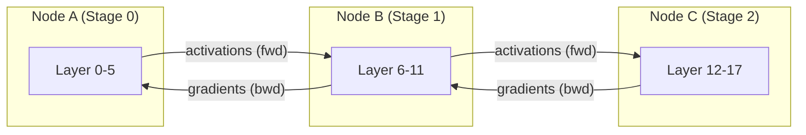
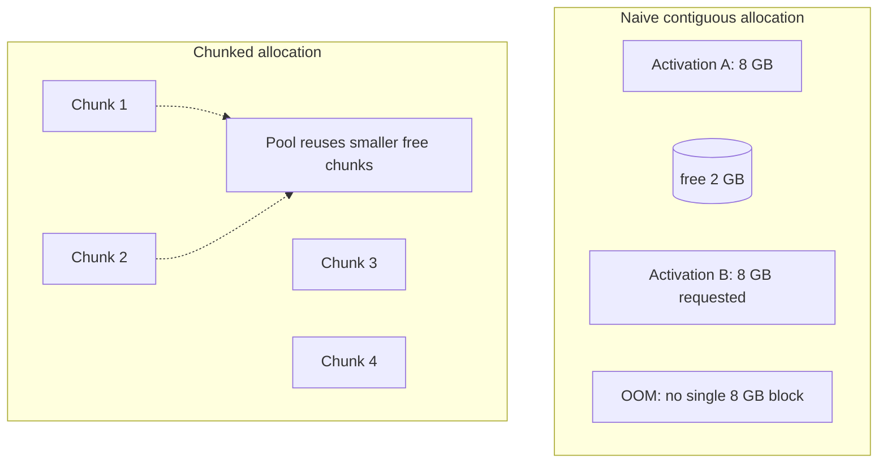

# Multi-Node Pipeline Parallelism for Long-Context Inference: A Practical Look at Activation Management
*Why inter-node activation handling, not just layer sharding, is the bottleneck in ultra-long sequence serving.*


**TL;DR**
- In multi-node pipeline parallelism (PP), the dominant inter-node traffic is activations and gradients, not parameters.
- Long-context inference makes activation tensors large enough to cause serious memory fragmentation when every layer allocates its own contiguous buffers.
- Chunked, reusable activation buffer pools and topology-aware communication (NVLink within a node, InfiniBand across nodes) are the practical levers for scaling PP.

## What actually crosses the wire in pipeline parallelism?

Pipeline parallelism splits a model's layers into consecutive stages and assigns each stage to a different GPU or node. A minibatch is further divided into microbatches that stream through the stages. While one microbatch is running on stage *N*, the previous microbatch can already be on stage *N+1*. That overlap is where PP gets its throughput.

What moves between stages? **Activations in the forward pass and gradients in the backward pass.** Parameters stay put. If you have a 70B-parameter model split across eight pipeline stages, each stage owns roughly 9B parameters; activations for a long-context batch, however, can still run into tens of gigabytes per microbatch.



This distinction matters because many performance problems in multi-node PP show up as "communication overhead" when they are really **activation management problems**. The wire is fast, but allocating, packing, and unpacking the tensors that cross it is not free.

## Why does long context break naive allocation?

In short-sequence inference, activation tensors are small enough that a layer can call `torch.zeros_like()` or rely on PyTorch's caching allocator without much fuss. The allocator sees similarly sized, short-lived requests and reuses blocks efficiently.

Long-context inference changes the request distribution dramatically. Activation sizes scale roughly linearly with sequence length. A batch with a 128K context may produce activation tensors that are orders of magnitude larger than those in the model's pretraining distribution. Two problems follow:

- **External fragmentation:** A layer asks for a single contiguous buffer for a large activation. The allocator may have enough total free memory but no single contiguous slab, forcing a CUDA OOM even when headroom exists.
- **Lifetime mismatch:** Activations for different microbatches live for different durations. Some are consumed immediately; others are stashed for the backward pass. Naive per-tensor allocation leaves holes that the allocator cannot compact.

The result is that memory usage grows faster than the actual tensor footprint.



## How do you implement chunked activations without rewriting the engine?

SGLang's optimized PP implementation uses a chunked allocation strategy for activations. The core idea is to avoid giving every layer a fresh contiguous slab. Instead, long activation tensors are broken into fixed-size chunks; those chunks are allocated from a reusable pool and released back when no longer referenced.

This is not the same as splitting a tensor into pieces and then concatenating them again for no reason. The chunks are the actual working units for communication and computation. Layers must be able to operate on lists or strided views of chunks, and the communication layer must be able to send chunks as they become ready rather than waiting for an entire tensor to materialize.

Below is a simplified illustration of the pattern. It is **not** a production-ready engine, but it shows how chunked buffer pools and P2P send/recv replace per-tensor allocation.

```python
import torch
import torch.distributed as dist

CHUNK_SIZE = 1024 * 1024 * 4  # 4 MB per chunk, illustrative
WORLD_SIZE = 4
STAGE = dist.get_rank()
NEXT_STAGE = (STAGE + 1) % WORLD_SIZE

class ChunkedBufferPool:
    """Reusable fixed-size chunks for activation buffers."""
    def __init__(self, chunk_size: int):
        self.chunk_size = chunk_size
        self.free = []
        self._cache = set()

    def allocate(self, shape, dtype, device):
        # Round up to whole chunks
        numel = sum(shape)
        n_chunks = (numel * torch.finfo(dtype).bits // 8 + self.chunk_size - 1) // self.chunk_size
        chunks = []
        for _ in range(n_chunks):
            if self.free:
                buf = self.free.pop()
            else:
                buf = torch.empty(self.chunk_size, dtype=torch.uint8, device=device)
            # View as the needed slice type
            chunks.append(buf)
        return chunks

    def release(self, chunks):
        self.free.extend(chunks)


def forward_stage(activation_chunks, pool):
    # Dummy layer computation on each chunk
    # In a real engine this is the stage's forward pass
    out_chunks = []
    for ch in activation_chunks:
        # Illustrative: keep same shape
        out = ch.clone()
        out_chunks.append(out)
        pool.release([ch])
    return out_chunks


# Main pipeline step
pool = ChunkedBufferPool(CHUNK_SIZE)

if STAGE == 0:
    # First stage generates activations
    activation = forward_stage(
        pool.allocate([128_000, 1024], torch.bfloat16, "cuda"),
        pool
    )
    # Send chunks to next stage as ready
    for ch in activation:
        dist.send(ch, dst=NEXT_STAGE)
elif STAGE < WORLD_SIZE - 1:
    # Intermediate stages
    activation = []
    for _ in range(num_expected_chunks):
        buf = torch.empty(CHUNK_SIZE, dtype=torch.uint8, device="cuda")
        dist.recv(buf, src=STAGE - 1)
        activation.append(buf.view_as_example())
    out = forward_stage(activation, pool)
    for ch in out:
        dist.send(ch, dst=NEXT_STAGE)
else:
    # Final stage
    ...
```

In production, this gets more complex. You need deterministic chunk counts per microbatch, proper overlap of computation and communication, and awareness of whether the next hop is a peer GPU via NVLink or a remote node via InfiniBand. The principle, though, is the same: **allocate once and reuse, then stream chunks rather than whole tensors.**

## What should you benchmark before trusting the cluster?

A common mistake is to assume that because the hardware spec lists fast links, the distributed runtime can saturate them. Before running long-context PP, verify the actual paths your activations will take:

- **Within a node**, `nvidia-smi topo -m` shows whether two GPUs are connected via NVLink, PCIe, or a switch. Modern NVLink links can deliver 800+ GB/s in synthetic tests, but the realized bandwidth depends on the topology and the number of simultaneous links.
- **Across nodes**, run `ib_write_bw` (or `ib_write_lat`) between the actual NICs that NCCL will use. This gives you a ceiling for inter-node point-to-point traffic.
- **End-to-end**, run the NCCL tests (`all_reduce_perf`, `sendrecv_perf`) with the same process-group layout you plan to use for PP. NCCL's routing choices can differ from raw IB benchmarks.

If the measured bandwidth is far below the link spec, check PCIeACS, NUMA affinity, NIC placement, and whether GPUDirect RDMA is enabled. These are tedious, but they are often the real reason PP underperforms.

## When is PP the right tool?

Pipeline parallelism is most useful when a model does not fit on one device and tensor parallelism alone would require impractical all-reduce volumes or too many devices on a single node. For very long contexts, PP has a useful property: the activation memory per stage is smaller than the full-model activation memory, and the inter-stage communication volume depends on microbatch size and hidden dimensions, not directly on model size.

That said, PP is not free. Pipeline bubbles, load imbalance between stages, and the need to keep multiple microbatches in flight all add complexity. It is usually combined with tensor parallelism within a node and data parallelism across replicas.

## Topics

`pipeline-parallelism` · `distributed-inference` · `long-context-llm` · `sglang` · `memory-fragmentation` · `nvlink` · `infiniband` · `pytorch-distributed`