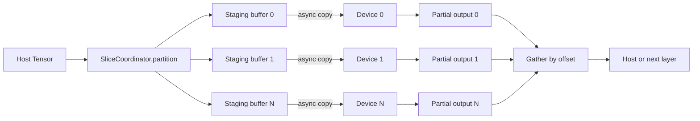

# Optimizing Distributed Inference Through Tensor-Slicing Coordination
*A practical pattern for balancing memory, data movement, and device utilization in large-batch inference.*

**TL;DR**
- Distributed inference often hits memory walls before it hits FLOP limits; tensor slicing is the escape hatch, but only if the slicing and recombination are coordinated.
- The cleanest pattern is staged batching: split the input tensor into device-sized slices, schedule work so that GPU/TPU compute overlaps with host-to-device transfer, then gather partial results before the next layer consumes them.
- The Python example below shows how a small coordination layer can keep code readable while still letting the runtime pipeline transfer and computation.

## Why does tensor slicing coordination matter?

In many production inference pipelines, the model itself fits on a single accelerator, but the batch does not. A single request might carry a long sequence, or the service might be asked to process thousands of examples in one pass. Either way, the input tensor can outgrow device memory long before the model layers become the bottleneck.

Tensor slicing is the natural response: break the large tensor into chunks that each accelerator can hold, run the forward pass on each chunk, and concatenate the outputs. The subtle part is coordination. Without it, slices arrive out of order, partial results wait idle for stragglers, or the host spends more time shuffling bytes than the devices spend computing. Teams running high-throughput inference services usually discover that the difference between “works” and “fast” comes down to how slices are assigned, transferred, and gathered—not the arithmetic itself.

Coordination also determines how gracefully the system degrades when hardware is heterogeneous. One worker might have less free memory, a slower interconnect, or a different batching cost. A rigid splitting rule ignores those differences and can serialize work around the slowest participant. A coordinated scheduler can compensate by overlapping transfer with compute and by aligning slice boundaries with the model’s natural parallelism dimensions.

## What makes a naive slice-and-scatter strategy slow?

The first implementation most teams write looks roughly like this: cut the host tensor into *N* pieces, copy piece *i* to device *i*, run the model, copy the output back, and concatenate. It is correct, but it is rarely optimal.

Three things usually go wrong:

1. **Transfer dominates compute.** If the host waits until every slice has been copied before any device starts work, the first device sits idle while the last slice is still in flight. The effective throughput becomes the copy time, not the matmul time.
2. **Synchronization points multiply.** A blocking `device_to_host` call after every slice forces the pipeline to drain before the next batch can begin. Latency then grows with the number of slices, even when the aggregate FLOPs stay constant.
3. **Slices fight over shared buses.** When several devices read from host memory at the same time over the same PCIe/NVLink topology, congestion can turn what looked like embarrassingly parallel work into a sequential transfer queue.

The fix is not usually a bigger accelerator or a more aggressive quantization pass. It is a small scheduling layer that decides *when* each slice moves and *where* each partial result lives before it is needed.

## The pattern: staged batching with async slicing

The pattern that tends to survive code review and production load has three stages, not four: **partition**, **pipeline**, and **gather**. Batching is still the entry point, but it is treated as a scheduling decision rather than a simple `split` call.

**Partition.** Choose the split dimension to match the model’s semantics. For most inference workloads the batch dimension is safe: every example is independent until the final gather. For transformer-style models, splitting along the sequence or hidden dimension may be better, but that requires attention to position embeddings, attention masks, and activation checkpoints. Pick one dimension per layer and document why.

**Pipeline.** Use asynchronous copies—`to(device, non_blocking=True)` in PyTorch, or pinned host memory plus `tf.device` placement and streaming in TensorFlow—so that slice *i+1* transfers while device *i* computes. Keep a small pool of pinned host buffers so the transfer path does not allocate on demand.

**Gather.** Concatenate outputs on whichever side still has the next consumer. If the next stage of the pipeline is another distributed layer, leave partial results on device and exchange only the halo or sliced edges. If the consumer lives on the host, schedule the device-to-host copy ahead of the concatenation so the CPU can prepare pointers while the last device finishes.

The coordination layer can be as simple as a function that maps `(global_batch_index, num_devices)` to `(device_id, local_offset, local_count)` and checks that slices are contiguous in memory. Contiguity matters: non-contiguous strided slices often force the framework to allocate temporary packed buffers, which quietly doubles memory traffic.

```python
import torch
from torch import nn

class SliceCoordinator:
    def __init__(self, num_devices: int, dim: int = 0):
        self.num_devices = num_devices
        self.dim = dim

    def partition(self, tensor: torch.Tensor):
        """Return (device_id, start, stop, slice) tuples, contiguously."""
        total = tensor.size(self.dim)
        per_device = (total + self.num_devices - 1) // self.num_devices

        assignment = []
        for rank in range(self.num_devices):
            start = rank * per_device
            stop = min(start + per_device, total)
            if start >= stop:
                break
            # Contiguous copy into a pinned staging buffer.
            local = tensor.narrow(self.dim, start, stop - start).contiguous()
            assignment.append((rank, start, stop, local))
        return assignment

    def pipeline_forward(self, model: nn.Module, tensor: torch.Tensor):
        results_by_order = {}
        current_stream = 0

        for rank, start, stop, local in self.partition(tensor):
            device = torch.device(f"cuda:{rank}")

            # Asynchronous H2D copy while previous devices compute.
            staged = local.to(device, non_blocking=True)

            with torch.cuda.stream(torch.cuda.Stream(device=device)):
                out = model(staged)

            # Store by start index so gather stays deterministic.
            results_by_order[start] = out
            current_stream += 1

        # Lightweight barrier: wait only for the streams we used.
        torch.cuda.synchronize()
        ordered = [results_by_order[k] for k in sorted(results_by_order)]
        return torch.cat(ordered, dim=self.dim)


# Illustrative usage
coordinator = SliceCoordinator(num_devices=4, dim=0)
input_tensor = torch.randn(4096, 1024)        # large host tensor
model = nn.Linear(1024, 256)                  # toy layer
output = coordinator.pipeline_forward(model, input_tensor)
```

The snippet is intentionally small. A real deployment would add pinned-buffer caching, mixed-precision hooks, and error handling for missing devices. But the structural idea—partition with offsets, pipeline copies, then gather by offset order—is what survives once the surrounding code changes.

## When is this pattern the right fit?

This pattern shines when the per-example FLOPs are modest but the aggregate batch is large: recommendation retrieval, embedding lookups, batched image preprocessing, or dense layers on long-context inputs. It adds the most value when the model layer is reusable across devices and the only scarce resource is local memory.

It is less helpful when the model itself is too large for one device, because then the problem is model parallelism, not batch slicing. It is also a poor fit when slices create excessive communication between layers—splitting the sequence dimension in a long-context transformer can trigger expensive all-to-all exchanges that erase the memory savings. In those cases the right trade-off may be pipeline parallelism or sequence parallelism rather than batch slicing.

The honest takeaway is that slicing coordination is a memory-optimization pattern first and a throughput pattern second. If the unbatchable memory footprint already fits, the extra complexity may not pay for itself.

## Diagram: data flow through the coordinator



The diagram shows the conceptual split, but the important detail is timing: each transfer is issued before its device is strictly needed, and the gather order is fixed by offsets rather than by arrival order. That determinism prevents downstream layers from blocking on reordering.

## Topics

`distributed systems`, `machine learning inference`, `tensor slicing`, `GPU optimization`, `batch processing`, `PyTorch`, `memory optimization`, `high-throughput serving`, `model deployment`