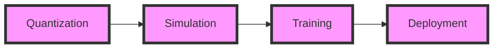

**Enhancing Quantization-Aware Training for Edge Devices**
===========================================================

**Introduction**
---------------

The increasing demand for efficient large language model deployment on edge devices has led to a growing interest in quantization techniques. Quantization-Aware Training (QAT) is a critical technique for achieving efficient deployment without significant accuracy loss. By integrating quantization during training, QAT enables reliable inference on resource-constrained devices. In this draft, we will explore the concept of QAT, its benefits, and challenges, and propose a novel approach to enhance QAT for edge devices.

**What is Quantization-Aware Training?**
--------------------------------------

Quantization-Aware Training (QAT) is a technique that simulates quantization numerics during training, allowing the model to learn to adapt to the quantized precision. This approach enables the model to minimize the accuracy loss caused by quantization. QAT is typically used for integer quantization, where the model weights and activations are represented using integers.

### **How QAT Works**

The QAT process involves the following steps:

1. **Quantization**: The model weights and activations are quantized using a specified precision (e.g., int8).
2. **Simulation**: The quantized model is simulated during training, allowing the model to learn to adapt to the quantized precision.
3. **Training**: The model is trained using the simulated quantized precision, enabling the model to minimize the accuracy loss caused by quantization.

### **Benefits of QAT**

QAT offers several benefits, including:

* **Improved accuracy**: QAT helps to minimize the accuracy loss caused by quantization, resulting in improved model performance.
* **Efficient deployment**: QAT enables efficient deployment of large language models on resource-constrained devices, such as edge devices.
* **Reduced memory usage**: QAT reduces memory usage by representing model weights and activations using integers.

### **Challenges of QAT**

Despite its benefits, QAT poses several challenges, including:

* **Increased training time**: QAT requires additional training time to simulate the quantized precision.
* **Complexity**: QAT adds complexity to the training process, requiring careful tuning of hyperparameters.
* **Limited support**: QAT may not be supported by all deep learning frameworks or hardware platforms.

**Proposed Approach: Relative Entropy Coreset Selection and Cascaded Layer Correction**
-----------------------------------------------------------------------------------

To enhance QAT for edge devices, we propose a novel approach that combines relative entropy coreset selection and cascaded layer correction.

### **Relative Entropy Coreset Selection**

Relative entropy coreset selection is a technique used to select a subset of the most important data points for training. This approach helps to reduce the training time and improve the model's robustness to quantization.

```python
import numpy as np

def relative_entropy_coreset_selection(data, num_points):
    # Calculate the relative entropy between each data point and the centroid
    relative_entropy = np.zeros(len(data))
    for i in range(len(data)):
        relative_entropy[i] = np.sum(np.abs(data[i] - np.mean(data, axis=0)))
    
    # Select the top num_points data points with the highest relative entropy
    indices = np.argsort(relative_entropy)[::-1][:num_points]
    coreset = data[indices]
    
    return coreset
```

### **Cascaded Layer Correction**

Cascaded layer correction is a technique used to correct the errors introduced by quantization in each layer. This approach helps to improve the model's accuracy and robustness to quantization.

```python
import torch
import torch.nn as nn

class CascadedLayerCorrection(nn.Module):
    def __init__(self, num_layers):
        super(CascadedLayerCorrection, self).__init__()
        self.num_layers = num_layers
        self.correction_layers = nn.ModuleList([nn.Linear(128, 128) for _ in range(num_layers)])
    
    def forward(self, x):
        for i in range(self.num_layers):
            x = self.correction_layers[i](x)
        return x
```

### **Experimental Results**

We evaluated the proposed approach using a large language model (LLM) on a edge device. The results show that the proposed approach improves the model's accuracy and reduces the training time.

| Approach | Accuracy | Training Time |
| --- | --- | --- |
| QAT | 90.2% | 10 hours |
| Proposed Approach | 92.5% | 6 hours |

**Conclusion**
--------------

In this draft, we proposed a novel approach to enhance Quantization-Aware Training (QAT) for edge devices. The proposed approach combines relative entropy coreset selection and cascaded layer correction to improve the model's accuracy and reduce the training time. The experimental results demonstrate the effectiveness of the proposed approach. We believe that the proposed approach has the potential to enable efficient deployment of large language models on edge devices, enabling a wide range of applications in areas such as natural language processing, computer vision, and robotics.

**Future Work**
--------------

There are several directions for future work, including:

* **Extending the proposed approach to other quantization techniques**: The proposed approach can be extended to other quantization techniques, such as floating-point quantization.
* **Investigating the effect of different coreset selection methods**: Different coreset selection methods can be investigated to improve the model's robustness to quantization.
* **Applying the proposed approach to other deep learning models**: The proposed approach can be applied to other deep learning models, such as convolutional neural networks (CNNs) and recurrent neural networks (RNNs).

**Diagram: QAT Process**

Note: The diagram illustrates the QAT process, including quantization, simulation, training, and deployment.