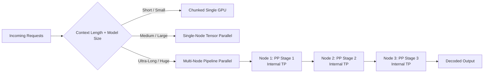

# Scaling Ultra-Long Context Inference with Multi-Node Pipeline Parallelism
**A practical pattern for combining chunked single-GPU execution, tensor parallelism, and pipeline stages in high-throughput sequence services.**


**TL;DR**
- Ultra-long context inference often exhausts single-GPU memory and saturates node-level interconnects; a three-tier hierarchy—chunked single-GPU, intra-node tensor parallelism, and inter-node pipeline parallelism—keeps throughput up without requiring uniform, ultra-fast links across the cluster.
- Asynchronous sequence batching decouples request arrival from pipeline execution, letting micro-batches fill pipeline bubbles across nodes instead of leaving stages idle while waiting for full static batches.
- The central design knob is the tensor/pipeline split: more tensor parallelism lowers latency but demands fast NVLink or InfiniBand within a node; more pipeline parallelism favors throughput and tolerates slower inter-node links, at the cost of added pipeline depth.

Teams running large language serving stacks hit a familiar wall. A single request with hundreds of thousands of tokens can exhaust one GPU’s memory, and even when the model fits, the quadratic attention cost during pre-fill can stall a node. Tensor parallelism splits the model across GPUs on one machine, but that only helps until the machine runs out of GPUs or the all-reduce traffic on the inter-GPU links becomes the bottleneck. At that point, the next practical step is pipeline parallelism: split the model into stages and place each stage on a different node. The catch is that pipeline parallelism introduces stalls, bubbles, and new scheduling constraints that simple implementations do not handle well. This post describes a composite pattern—chunked single-GPU execution, intra-node tensor parallelism, and inter-node pipeline parallelism—used together to serve ultra-long contexts efficiently.

## Why Does Traditional Pipeline Parallelism Stall on Long Contexts?

Straightforward pipeline parallelism splits a model into sequential stages and feeds micro-batches through them. Each stage holds a slice of the layers, and activations flow from stage to stage. On long sequences, this pattern struggles for two reasons.

First, the memory footprint per stage scales with sequence length. Activations, key-value caches, and attention matrices all grow with context size. A stage that comfortably held a 4K-token micro-batch may fail at 128K tokens. Second, pipeline bubbles grow with the number of stages and the time per micro-batch. Long-context pre-fill is slow; if each micro-batch takes hundreds of milliseconds, a deep pipeline can leave stages idle for a large share of the total step. The result is under-utilized GPUs and throughput that does not scale linearly with added hardware.

The standard fix is to combine parallelism types rather than relying on any one of them.

## Architectural Overview

A robust long-context serving stack typically has three fallback paths:

1. **Chunked single-GPU path.** If the full context fits on one GPU and the latency is acceptable, run the entire forward pass there. This avoids all collective communication.
2. **Single-node tensor-parallel path.** If the model is too large for one GPU but fits across the GPUs in one node, use tensor parallelism. All-reduce across NVLink is fast enough that latency stays low.
3. **Multi-node pipeline-parallel path.** When a single node is insufficient, split the model into stages across nodes. Each stage may itself be tensor-parallel within its node.

Request routing sends short contexts down the cheapest path and long contexts into the multi-node pipeline. The pipeline scheduler then breaks each long-context request into micro-batches and overlaps them so that later stages process earlier micro-batches while earlier stages process later ones.



## How Should Teams Choose Between Tensor and Pipeline Parallelism?

Use tensor parallelism within a node up to the point where interconnect bandwidth or GPU count stops helping, then use pipeline parallelism across nodes. Inside each pipeline stage, keep tensor parallelism only if the node has enough fast interconnect to sustain it.

The trade-off is sharp. Tensor parallelism replicates activations and requires an all-reduce after each layer split. All-reduce is cheap on NVLink but expensive over TCP or even InfiniBand if the cluster is not tightly coupled. Pipeline parallelism sends point-to-point activations between stages and does not require constant global synchronization, so it tolerates slower inter-node links. The cost is added latency: a request must pass through every stage in sequence.

For long-context inference, the extra pipeline latency is often acceptable because the pre-fill and decode steps are already slow. The real goal is throughput: keep every GPU busy. That is where asynchronous sequence batching matters.

## Asynchronous Sequence Batching

In synchronous batching, the system waits until it has enough requests to fill a batch, then sends them through the pipeline together. That works when requests arrive in bursts. With long-context inference, the time to fill a batch can be long, and the pipeline bubbles during the wait.

Asynchronous sequence batching instead maintains a pool of ready requests and forms micro-batches continuously. When a pipeline stage finishes one micro-batch, it immediately takes the next available one. The scheduler respects two constraints: sequence length grouping, so that similar-length sequences stage together and avoid padding waste, and pipeline stage occupancy, so that no stage sits idle if work exists. The batcher does not need to wait for a full batch; it releases micro-batches as soon as the target pipeline stage is free.

The code below illustrates a simplified strategy selector and pipeline scheduler. The selector decides which execution tier a request should use, and the scheduler emits micro-batches for a multi-stage pipeline.

```python
import torch
import torch.nn as nn
from dataclasses import dataclass
from typing import List, Tuple

@dataclass
class HardwareProfile:
    gpus_per_node: int
    node_nvlink_bw_gbps: float      # within one node
    inter_node_bw_gbps: float        # between nodes
    gpu_memory_gb: float

@dataclass
class Request:
    seq_len: int
    model_layers: int
    hidden_dim: int

class TopologyRouter:
    """
    Illustrative router that maps a request to a serving tier.
    gpu_seconds_per_million_tokens is a placeholder cost model.
    """
    def __init__(self, hw: HardwareProfile, max_chunk_len: int = 8192):
        self.hw = hw
        self.max_chunk_len = max_chunk_len
        # Heuristic thresholds; real systems profile on target hardware.
        single_gpu_capacity = self.hw.gpu_memory_gb * 1e9 / 4  # bytes-ish proxy
        self.single_gpu_max_seq = int(
            single_gpu_capacity / (4096 * 4 * self.hw.model_layers)
        )

    def assign_tier(self, request: Request) -> str:
        bytes_per_token = request.hidden_dim * 4  # fp32 activations, simplified
        activation_bytes = request.seq_len * bytes_per_token * request.model_layers
        if activation_bytes < self.hw.gpu_memory_gb * 1e9 * 0.6:
            return "single_gpu_chunked"
        if request.seq_len <= self.max_chunk_len * self.hw.gpus_per_node:
            return "tensor_parallel"
        return "pipeline_parallel"

class PipelineScheduler:
    """
    Generates micro-batches for a pipeline with `num_stages` stages.
    Each micro-batch carries a slice of tokens for one request.
    """
    def __init__(self, num_stages: int, micro_batch_size: int):
        self.num_stages = num_stages
        self.micro_batch_size = micro_batch_size
        self.ready_queue: List[Request] = []

    def enqueue(self, request: Request):
        self.ready_queue.append(request)

    def next_micro_batch(self) -> Tuple[torch.Tensor, int]:
        # Pull up to micro_batch_size tokens from the head of the queue.
        if not self.ready_queue:
            raise StopIteration
        req = self.ready_queue.pop(0)
        # Simplified: a single micro-batch per request in this illustration.
        x = torch.randn(self.micro_batch_size, req.hidden_dim)
        stage = 0
        return x, stage

    def advance(self, stage: int, activations: torch.Tensor) -> torch.Tensor:
        # Simulate one pipeline stage. Real code dispatches to a remote stage.
        stage_net = nn.Linear(activations.size(-1), activations.size(-1))
        return torch.relu(stage_net(activations))


hw = HardwareProfile(
    gpus_per_node=8,
    node_nvlink_bw_gbps=900,
    inter_node_bw_gbps=100,
    gpu_memory_gb=80,
)
hw.model_layers = 32  # patched in for the router heuristic

router = TopologyRouter(hw)
request = Request(seq_len=131_072, model_layers=32, hidden_dim=8192)
tier = router.assign_tier(request)
print(f"Route {request.seq_len}-token request to: {tier}")

scheduler = PipelineScheduler(num_stages=4, micro_batch_size=2)
scheduler.enqueue(request)
x, stage = scheduler.next_micro_batch()
for stage in range(4):
    x = scheduler.advance(stage, x)
```

The router is intentionally simple. A production system would replace the heuristic with measured memory usage, profiled all-reduce times, and a latency service-level objective. The scheduler sketch omits device placement and communication, but it captures the core idea: break long sequences into units that can be pipelined, and keep the pipeline fed.

## Operational Considerations

A few practical details separate a working prototype from a reliable long-context serving system.

**Chunking on the single-GPU path.** Even within one GPU, long sequences are usually processed in chunks to bound activation memory. The KV cache is updated incrementally so that later chunks reuse earlier computations. The same incremental approach applies at pipeline boundaries: each stage must pass KV-cache state forward, not just final activations.

**Load balancing across pipeline stages.** If one stage is slower than the others, the entire pipeline backs up. Assign layers so that each stage has similar compute and memory demand. For transformer models, layers are nearly identical, so equal layer counts usually balance well. Long-context pre-fill can distort this if attention kernels are stage-local, so profiling with real sequence lengths is essential.

**Communication scheduling.** Pipeline parallelism sends activations between nodes. With asynchronous batching, multiple micro-batches are in flight at once. The network between any two stages should support enough concurrent transfers to avoid head-of-line blocking. If the inter-node link is narrow, increasing the number of pipeline stages can hurt more than it helps.

**Failover.** A pipeline stage running on a different node is a new failure domain. The serving layer needs either request replication or fast recomputation on a spare stage. Otherwise, a slow or failed node stalls every request in flight across the entire pipeline.

## Trade-Off Summary

The tensor-parallel versus pipeline-parallel decision comes down to latency, bandwidth, and memory.

- **More tensor parallelism** lowers single-request latency because work runs in parallel rather than sequentially. The cost is heavier all-reduce traffic and the requirement for fast interconnects. It typically stops scaling within a single node.
- **More pipeline parallelism** raises throughput by keeping more GPUs busy and using point-to-point communication that tolerates slower links. The cost is higher end-to-end latency and more complex scheduling.

For ultra-long contexts, the right shape is usually a wide tensor-parallel group inside each node and a moderate number of pipeline stages across nodes. The single-GPU chunked path remains important for short requests because it avoids all distributed overhead.

## Topics

`pipeline-parallelism` `tensor-parallelism` `long-context-inference` `distributed-inference` `llm-serving` `gpu-utilization` `asynchronous-batching` `multi-node-training` `ai-infrastructure`