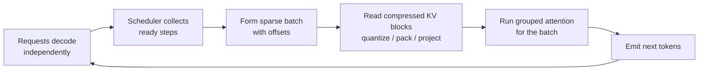

# Asynchronous Sequence Batching for the KV Cache: A Practical Pattern
**Combining per-token quantization, value packing, low-dimensional projection, and layout changes to relieve decode's memory wall.**


**TL;DR**
- The KV cache read path dominates decode latency because each step must stream all prior key–value vectors from memory.
- Asynchronous sequence batching decouples request arrivals from attention execution, so a scheduler can pack ready decode steps into denser GPU batches instead of waiting for stragglers.
- Quantization, packing, projection, and layout conversion shrink and restructure the cache so the packed batch can be fed without becoming memory-bound.

## Why does the KV cache dominate decode cost?

During autoregressive decoding, the model emits one token at a time, and every new token attends to the keys and values of every token generated so far. That means each decode step reads the full KV state for the sequence. The cost is not the matrix multiply alone; it is the memory traffic required to move those cached tensors across the memory hierarchy. As sequence length grows, so does the read footprint, and because decode batches are often small, the workload becomes memory-bound rather than compute-bound.

Sequence batching helps by reusing the same weights across multiple requests, but synchronous batching has a subtle cost: every request in a batch must reach the next decode step together. A single slow tail request, a brief GC pause, or variable pre-fill time forces the rest of the batch to wait, and padding or bubbles appear. Memory then becomes the second problem. Storing keys and values in full precision for many layers, heads, and long contexts consumes most of the accelerator’s RAM, leaving little room for larger batches or longer contexts.

## What does the pattern actually look like?

The pattern separates *when* requests are scheduled from *what* is stored. A lightweight scheduler collects decode steps that are ready, forms a compact batch, and dispatches attention against a compressed KV cache.

That gives two levers:
1. **Temporal decoupling.** Requests advance independently until they have a token ready; only then do they enter the next attention kernel. This reduces idle time compared to lock-step batching.
2. **Spatial compression.** The stored KV tensors are quantized, packed, optionally projected to a lower dimension, and laid out so that a contiguous read pulls exactly the data the attention kernel needs.

The four compression techniques stack:

- **Quantization** represents each key or value element with fewer bits. A symmetric per-token scheme is usually enough: store a scale per token or head and keep the residuals in a narrow integer range.
- **Packing** stores multiple low-bit values in a single machine word, so cache-line utilization rises even when each scalar is tiny.
- **Low-dimensional projection** multiplies the key and value vectors by a fixed or learned reduction matrix. This directly cuts memory and FLOPs, but it changes the model surface, so it is best treated as a training-time or fine-tuning decision.
- **Layout conversion** reorders the cache from a batch-major shape to a sequence-major or head-major layout so that the attention read gathers coalesced blocks instead of striding across memory.

The result is a denser, more predictable memory stream and fewer wasted cycles between decode steps.



## How do the pieces fit together in code?

The example below is intentionally simplified. A production kernel would fuse dequantization into the attention matmul and pack bits according to the target GPU’s INT4/INT8 instructions. Treat this as a structural sketch.

```python
import torch

def quantize_symmetric(x: torch.Tensor, nbits: int = 4):
    """
    Per-token (or per-head) symmetric quantization.
    x shape: [batch, heads, seq_len, head_dim]
    Returns int8 quantized values and fp16 scales.
    """
    max_val = x.abs().amax(dim=-1, keepdim=True).clamp_min(1e-8)
    scale = max_val / (2 ** (nbits - 1) - 1)
    q = torch.round(x / scale).clamp(
        -(2 ** (nbits - 1) - 1), 2 ** (nbits - 1) - 1
    ).to(torch.int8)
    return q, scale.squeeze(-1)

def pack_int4_pairs(q: torch.Tensor):
    """
    Pack two signed int4-like values into one uint8.
    A real kernel would unpack for GEMM, not operate on floats.
    """
    low = q[..., 0::2] & 0x0F
    high = (q[..., 1::2] & 0x0F) << 4
    return (low | high).to(torch.uint8)

def project_kv(x: torch.Tensor, proj: torch.Tensor):
    """
    Optional low-rank projection.
    x:  [B, H, T, D]
    proj: [D, R] with R < D
    """
    return torch.einsum('bhtd,dr->bhtr', x, proj)

def to_sequence_major(kv: torch.Tensor):
    """
    Reorder from [B, H, T, D] to [T, B, H, D] for coalesced seq reads.
    """
    return kv.permute(2, 0, 1, 3).contiguous()

class AsyncDecodeScheduler:
    def __init__(self, max_batch: int):
        self.ready = []
        self.max_batch = max_batch

    def on_token_ready(self, request_id, kv_block):
        self.ready.append((request_id, kv_block))

    def step(self, attention_fn):
        batch = self.ready[:self.max_batch]
        self.ready = self.ready[self.max_batch:]
        if not batch:
            return []
        # Gather keys, values, and sequence offsets
        outputs = attention_fn(batch)
        return outputs
```

Used together, `quantize_symmetric` and `pack_int4_pairs` shrink the cache to a fraction of its FP16 size; `to_sequence_major` aligns the compressed blocks with theattention gather pattern; and `AsyncDecodeScheduler` lets the system feed those blocks to the GPU as soon as enough requests are ready.

## Where does each optimization help, and where does it not?

Quantization and packing are almost pure wins for memory bandwidth once the serving stack has kernels that can dequantize inside the attention matmul. They do not change model capacity, but they do add one extra scale tensor per token or head and can introduce small quantization errors. Teams usually start here before touching model architecture.

Low-dimensional projection is more invasive. It reduces both memory and compute, but it alters the attention score distribution. Whether the quality drop is acceptable depends on whether the projection matrices are trained end-to-end or distilled from the original model. It is not a drop-in optimization.

Layout conversion is easy to overlook but high leverage when the cache lives off-chip. A bad layout turns every attention read into a scatter-gather; a sequence-major or blocked layout turns it into a streaming read. The right choice depends on the batching shape, not just the hardware.

Asynchronous batching itself is not free. It adds scheduling state, variable per-step batch sizes, and the possibility of starvation if too few requests are ready. In practice, it works best when paired with a timeout or a minimum-fill policy: wait a bounded amount of time for a few more requests, then dispatch whatever is available.

## Bringing it together

The read path is the defining bottleneck for low-latency decoding. Larger models and longer contexts only make the KV cache footprint worse. Asynchronous sequence batching changes the shape of the problem by letting the system batch what is *ready* rather than what is *aligned*, while quantization, packing, projection, and layout conversion reduce the bytes each batch must move.

Teams that adopt this pattern usually see smoother utilization, better tolerance for variable pre-fill times, and headroom for longer contexts without proportional increases in batch latency. The exact gains depend on workload shape, model size, and kernel quality, but the architectural direction is clear: make the KV cache smaller, more regular, and easier to feed in bursts.

## Topics
LLM inference, KV cache optimization, sequence batching, continuous batching, model quantization, INT4 quantization, memory bandwidth, generative AI systems, distributed inference, attention optimization