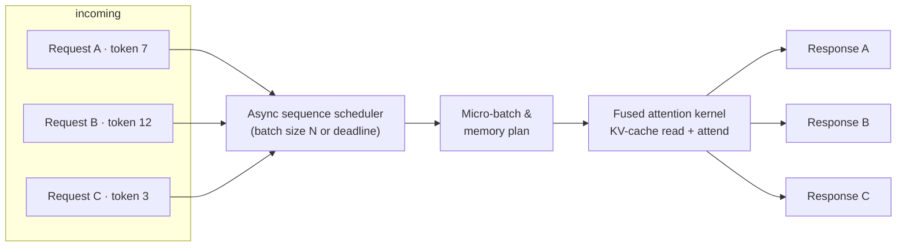

# Can Asynchronous Sequence Batching Quiet the KV Cache Bottleneck?
_Rethinking key-value cache read paths for low-latency inference and real-time evaluation engines._


**TL;DR**
- The KV cache removes the O(n²) per-token recomputation cost in transformer inference, but the read-attend-write loop per decode step can still serialize the engine.
- Asynchronous sequence batching decouples request arrival from kernel launch, letting a scheduler accumulate tokens from independent sequences into hardware-efficient micro-batches.
- Quantization, packing, low-dimensional projection, and layout conversion each remove a different bottleneck—memory footprint, arithmetic intensity, or bandwidth—when paired with async batching.

In transformer inference, the KV cache is the collection of key and value tensors produced for every earlier token in a sequence. Without it, generating each new token would recompute attention against the entire prefix, turning decoding into the expensive core of the model. Caching removes that repetition, but it introduces a new cost center: every decode step still has to read back all retained K and V state, run attention, and write the updated cache. In real-time evaluation engines—reward models, safety classifiers, ranking scorers, and agentic tool evaluators—requests arrive with tight latency budgets and long prefixes. The challenge is no longer avoiding recomputation; it is scheduling memory and compute so that the cache does not become a wall.

## Why does sequential KV-cache access stall throughput?

Sequential access treats each incoming request as an isolated decode step. The engine fetches KV tensors, runs attention, generates or scores the token, and only then starts the next request. That serial dependency wastes the hardware.

A single decode step is small. It decodes one query, attends over a potentially long prefix, and produces one output token. The attend step is memory-bandwidth heavy: each head reads every cached position for its sequence. GPUs hide latency by running many parallel warps, but a request with one query and a long prefix rarely fills the device on its own. When requests are processed strictly first-in-first-out, the hardware waits for one kernel to finish before the next begins. Latency for request `n` then includes the queueing time of all earlier requests. In evaluation engines, where a single prompt may contain thousands of tokens but scoring itself is brief, that idle time dominates.

The real enemy is not the amount of work; it is the spacing between units of work.

## What does asynchronous sequence batching change?

It decouples request arrival from kernel launch. Instead of executing each query immediately, an async scheduler buffers incoming requests and launches a kernel only when it has enough work or a short deadline expires. Tokens from unrelated sequences can share the same attention kernel because their KV state is indexed per sequence.

This amortizes kernel-launch overhead across several requests and gives the memory subsystem larger, contiguous transfers. It also lets memory reads for the next batch overlap with the compute of the current one. From the caller’s point of view, the interface remains per-request: each request awaits its own future, so callers see only their own latency plus a small scheduling headroom, not the full batch wall time.

The pattern shows up whenever request arrival is bursty and individual requests are too small to saturate the accelerator on their own.

## Architectural patterns that make async batching effective

Asynchronous sequence batching is a scheduling idea. Four storage and compute patterns remove the bottlenecks that scheduling alone cannot fix.

**Quantization** stores cached K and V tensors in FP8 or INT8 instead of FP16/BF16. That halves memory footprint and bandwidth, at the cost of a small accuracy budget and dequantization inside the attention kernel. With async batching, the dequantization cost is paid once per micro-batch rather than per request.

**Packing** solves the padding problem. Sequences in a batch have different lengths; left or right padding wastes memory and compute. PagedAttention-style block tables let the engine pack non-contiguous physical blocks into dense tensor-core operations. Async batching plus fine-grained block allocation reduces the bubbles between sequences of different lengths.

**Low-dimensional projection** compresses cached K/V through a learned linear projection before storage, expanding it back before attention. This lowers both memory pressure and the per-attend arithmetic cost. The projection itself is a small matrix multiplication that benefits directly from batched execution.

**Layout conversion** reorders K/V tensors from sequence-major to head-major or block-major layouts that match the attention kernel’s access pattern. Without batching, that conversion would add overhead per request. With async batching, it happens once, at the scheduler boundary, for the whole micro-batch.



## A sketch of the scheduler

The code below is intentionally simplified. A production engine would push the batch to a fused CUDA kernel, but Python’s `asyncio` is enough to show the control flow: collect requests, wait for a batch-size threshold or a deadline, then execute one batch.

```python
import asyncio
from dataclasses import dataclass, field
from typing import List, Dict

@dataclass
class AttentionRequest:
    request_id: int
    seq_id: int
    kv_range: tuple[int, int]  # positions in the per-sequence KV cache
    query: object              # placeholder for the query tensor

class AsyncSequenceBatcher:
    def __init__(self, batch_size: int, timeout_ms: float):
        self.batch_size = batch_size
        self.timeout_s = timeout_ms / 1000.0
        self.queue: asyncio.Queue[AttentionRequest] = asyncio.Queue()
        self.futures: Dict[int, asyncio.Future] = {}

    async def submit(self, req: AttentionRequest) -> object:
        loop = asyncio.get_running_loop()
        fut = loop.create_future()
        self.futures[req.request_id] = fut
        await self.queue.put(req)
        return await fut

    async def run(self):
        while True:
            batch: List[AttentionRequest] = []
            deadline = asyncio.get_running_loop().time() + self.timeout_s

            while len(batch) < self.batch_size:
                wait_s = deadline - asyncio.get_running_loop().time()
                if wait_s <= 0:
                    break
                try:
                    req = await asyncio.wait_for(self.queue.get(), timeout=wait_s)
                    batch.append(req)
                except asyncio.TimeoutError:
                    break

            if batch:
                await self._execute_batch(batch)

    async def _execute_batch(self, batch: List[AttentionRequest]):
        # In production this becomes a single CUDA graph / kernel launch.
        # Here we group the requests, plan contiguous KV reads, and “score.”
        grouped_by_seq: Dict[int, List[AttentionRequest]] = {}
        for req in batch:
            grouped_by_seq.setdefault(req.seq_id, []).append(req)

        # Placeholder: fuse attention over the micro-batch.
        outputs = {req.request_id: f"score_for_{req.request_id}" for req in batch}

        for req in batch:
            self.futures.pop(req.request_id).set_result(outputs[req.request_id])

async def demo():
    batcher = AsyncSequenceBatcher(batch_size=8, timeout_ms=2.0)

    # Background scheduler.
    asyncio.create_task(batcher.run())

    # Simulate bursty arrivals from different sequences.
    reqs = [
        AttentionRequest(i, seq_id=i % 3, kv_range=(0, 64), query=None)
        for i in range(5)
    ]
    results = await asyncio.gather(*(batcher.submit(r) for r in reqs))
    print(results)

asyncio.run(demo())
```

The deadline parameter is the usual tension. Set it too long and small batches wait for no reason; set it too short and kernels launch under-filled. The right value depends on the target tail latency and the arrival rate. A few milliseconds is often the starting point for interactive evaluators.

## Where async sequence batching is not the answer

Every optimization rebalances cost. Batching adds scheduling delay, even if small. It also buffers in-flight requests, which raises peak memory use. For strict per-request latency targets or very low arrival rates, a simple synchronous path can be both faster and easier to reason about. Projection tricks require re-validation because they change model behavior. Quantization needs fallback paths when accuracy dips on numerically sensitive heads.

Teams running distributed inference often see the biggest gains by combining these patterns rather than treating them as a checklist. Async batching wins the scheduling game; quantization, packing, projection, and layout conversion win the arithmetic and bandwidth games. Used together, they turn the KV cache from a sequential choke point into a parallel work queue.

## Topics

`LLM inference`, `KV cache`, `sequence batching`, `low-latency systems`, `transformer optimization`, `attention`, `real-time evaluation`, `GPU inference`