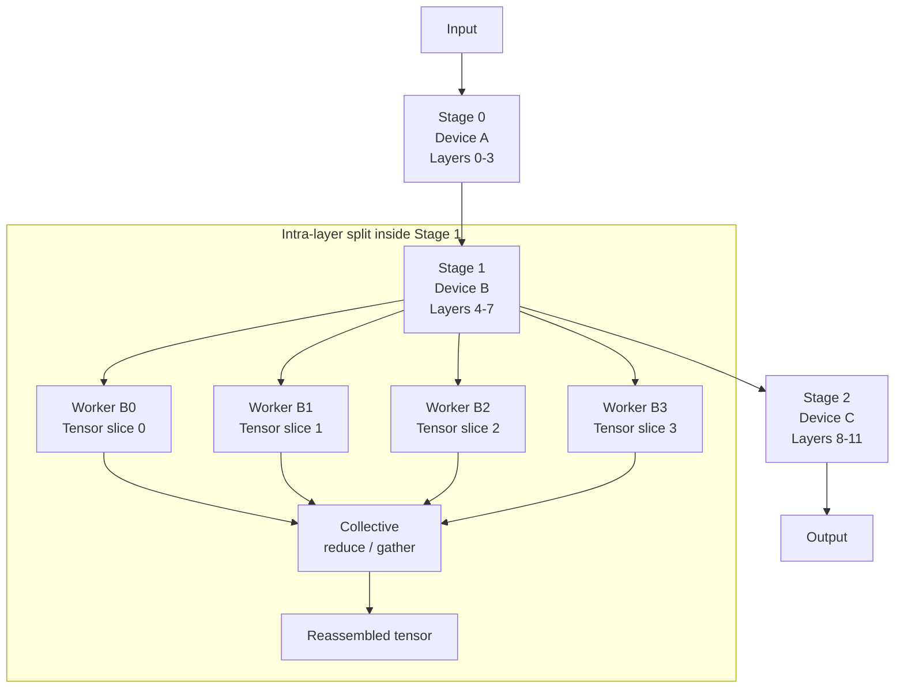

# Distributed Inference with Tensor Slicing Coordination


## A two-phase partitioning strategy for low-latency model evaluation

**TL;DR**
- Distributing a model across devices makes sense only when compute, memory, or network constraints make single-node deployment impractical.
- A two-phase partitioning strategy—inter-layer pipeline parallelism plus intra-layer tensor slicing—can reduce per-request latency if communication is treated as a first-class design constraint.
- The coordination code must answer three questions for every slice: who owns the data, where does it move next, and when does the partial result get reduced?

## Why split a model across devices?

Centralized inference is straightforward: load the model into one accelerator, send requests, collect responses. That simplicity becomes expensive when the model exceeds GPU memory, when peak throughput requires a fleet of devices, or when requests must be placed close to sensors. Distributed inference breaks the model into smaller units that run on multiple workers. The goal is not distribution for its own sake; the goal is to satisfy latency or capacity constraints that a single node cannot meet.

The practical benefits fall into three categories:

- **Memory scaling.** A model too large for one device can be spread across several, each holding only the weights it needs.
- **Throughput scaling.** Independent sub-batches can be processed side by side once the model is replicated or partitioned.
- **Placement flexibility.** Workers can run at the edge for local decision-making, in a cloud region for batch throughput, or both.

Splitting the work is easy; coordinating it is not. The overhead of moving activations between devices can erase the gains of parallelism if the partitioning scheme is sloppy.

## Where does naive model sharding lose performance?

A common first attempt is to assign every second layer to a different device. Requests flow left-to-right through the pipeline, then return. This is inter-layer partitioning, also called pipeline parallelism. It works when there is enough batching to hide transfer latency, but micro-batches of size one often stall: while device B waits for device A to finish a layer, it sits idle. Per-request latency can actually increase compared with single-node inference.

Then there is intra-layer partitioning, or tensor parallelism. Here a single layer's activations and weights are sliced across devices. Each device computes a partial result, and the devices exchange partials via a collective operation such as all-reduce. This approach keeps per-device memory usage low and can reduce the time spent in a single layer, but it adds frequent synchronization points.

The most robust pattern combines the two: inter-layer partitioning to spread the full model depth across edge or cloud devices, and intra-layer partitioning to parallelize the heaviest individual layers. The question is how to coordinate the two without turning the system into a network benchmark.

## A two-phase partitioning model



In this model, an inference request first crosses pipeline stages. Between stages, whole activations are transferred. Inside a stage, particularly a computationally heavy one, the tensor is split across several workers; after local computation, the pieces are reduced or gathered back together. The traffic pattern changes at the boundary, so the implementation must make both explicit.

## What the coordinator must track

A minimal tensor-slicing coordinator has three responsibilities:

**1. Slice ownership and indexing.** Every worker must know which indices of the input tensor it owns. If the batch dimension is 64 and there are 4 workers, rank 2 owns indices `[32:48)`. Ambiguity here produces silent correctness bugs.

**2. Communication scheduling.** Inter-layer stages should overlap computation with transfer when possible. Instead of blocking for the full activation to arrive, use the distributed runtime's buffered queue to prefetch the next micro-batch while the current one is being computed.

**3. Collective reduction.** Within a tensor-parallel stage, partial matrix multiplications must be reduced before the next layer can use them. Wrap the reduction in a dedicated helper so that switching between `all_reduce`, `reduce_scatter`, or `all_gather` is a configuration change, not a code rewrite.

## Example: a minimal PyTorch coordinator

The following sketch is intentionally simplified. It shows a coordinator that splits a single forward pass across four tensor workers and then advances through pipeline stages. The values are illustrative.

```python
import torch
import torch.distributed as dist
from torch.distributed.tensor import DTensor, DeviceMesh, Shard

def init_mesh(world_size: int):
    dist.init_process_group("nccl")
    ranks = torch.arange(world_size)
    return DeviceMesh("cuda", ranks)

def run_pipeline_stage(
    mesh: DeviceMesh,
    activation: torch.Tensor,
    layer_partition: torch.nn.ModuleList,
    shard_dim: int = 0,
):
    # Slice the activation across the mesh along the batch dimension
    sharded_input = DTensor.from_local(
        activation.to(f"cuda:{dist.get_rank()}"),
        mesh,
        placements=[Shard(shard_dim)],
    )

    # Each worker runs its local layers on its owned slice
    hidden = sharded_input
    for layer in layer_partition:
        hidden = layer(hidden)

    # If this stage is tensor-parallel, reduce-scatter before sending
    # to the next pipeline stage. If not, to_local returns the slice.
    return hidden.to_local()

# illustrative dimensions: batch=64, pipeline stages=2, tensor workers=4
batch_size = 64
tensor_mesh = init_mesh(world_size=4)

input_tensor = torch.randn(batch_size, 3, 224, 224)

# Two-stage pipeline: each stage holds half the model
stage_0 = torch.nn.ModuleList([...])  # layers 0-5
stage_1 = torch.nn.ModuleList([...])  # layers 6-11

out_0 = run_pipeline_stage(tensor_mesh, input_tensor, stage_0)
out_1 = run_pipeline_stage(tensor_mesh, out_0, stage_1)

# A real deployment would add overlapping send/recv between stages,
# gradient checkpointing for memory, and request batching for throughput.
```

Notice what this code omits: request routing, fault tolerance, device placement, and kernel-level overlap. Those live in the surrounding scheduler, not in the tensor coordinator itself. That separation is important; it keeps the core arithmetic code readable while allowing platform-specific optimizations to move in and out without rewriting the model.

## Operational trade-offs

Partitioning changes the failure modes. A single-node engine fails only when its host fails. A distributed engine fails when any link, worker, or reduction stalls. Teams should plan for partial failures: timeouts on collectives, bounded retries for stage-to-stage messages, and graceful degradation to smaller batch sizes when workers drop.

Communication also becomes the bottleneck faster than expected. For example, teams often see p99 latency roughly double when moving from one data-center rack to two, unless the schedule is designed to overlap compute with transfer. The fix is rarely more bandwidth; it is usually reordering work so that transfers happen while arithmetic units are busy.

Memory usage is a third variable. Splitting a layer across four devices lowers peak per-device activation memory, but it keeps four copies of specialized buffers and bookkeeping state. For inference workloads, watch the KV-cache footprint: tensor slicing changes which worker stores which attention heads, and the allocation strategy must match the attention pattern.

## When to choose this pattern

Distributed inference is worth the complexity when at least one of these is true:

- The model weights exceed device memory.
- The required throughput cannot be served by a single host even with batching.
- Requests must be placed at the edge, but the full model belongs in the cloud.

If none of those apply, a single-node or replicated model will be simpler, cheaper, and easier to debug. The two-phase approach is a scalpel, not a default.

## Topics

distributed inference, tensor parallelism, pipeline parallelism, low-latency mlops, model partitioning, pytorch distributed, edge ai, large model inference, collective communication