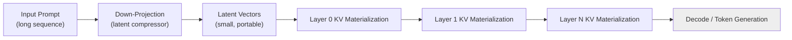

# Layer-Wise Prefill: A Practical Pattern for Low-Latency Distributed LLM Inference

## Splitting the prefill phase so compression, communication, and generation stop waiting on each other.

**TL;DR**
- In long-context and agentic workloads, the prefill phase dominates latency because it materializes full layer-wise KV tensors before decoding can start.
- Layer-wise prefill separates *token compression* from *per-layer KV materialization*, which gives distributed inference workers smaller tensors to move and more opportunities to overlap compute with InfiniBand transfers.
- Like any compression-based pattern, it trades fidelity and memory-complexity for speed, so teams need to evaluate it against their target context lengths, batch sizes, and tolerance for cache eviction overhead.

---

Most production LLM serving clusters today run on multi-GPU nodes linked by InfiniBand. The hardware is fast, yet inference latency still degrades under long contexts because the **prefill phase**—the first forward pass that turns a prompt into key/value tensors—stops the decode phase from starting. Once decoding begins, memory bandwidth and KV-cache movement become the bottleneck. The two phases want different things from the same fabric.

Layer-wise prefill is one response to that tension. The idea, explored in recent systems work (Xiong et al., 2024; Du et al.), is to avoid treating the KV cache as a monolithic block. Instead, the model first compresses tokens into a compact latent representation and then materializes per-layer KV tensors on demand. The result is a more pipelined data flow: smaller tensors move between workers, layers can be scheduled independently, and the system can overlap more communication with computation.

## Why does prefill still dominate latency in distributed LLM serving?

Because modern LLMs compute key and value tensors for **every token at every layer** before generating the first new token, and that work is both compute-heavy and generative of large intermediate state.

In a typical deployment, the prefill step looks like this:

1. The full prompt arrives at one rank.
2. Each tensor- or pipeline-parallel worker computes its slice of the attention KV matrices.
3. The resulting KV state is scattered across workers and held in memory, waiting for decode.

Only after this finishes does token generation begin. For long prompts, or for agentic workflows that repeatedly append tool outputs back into context, the prefill-to-decode handoff becomes a serialization point. Even with HBM bandwidth, moving `[batch, layers, heads, context, head_dim]` tensors across InfiniBand adds up, and the next batch cannot start decoding until the prefilled KV state is coherent.

Layer-wise prefill attacks that serialization directly.

## Where does the tensor slicing fit in?

Layer-wise prefill changes the pipeline by inserting an explicit **compression** step before full KV cache materialization. The architecture has two conceptual stages:

1. **Down-projection**: tokens are compressed into a lower-dimensional latent representation.
2. **Per-layer KV materialization**: the compressed latents are expanded, layer by layer, into the actual KV tuples that attention consumes.

The coordination challenge is what happens between those stages. In a distributed cluster, no single GPU holds the full model or the full context. Tensor-parallel workers own slices of each layer, while pipeline-parallel workers own different layer groups. If the KV cache is produced layer by layer, the runtime can schedule communication at the granularity of one layer—or even one slice of a layer—rather than waiting for the entire prefill tensor to be ready.

Teams running distributed inference often see two practical effects:

- **Smaller transfers over the network.** A small latent representation can broadcast to all workers before they independently expand their local shard of the KV cache, rather than shipping full `[context, hidden_dim]` tensors.
- **More overlap with decode preparation.** Because layer `L+1`'s KV tensors do not depend on layer `L`'s compute being visible to every other node, the scheduler can interleave prefill work for an in-flight sequence with decode work for another sequence.

The diagram below shows the resulting flow.



The critical change is in the arrow leaving `Latent Vectors`. Instead of a single monolithic KV blob, each layer receives only the latent slice it needs. In practice that slice is combined with tensor parallelism so that multiple GPUs expand disjoint head groups or hidden partitions at the same time.

## What does the code pattern look like?

A production implementation is tightly coupled to a specific runtime, but the architectural shape can be sketched with plain PyTorch. The example below is not a drop-in engine; it isolates the moving parts so the design is easier to reason about.

```python
import torch
import torch.nn as nn
import math

class LatentCompressor(nn.Module):
    """
    Compress each input token into a smaller latent vector.
    In deployed systems this is often a small MLP or a linear
    projection shared across the sequence.
    """
    def __init__(self, hidden_dim: int, latent_dim: int):
        super().__init__()
        self.down = nn.Linear(hidden_dim, latent_dim)

    def forward(self, x: torch.Tensor) -> torch.Tensor:
        # x: [batch, seq_len, hidden_dim]
        return self.down(x)


class LayerWiseKVStore:
    """
    One conceptual slot per layer. Each layer expands the shared
    latent representation into its own K/V projection slice.
    In a real runtime these slices live across distributed workers.
    """
    def __init__(self, num_layers: int, num_heads: int, head_dim: int):
        self.num_layers = num_layers
        self.num_heads = num_heads
        self.head_dim = head_dim
        self.store: dict[int, tuple[torch.Tensor, torch.Tensor]] = {}

    def prefill_layer(self,
                      layer_id: int,
                      latents: torch.Tensor,
                      k_proj: nn.Linear,
                      v_proj: nn.Linear) -> None:
        # latents: [batch, seq_len, latent_dim]
        # k_proj / v_project to [batch, seq_len, num_heads * head_dim]
        k = k_proj(latents).view(latents.size(0), latents.size(1),
                                 self.num_heads, self.head_dim)
        v = v_proj(latents).view(latents.size(0), latents.size(1),
                                 self.num_heads, self.head_dim)
        self.store[layer_id] = (k, v)

    def retrieve(self, layer_id: int) -> tuple[torch.Tensor, torch.Tensor]:
        return self.store[layer_id]


class ChunkedPrefillPipeline(nn.Module):
    def __init__(self,
                 hidden_dim: int = 1024,
                 latent_dim: int = 128,
                 num_layers: int = 12,
                 num_heads: int = 8,
                 head_dim: int = 64):
        super().__init__()
        self.compressor = LatentCompressor(hidden_dim, latent_dim)
        self.num_layers = num_layers
        self.cache = LayerWiseKVStore(num_layers, num_heads, head_dim)
        self.layer_k_projs = nn.ModuleList([
            nn.Linear(latent_dim, num_heads * head_dim)
            for _ in range(num_layers)
        ])
        self.layer_v_projs = nn.ModuleList([
            nn.Linear(latent_dim, num_heads * head_dim)
            for _ in range(num_layers)
        ])

    @torch.no_grad()
    def prefill(self, tokens: torch.Tensor) -> None:
        latents = self.compressor(tokens)          # shared representation
        for layer_id in range(self.num_layers):
            self.cache.prefill_layer(
                layer_id, latents,
                self.layer_k_projs[layer_id],
                self.layer_v_projs[layer_id],
            )

    def decode_query(self,
                     layer_id: int,
                     query: torch.Tensor) -> tuple[torch.Tensor, torch.Tensor]:
        k, v = self.cache.retrieve(layer_id)
        return k, v


# --- illustrative usage ---
batch, seq_len, hidden_dim = 2, 256, 1024
tokens = torch.randn(batch, seq_len, hidden_dim)

model = ChunkedPrefillPipeline()
model.prefill(tokens)
k0, v0 = model.decode_query(0)
print(k0.shape)   # torch.Size([2, 256, 8, 64])
```

Several details worth noting:

- `prefill_layer` is the seam where a production runtime would shard execution across GPUs, run only the layers each worker owns, or overlap layer `L+1`'s computation with layer `L`'s all-gather.
- The `latent_dim` is smaller than `hidden_dim`, so the compressed latent vectors are cheaper to broadcast before expansion.
- The in-memory `LayerWiseKVStore` is a stand-in; real systems layer this on top of paged memory managers or chunked eviction policies.

## What should teams watch out for?

Compression is not free. Layer-wise prefill can reduce inter-GPU traffic, but it also introduces design questions that affect model quality and serving reliability.

**Compression fidelity.** A smaller latent vector means some information is discarded. The degree of acceptable loss depends on the task. Teams often experiment with task-specific loss terms or keep the full KV cache for the first few layers while compressing deeper layers.

**Cache fragmentation.** If every layer manages its own KV slice, the runtime must track many small allocations. Without careful page-based management, memory fragmentation can eat the bandwidth and capacity savings the pattern provides.

**Eviction and recomputation.** Long-context and agentic systems frequently drop old conversation turns or tool outputs. With a latent store, evicting a chunk means either recomputing from raw tokens or accepting approximation. The eviction policy therefore couples tightly with the prefill design.

**Consistency between prefill and decode.** decode-phase attention expects KV tensors that match the projected query. If the compressor or layer projections differ between prefill and decode runs—for example, after a model update or quantization change—outputs silently degrade. Versioning these projections and validating cache compatibility is essential.

## Is this pattern right for every serving stack?

Probably not. Layer-wise prefill is most attractive when the prefill phase is the dominant source of end-to-end latency: large contexts, variable prompt lengths, or workloads where many short decode steps wait on one long prefill. When prompts are short and decode dominates, the extra complexity may not pay for itself. However, for teams already operating multi-node inference at scale, the pattern is worth evaluating as part of a broader engine redesign rather than a bolt-on optimization.

The broader lesson is that the KV cache is no longer just a memory structure; it is a distributed scheduling surface. Treating it as a sequence of layer-local, sliceable tensors lets teams trade compression and coordination for latency in ways that monolithic caches cannot.

---

## Topics

`Large Language Models` `KV Cache` `Distributed Inference` `Low-Latency Serving` `Tensor Parallelism` `Layer-Wise Prefill` `InfiniBand` `PyTorch` `LLM Deployment` `Real-Time AI Systems`