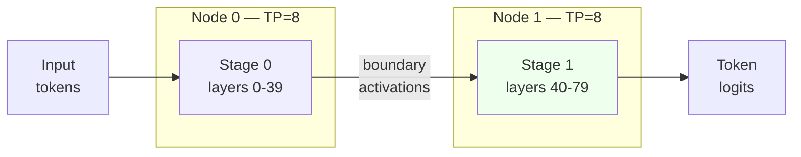

# Multi-Node Pipeline Parallelism for Long-Context Serving


Pipeline parallelism across nodes keeps the inference pipeline full when single-node memory and compute can’t stretch any further.

**TL;DR**
- Long-context inference explodes the KV-cache footprint and activation traffic inside one node, so model layers have to be spread across nodes.
- Pipeline parallelism runs contiguous layer groups on each node and overlaps computation by streaming micro-batches through the stages.
- Before relying on PP, verify the fabric: a healthy cluster should see 800+ GB/s within-node bandwidth on NVLink and clean inter-node InfiniBand/RoCE paths.

## Why does a single node stop being enough?

A single high-memory GPU node is the natural place to start serving large language models, but it hits three hard walls almost at once for long-context workloads.

First, the KV-cache grows linearly with context length and layer count. At 100k+ tokens and tens of transformer layers, the working set no longer fits in HBM even on 80 GB or 96 GB GPUs. Tensor parallelism inside the node helps by sharding attention and MLP weights, yet every layer still stores its slice of keys and values; the aggregate memory still scales with full sequence length.

Second, all-reduce traffic inside a node climbs with batch size and hidden dimension. NVLink is fast, but a saturated NVLink domain has a ceiling; once token generation is dominated by inter-GPU reductions, adding GPUs gives diminishing returns.

Third, power, cooling, and chassis limits mean the largest multi-GPU nodes are expensive and often scarce. Spreading contiguous model layers across separate nodes—pipeline parallelism—moves the bottleneck from “how many GPUs fit in one box” to “how fast can activation tensors move between boxes.”

## How does pipeline parallelism change the data flow?

Each node owns a contiguous slice of model layers, and requests flow through the slices as a sequence of micro-batches.

This is different from tensor parallelism, which shards each layer across GPUs. In TP, every GPU computes a fraction of every layer and all-reduces activations within the same step. In PP, GPU 0–7 on node 0 might run layers 0–39, GPU 0–7 on node 1 might run layers 40–79, and so on. Only the boundary activations cross the node boundary; no full-model all-reduce is needed at every layer.

The throughput win comes from keeping every stage busy. While micro-batch *n* is on node 1, micro-batch *n+1* can already be computing on node 0. The bubble—the idle time at the start and end of a batch—shrinks as you increase the number of micro-batches.



That diagram shows the simplest two-node case. A four-stage pipeline would split layers into four contiguous chunks across four nodes; each stage still uses TP=8 internally, while PP forms the outer mesh.

## What has to be true before the cluster can run efficiently?

PP is only as fast as the slowest stage, and the slowest stage is usually the one waiting on a network transfer.

Within each node, the intra-node fabric must be NVLink. A well-configured cluster should measure 800+ GB/s GPU-to-GPU bandwidth on NVLink; anything materially lower points to a topology or BIOS/NVSwitch issue. Between nodes, activation traffic crosses InfiniBand or RoCE, so latency and bandwidth there directly impact pipeline bubble size. Tools like `nvidia-smi topo -m` verify the NVLink mesh, while `ib_write_bw` confirms the inter-node link can sustain the expected line rate.

Teams also need to watch memory fragmentation. PP reduces per-device memory pressure, but each stage still holds activations for every micro-batch currently in flight between it and the next stage. Chunking requests into small micro-batches lowers that staging cost, while too few micro-batches leaves the pipeline under-filled.

SGLang exposes pipeline parallelism through its launch server. The exact flag names change between releases, but the shape of the command is consistent: specify the number of nodes, the tensor-parallel size inside each node, the pipeline-parallel size across nodes, and a rendezvous address for the distributed backend.

```bash
# Node 0 — representative launch command, check the SGLang release docs for exact flags
python -m sglang.launch_server \
  --model-path /mnt/weights/Meta-Llama-3-70B \
  --tp 8 \
  --pp 2 \
  --nnodes 2 \
  --node-rank 0 \
  --dist-init-addr 10.0.0.10:29500 \
  --max-model-len 131072 \
  --max-num-seqs 256

# Node 1 — same flags, different node-rank
python -m sglang.launch_server \
  --model-path /mnt/weights/Meta-Llama-3-70B \
  --tp 8 \
  --pp 2 \
  --nnodes 2 \
  --node-rank 1 \
  --dist-init-addr 10.0.0.10:29500 \
  --max-model-len 131072 \
  --max-num-seqs 256
```

Server-side PP determines how the model layers are partitioned. Client-side, throughput improves when callers break large batches into micro-batches that keep every stage occupied.

```python
import sglang as sgl
import itertools

@sgl.function
def summarize_chunks(s, documents):
    for doc in documents:
        s += f"Document: {doc}\n"
    s += sgl.gen("summary", max_tokens=256)

documents = load_long_context_batch(n=64)

# 8 requests per micro-batch keeps the pipeline stages busy
micro_batches = [
    documents[i:i + 8]
    for i in range(0, len(documents), 8)
]

results = list(itertools.chain.from_iterable(
    summarize_chunks.run_batch(mb) for mb in micro_batches
))
```

In this pattern the micro-batch size is a tuning parameter, not a hyperparameter of correctness. Smaller micro-batches reduce activation staging memory; larger ones raise arithmetic intensity. The right value depends on the hidden dimension, sequence length, and the inter-node fabric.

## When is multi-node PP the right trade-off?

Pipeline parallelism pays off when the model or context length is too large for even the biggest single node, but the workload has enough concurrency to fill the pipeline.

If requests arrive one at a time and latency matters most, PP adds serial inter-node hops; a single-node TP deployment will usually be faster end-to-end. If throughput is the target and batches contain dozens or hundreds of long-context requests, the overlapping of micro-batches across stages usually wins. Teams also reach for PP when they want to scale incrementally—adding another node adds another pipeline stage—rather than waiting for a larger single-node SKU.

The real discipline is measurement: profile the bubble, measure per-stage utilization, and validate the fabric before turning up traffic. A cluster that looks correct on paper but underperforms on `ib_write_bw` or `nvidia-smi topo` will hide its problems until the pipeline is under load.

## Topics

- Distributed Systems
- LLM Inference
- Pipeline Parallelism
- SGLang
- GPU Clusters
- Performance Engineering
- Machine Learning Infrastructure