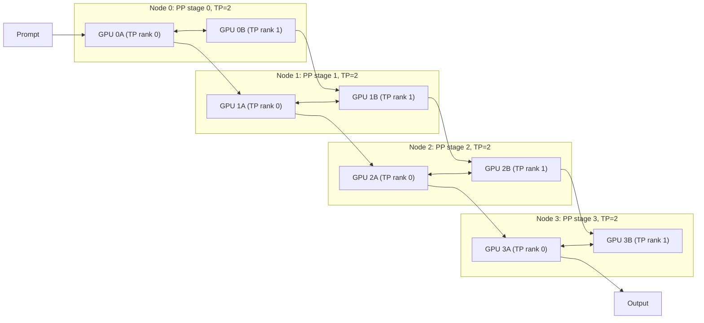

# Multi-Node Pipeline Parallelism for Low-Latency Long-Context Inference
*A practical look at balancing tensor and pipeline parallelism when one GPU is no longer enough.*

**TL;DR**
- Pipeline parallelism (PP) partitions model layers across nodes, letting teams serve long-context models that exceed single-GPU memory; the cost is added per-request latency from stage-to-stage handoffs.
- The right mix of tensor parallelism (TP) inside a node and PP across nodes depends on interconnect bandwidth, not just GPU count.
- Taming inter-node activation transfer means overlapping communication with compute, keeping micro-batches full, and aligning stage placement with the physical network topology.

Real-time evaluation engines that score, rank, or rerank model outputs can no longer assume that the whole model fits on one device. Long prompts—hundreds of thousands of tokens—push weights, attention states, and KV caches past the memory envelope of a single GPU. Once that happens, the question is not *whether* to distribute the model, but *how*.

Two patterns dominate: tensor parallelism, which splits individual layers across GPUs, and pipeline parallelism, which splits layers into sequential stages. Used together, they let a team scale a single inference request across many nodes. The hard part is managing what flows between those nodes.

## Why does pipeline parallelism dominate the latency-stretch trade-off for long contexts?

**Pipeline parallelism wins when model size and KV-cache footprint force activations out of a single node, because it scales memory capacity linearly with stage count while keeping intra-node collectives small.**

Tensor parallelism is usually the lower-latency option. Inside a node, TP partitions a layer’s weights and matrices across GPUs, runs the forward pass in parallel, and reconciles results with fast NVLink or PCIe all-reduces. For short-context workloads that fit comfortably on one server, TP is almost always the first knob to turn.

But TP does not scale cleanly across nodes. Each layer needs an all-reduce over the interconnect, and that cost grows with the size of the activation tensor. In long-context inference, activations are large. The wider the context window, the more bytes each TP all-reduce must move. Once the TP group spans rack-switch boundaries, the latency of those collectives can dominate the entire forward pass.

Pipeline parallelism takes a different approach: it assigns contiguous groups of layers—stages—to different nodes. A token batch is computed by stage 0, then its activations are shipped to stage 1, then stage 2, and so on. The per-stage all-reduces stay local, and the cross-node traffic becomes point-to-point forward activations rather than all-reduce collectives.

The trade-off is latency stretch. A request must visit every stage in order. With four PP stages, the minimum wall-clock time for one micro-batch is roughly the sum of four stage latencies plus three inter-stage transfers. That is why increasing PP raises per-request latency even as it raises throughput and scale.



In the diagram, each node hosts one PP stage and uses two-way TP inside the node. Activations move horizontally through the pipeline, while TP all-reduces stay inside each node. That is the topology teams usually want: wide and fast within a node, narrow and scheduled between nodes.

## How do chunked allocation and micro-batching keep the pipeline full?

**The key is to split each request into chunks—micro-batches—so that one stage can compute the next chunk while the following stage computes the previous one, hiding inter-node transfer latency behind compute.**

Without chunking, a four-stage pipeline would spend most of its time idle. Stage 1 waits for stage 0 to finish the whole prompt, stage 2 waits for stage 1, and so on. The result is a large bubble: wasted GPU time at the start and end of every forward pass.

By slicing the prompt into smaller pieces and streaming them through the stages, each GPU has a micro-batch to work on almost every cycle. SGLang’s pipeline-parallel scheduler, like other modern serving engines, uses this pattern to overlap the send of one chunk with the compute of the next. The chunk size is a tunable lever: too small and communication overhead dominates; too large and the pipeline bubble returns.

Here is an illustrative launch configuration for a deployment that needs both scale and a reasonable latency floor:

```bash
# Illustrative SGLang server launch: 4 PP stages, 2-way TP per node
python -m sglang.launch_server \
  --model-path meta-llama/Meta-Llama-3.1-70B-Instruct \
  --tp 2 \
  --pp 4 \
  --mem-fraction-static 0.85 \
  --max-running-requests 64 \
  --chunked-prefill-size 8192
```

And the corresponding frontend call pattern:

```python
import sglang as sgl

@sgl.function
def eval_long_context(s, document, question):
    s += system_prompt
    s += "Document:\n" + document + "\n\n"
    s += "Question: " + question + "\nAnswer:"
    s += sgl.gen("answer", max_tokens=256, temperature=0.0)

# llm points at the multi-node SGLang server above
llm = sgl.Engine(
    model_path="meta-llama/Meta-Llama-3.1-70B-Instruct",
    tp_size=2,
    pp_size=4,
)

# A prompt that would not fit on a single H100 is distributed across 4 nodes
states = eval_long_context.run(
    [{"document": "..." * 20000, "question": "Does this mention X?"}],
    llm=llm,
)
print(states[0]["answer"])
```

The `--pp 4` flag partitions the 70B model into four layer stages, while `--tp 2` keeps each stage’s matrix multiplications local to a pair of GPUs. `--chunked-prefill-size 8192` tells the scheduler to break the prefill into 8192-token chunks that flow through the pipeline. The exact numbers will differ for each model and hardware generation, but the shape of the config—PP for memory capacity, TP for intra-stage speed, chunked prefill for bubble hiding—is the pattern to remember.

## What makes inter-node activation transfer expensive, and how do teams mitigate it?

**The dominant cost is bytes times fabric hops: every pipeline stage passes full forward activations, and sometimes attention KV states, to the next stage over the inter-node network.**

With long contexts, those activations are not tiny tensors. A batch with 64K tokens of hidden dimension 8K in BF16 moves roughly a gigabyte of activation data per PP boundary per micro-batch. If the network path crosses multiple switches or if the cluster does not have InfiniBand-style bandwidth, transfer time becomes the bottleneck even when the GPUs themselves are underutilized.

Teams reduce this cost in three ways.

First, they overlap communication with computation. Modern PP runtimes send activations for micro-batch *n* while computing micro-batch *n+1*. The degree of overlap depends on how evenly the stages are balanced. A stage with slightly more layers or a slower kernel can stall the whole pipeline, so layer assignment should distribute FLOPs and memory use evenly.

Second, they keep micro-batches small enough that transfer latency is hidden, but large enough that the per-transfer fixed cost does not dominate. There is no universal optimum; it shifts with context length, batch size, and network bandwidth.

Third, they place stages according to the physical topology. Putting adjacent PP stages on nodes connected by the same top-of-rack switch or by a high-bandwidth rail avoids long-haul transfers. Some teams also quantize inter-stage activations—from BF16 to FP8 or even INT8—at the cost of a small accuracy budget. This cuts bytes moved by half or more, which directly reduces transfer time.

One subtle issue is buffering. Each stage needs enough pinned memory to hold incoming and outgoing activation buffers for several micro-batches. Under high concurrency, that buffer memory can compete with the KV cache. A deployment that looks correct at low load can run out of memory at high load because the pipeline needs more micro-batches in flight to stay busy. Monitoring peak activation-buffer usage alongside KV-cache usage is essential.

## Closing the loop

Balancing TP and PP is not a one-time decision. As context lengths grow and batch sizes shift, the bottleneck can move from compute to memory, from memory to interconnect, or from interconnect back to bubble time. Teams running these systems usually start with the minimal PP degree that fits the model in memory, keep TP inside the node, and then increase PP only when the alternative is slower cross-node all-reduces.

Pipeline parallelism is not free latency. It is a deliberate trade: accept a predictable stage-to-stage cost in exchange for memory capacity that scales linearly with node count. For real-time evaluation engines facing ultra-long prompts, that trade is often the only path that keeps the request on a single coherent model.

## Topics

`distributed-inference`, `pipeline-parallelism`, `sglang`, `long-context-models`, `tensor-parallelism`, `real-time-ml`, `gpu-serving`, `llm-inference-engineering`