# Pipeline Parallelism for Long-Context Inference: Coordinating Tensor Slices Across Nodes
*A look at how chunked scheduling across pipeline stages helps scale transformer inference when tensor parallelism runs out of headroom.*


**TL;DR**
- For very long contexts, tensor parallelism within a single node often hits memory and interconnect limits before compute does.
- Pipeline parallelism across nodes can scale model size, but naive implementations spend most of their time in fill/drain bubbles and store too much activation state per stage.
- Chunked tensor slicing—splitting the sequence into micro-batches and streaming them through stage boundaries—keeps the pipeline busy, bounds memory, and is a key pattern behind recent work such as SGLang's multi-node PP.

Long-context inference is hard for the obvious reason—more tokens need more compute—but it is also hard for a less obvious one: the working set grows with sequence length. Activations, attention buffers, and the KV cache can quickly exhaust GPU memory on a single node, and tensor parallelism (TP) only helps until you run out of devices in the same box or out of cross-GPU bandwidth. That is the point where teams usually turn to pipeline parallelism (PP): splitting the model vertically by layer, placing consecutive stages on different nodes, and letting each node own a slice of the network depth. Done naively, however, PP is slow. This post looks at why, and how chunked tensor slicing fixes the worst of it.

## Why does naive pipeline parallelism stall on long contexts?

Because each stage sits idle while the full sequence propagates through the others, and long sequences make that idle time and the per-stage memory footprint significantly worse.

In pipeline parallelism, every layer in a contiguous block is assigned to the same stage (or same group of TP-attached devices). A forward pass starts at stage 0, moves to stage 1, then stage 2, and so on. If you push one large tensor through—say, the entire prompt length multiplied by batch size—stage 0 finishes first, then waits while stage 1, stage 2, and every other stage take their turns. During that *fill* phase, most of the cluster is idle. The same thing happens in reverse during the *drain* phase. The fraction of time spent in those bubbles is roughly proportional to the number of stages divided by the number of micro-batches, so a single giant batch with only one chunk leaves the GPUs dark most of the time.

Long contexts amplify two related costs inside that bubble. First, intermediate activations and the KV cache are larger, so any stage that has finished its chunk but must hold state while waiting for downstream stages consumes more memory for longer. Second, each node-to-node transfer ships a bigger payload. If the interconnect time is not overlapped with computation, it becomes idle time as well. The result is a system that technically scales model size across many nodes but delivers throughput far below the sum of its hardware.

## How does chunked tensor slicing keep the pipeline full?

By splitting the input into micro-batches along the sequence dimension and scheduling them so that every stage has useful work in almost every time step.

The idea is the same one used in GPUs and CPUs everywhere: hide latency with concurrency. If you slice the input tensor along the sequence dimension—`[batch, seq_len, hidden]` becomes a series of `[batch, chunk_size, hidden]` chunks—then stage 0 can work on chunk $k+1$ while stage 1 works on chunk $k$, stage 2 works on chunk $k-1$, and so on. During steady state every stage is busy, and activation memory at any point is bounded by the chunk size rather than the full sequence length.

Of course, chunking adds scheduling complexity. The runtime must track which micro-batch is in which stage, stage output must be forwarded to the next stage, and prefilled KV caches may need to be aggregated across chunks. But the gains are substantial: bubble time falls because there are far more in-flight chunks than stages, and peak memory falls because no single stage materializes the full-length state at once. This is the pattern SGLang's multi-node PP implementation uses—coordinating chunked prefills and decodes with the pipeline boundary so that communication and compute overlap rather than alternating.

The diagram below shows the fill/steady-state/drain shape for three micro-batches across three pipeline stages:

```mermaid
gantt
    title Pipeline fill, steady state, and drain with three micro-batches
    dateFormat X
    axisFormat %s
    section GPU 0 / Stage 0
    chunk 0   :0, 1
    chunk 1   :1, 2
    chunk 2   :2, 3
    section GPU 1 / Stage 1
    chunk 0   :1, 2
    chunk 1   :2, 3
    chunk 2   :3, 4
    section GPU 2 / Stage 2
    chunk 0   :2, 3
    chunk 1   :3, 4
    chunk 2   :4, 5
```



In the first time unit only stage 0 is active; in the last time unit only stage 2 is active; in between, all three are running in parallel. With more chunks and more stages, the steady-state region dominates the timeline.

## An illustrative chunked-pipeline skeleton

The Python below is not production-distributed code; it runs in a single process and uses plain modules for stage boundaries, but it captures exactly the scheduling invariant that matters for chunked PP. The key detail is that each micro-batch is forwarded one stage per step, and in-flight activations are advanced in reverse order so that a chunk never overwrites an activation before it has been consumed.

```python
import torch
from typing import List

class PipelineStage(torch.nn.Module):
    def __init__(self, input_dim: int, hidden_dim: int):
        super().__init__()
        self.net = torch.nn.Sequential(
            torch.nn.Linear(input_dim, hidden_dim),
            torch.nn.GELU(),
            torch.nn.Linear(hidden_dim, input_dim),
        )

    def forward(self, x: torch.Tensor) -> torch.Tensor:
        return self.net(x)

def chunked_pipeline_forward(
    x: torch.Tensor,
    stages: List[PipelineStage],
    chunk_size: int,
) -> torch.Tensor:
    """Single-process illustration of chunked pipeline parallelism.
    x shape: (batch, seq_len, hidden)
    """
    batch, seq_len, hidden = x.shape
    assert seq_len % chunk_size == 0

    chunks = x.split(chunk_size, dim=1)
    num_stages = len(stages)
    in_flight: List[torch.Tensor] = [None] * (num_stages - 1)
    outputs: List[torch.Tensor] = []

    def advance(output: torch.Tensor, stage_idx: int):
        if stage_idx == num_stages - 1:
            outputs.append(output)
        else:
            # In real multi-node code this is a point-to-point NCCL send.
            in_flight[stage_idx] = output

    # Fill and steady state
    for chunk in chunks:
        out = stages[0](chunk)
        advance(out, 0)

        # Advance each in-flight activation by one stage, back-to-front.
        for s in range(num_stages - 2, -1, -1):
            if in_flight[s] is not None:
                out = stages[s + 1](in_flight[s])
                in_flight[s] = None
                advance(out, s + 1)

    # Drain remaining stages
    for _ in range(num_stages - 1):
        for s in range(num_stages - 2, -1, -1):
            if in_flight[s] is not None:
                out = stages[s + 1](in_flight[s])
                in_flight[s] = None
                advance(out, s + 1)

    return torch.cat(outputs, dim=1)


# Usage: 8192-token sequence chunked into 1024-token micro-batches,
# partitioned across four pipeline stages.
batch, seq_len, hidden = 2, 8192, 1024
x = torch.randn(batch, seq_len, hidden)

stages = [PipelineStage(hidden, hidden * 4) for _ in range(4)]
y = chunked_pipeline_forward(x, stages, chunk_size=1024)
assert y.shape == x.shape
```

In a real engine, the `stages` would live on different ranks, `forward` would be wrapped with `torch.distributed` send/recv ops, and the chunk size would be tuned for the network bandwidth and activation memory budget rather than just sequence divisibility. Still, the scheduling invariant is the same: keep every stage fed, one chunk at a time.

## Choosing the right mix of TP and PP

Neither tensor nor pipeline parallelism is outright better; they solve different problems and impose different costs.

- **More TP tends to reduce per-request latency.** Tensor parallelism splits individual layers across devices that work in lockstep, so a single forward pass finishes faster because all GPUs in the group contribute. The cost is an all-reduce after every layer in both forward and backward directions. That all-reduce requires fast interconnect; for typical transformer blocks, TP is usually kept inside a single node where NVLink or equivalent links are available.

- **More PP improves throughput with weaker interconnect.** Pipeline parallelism sends only stage boundary activations between nodes, and those transfers can overlap with compute once the pipe is full. Per-request latency is higher, because a request must walk through every sequential stage. That makes PP attractive for throughput-oriented serving, especially when cross-node bandwidth is limited.

A practical rule of thumb for long-context inference is to maximize TP within a node first—use every accelerator that shares a fast fabric—then add PP stages across nodes to fit the model and its KV cache. The chunk size then becomes the final tuning knob: too large and you reintroduce memory pressure and bubbles; too small and scheduling overhead dominates.

## What this means in practice

Pipeline parallelism is not a drop-in replacement for tensor parallelism; it is a scheduling discipline. Teams that get it right treat the boundary between stages as a first-class concern: chunk size, activation checkpointing, KV-cache layout across chunks, and point-to-point communication scheduling all matter.

Implementations such as SGLang's multi-node PP show one way to put these pieces together by combining chunked prefill/decode with the pipeline boundary. The underlying pattern, though, is general: slice the work small enough that the pipe is full, large enough that dispatch overhead stays negligible, and overlap the inter-stage transfers so the network is never the long pole.

For now, the most honest thing to say is that multi-node PP works best when it is co-designed with the serving stack and the hardware topology—not bolted on after the model and cluster are already fixed.

## Topics

- Machine Learning Engineering
- Distributed Training and Inference
- Transformer Inference
- Pipeline Parallelism
- Long-Context Models
- SGLang
- GPU Optimization