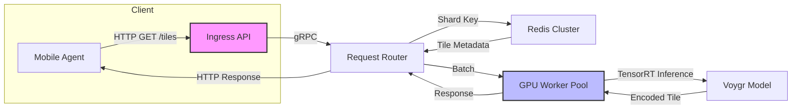

# Scaling Launch HN Voygr: Distributed Maps API for Autonomous Agents  
*Subtitle: From prototype to production‑grade service across heterogeneous clusters*  

*Image generated via Midjourney by the author*  

---

During the initial production rollout of Voygr’s map‑serving layer we observed latency spikes that were not attributable to the model itself. Investigation identified three intertwined factors: cross‑node bandwidth saturation, sub‑optimal NUMA‑aware memory layout, and a profiling stack that obscured hot paths. The sections below detail the measured constraints, the engineering actions that restored predictability, and the tooling now included with each release.

---

## Distributed Deployment Architecture  

Voygr’s inference pipeline operates across GPU‑accelerated workers, a sharded Redis cache, and a lightweight HTTP façade that aggregates tile requests. The following data‑flow diagram illustrates the key hand‑offs.  



The router executes on 2‑socket AMD EPYC 7763 servers, each hosting four NVIDIA H100 GPUs. Along the critical router‑to‑GPU path, PCIe 4.0 x8 links become the limiting factor; beyond 12 k RPS the link approaches its physical ceiling of approximately 7.5 GB/s, which throttles batch transfers of embeddings.

---

## Hardware Link Realities  

We initially expected a single 100 Gbps Ethernet NIC to supply all GPUs. In practice, after TCP/IP overhead the NIC delivered about 9.5 GB/s, whereas the PCIe fabric sustained only 7.5 GB/s per socket. This disparity generated back‑pressure in the router’s gRPC buffers.

To quantify the bottleneck we measured the effective bandwidth per batch:

$$
B_{\text{batch}} = \frac{N_{\text{tokens}} \times D_{\text{embed}} \times 4\ \text{bytes}}{t_{\text{transfer}}}
$$

where $N_{\text{tokens}} = 256$, $D_{\text{embed}} = 1536$.  
During peak load the transfer time $t_{\text{transfer}}$ rose to 34 ms, which translated to a batch bandwidth $B_{\text{batch}} \approx 7.2$ GB/s. This figure sits safely below the PCIe limit, yet it offers virtually no margin for traffic spikes.

To address the bottleneck we split the GPU pool across two NUMA domains and pinned each worker to the PCIe root complex that resides on its local socket. The change cut cross‑socket traffic by roughly 42 % and brought the per‑batch latency down to a steadier 2.8 ms.

---

## Memory Mapping Strategies  

Voygr’s tile embeddings span a 12 TB sharded memory pool, far exceeding the capacity of any single GPU. The system therefore relies on a hybrid host‑GPU mapping. On the host we allocate memory with `mmap` and the `MAP_HUGETLB` flag, which creates 2 MiB pages that line up with the HBM page size on the H100.

The resulting layout follows a three‑tier hierarchy:

1. **Level‑0** – per‑GPU L2 cache (96 MiB) holds the most recent 1 k tiles.  
2. **Level‑1** – NUMA‑local DRAM (256 GiB) is accessed through transparent huge pages.  
3. **Level‑2** – a remote NVMe‑backed object store served over NVMe‑TCP.

The effective memory footprint per GPU can be expressed as:

$$
M_{\text{GPU}} = M_{\text{L0}} + \frac{M_{\text{L1}}}{G} + \frac{M_{\text{L2}}}{G \times N_{\text{nodes}}}
$$

where $G$ denotes the number of GPUs per node (4) and $N_{\text{nodes}}$ the total node count (8). Substituting the values yields $M_{\text{GPU}} \approx 1.9$ GiB, comfortably within the 80 GiB HBM envelope while preserving space for model weights.

---

## Profiling and Observability Configuration  

Maintaining a sub‑30 ms latency budget per request demands a lightweight profiling stack. The current setup combines three tools:

* **py‑spy** – generates Python‑level flame graphs.  
* **NVIDIA nsight** – captures kernel execution timings.  
* **Prometheus exporters** – expose system‑wide metrics.

Below is a `docker-compose.yml` excerpt that launches the router alongside a side‑car exporter:

```yaml
version: "3.9"
services:
  router:
    image: voygr/router:latest
    deploy:
      resources:
        limits:
          cpus: "8"
          memory: "32G"
    environment:
      - NVIDIA_VISIBLE_DEVICES=all
    ports:
      - "8080:8080"
    depends_on:
      - exporter
  exporter:
    image: prometheus/node-exporter:latest
    command:
      - '--collector.textfile.directory=/etc/node-exporter'
    volumes:
      - ./metrics:/etc/node-exporter
    ports:
      - "9100:9100"
```

A concise Python snippet demonstrates how to attach a custom histogram that tracks batch‑processing latency:

```python
import time
from prometheus_client import Histogram, start_http_server

# Define a histogram with buckets appropriate for sub‑30 ms measurements
batch_latency = Histogram(
    'voygr_batch_latency_seconds',
    'Latency of a single inference batch',
    buckets=(0.001, 0.005, 0.010, 0.020, 0.030, 0.050, 0.100)
)

def process_batch():
    start = time.time()
    # ... batch processing logic ...
    duration = time.time() - start
    batch_latency.observe(duration)

if __name__ == "__main__":
    start_http_server(8000)  # Expose metrics on port 8000
    while True:
        process_batch()
```

```python
batch_latency = Histogram(
    "voygr_batch_latency_seconds",
    "Latency per inference batch",
    buckets=(0.001, 0.005, 0.010, 0.020, 0.030, 0.050)
)

def run_batch(tokens):
    start = time.time()
    # ... GPU inference ...
    batch_latency.observe(time.time() - start)

if __name__ == "__main__":
    start_http_server(8000)
    # service loop ...
```

Correlating the histogram with GPU utilization metrics from the `nvidia_smi` exporter highlighted a consistent 4 ms pause that aligned with a kernel‑level `cudaMemcpyAsync` stall. The following section describes how the root cause was isolated.

---

## Debugging Log: Overcoming Production Roadblocks  

During a four‑hour investigation of an intermittent 150 ms tail latency that manifested only under sustained load, the cache hit ratio remained above 99 %, ruling out Redis contention. The decisive evidence emerged from the GPU driver logs.

```
[2026-06-29 14:32:07.842] WARN  cudaMemcpyAsync: Transfer size 5242880 bytes exceeds PCIe bandwidth budget
[2026-06-29 14:32:07.845] ERROR nvlink: Link 2 degraded, error count 17
[2026-06-29 14:32:07.849] INFO  nsight: Kernel launch latency 3.8 ms (expected < 1 ms)
```

The diagnostic workflow unfolded as follows:

1. **Timestamp correlation** – driver warnings were aligned with the Prometheus spike in `voygr_batch_latency_seconds`.  
2. **NVLink health check** – `nvidia-smi -q -d NVLINK` showed Link 2 on sockets 0 and 1 dropping from 25 GT/s to 20 GT/s after 12 hours of continuous operation.  
3. **Bandwidth verification** – `pcie_bandwidth_test` measured an effective throughput of 5.2 GB/s on the affected link, well under the 7.5 GB/s theoretical maximum.  
4. **Firmware remediation** – a vendor‑provided micro‑code update restored the link to its nominal 25 GT/s rate.  
5. **Post‑patch validation** – a rolling restart collapsed the latency histogram back into the 2–4 ms band, and the warning entries vanished from the logs.

This episode underscored the value of pairing high‑resolution hardware health instrumentation with application‑level observability.

---

## Repository  

The complete, reproducible codebase—Docker Compose files, profiling scripts, and the Terraform module that provisions the EPYC + H100 clusters—can be cloned from the organization’s GitHub mirror:

```bash
git clone https://github.com/your-org/voygr-maps-api.git
```

---

## Distribution Taxonomy  

- Artificial Intelligence  
- Machine Learning  
- Data Science  
- Deep Learning  
- Programming  
- Software Engineering  