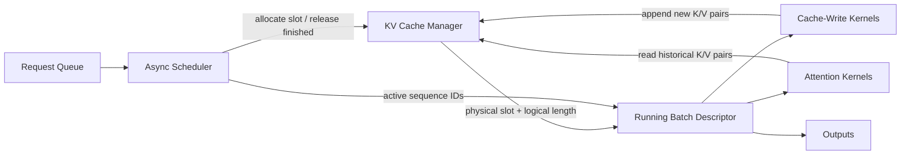

# Asynchronous Sequence Batching for KV Caches: A Pattern for Low-Latency Inference Engines


## How real-time evaluation engines keep GPUs busy without waiting for every sequence to finish at the same time.

**TL;DR**
- Synchronous batching wastes GPU time and memory when sequence lengths and arrival times vary.
- Asynchronous sequence batching treats the batch as a dynamic resource: new sequences join as soon as a slot frees, while a KV cache manager tracks per-sequence physical offsets.
- The correctness of the pattern depends on the contract between the scheduler, cache-write kernels, and attention kernels—each must agree on which physical slots store which historical tokens.

Real-time evaluation engines for transformer models face a tension that synchronous training pipelines rarely encounter. Requests arrive one by one, each with a different prompt length and a different appetite for generated tokens. If the engine waits until it can form a full, aligned batch, most of the GPU sits idle. If it pads every request to the longest sequence in a static batch, it throws away memory bandwidth and cache capacity on zeros. The pattern that resolves this is asynchronous sequence batching, and its central data structure is the KV cache managed with explicit physical mapping.

## Why does synchronous batching fall over at scale?

It forces every sequence in a batch to start and finish together, which leaves the GPU idle while waiting for stragglers and wastes memory on padding.

In a synchronous scheme, the scheduler collects N requests, pads or truncates them to a common length, dispatches one forward pass, and returns N outputs. That works when traffic is bursty, sequences are equal in length, and latency requirements are loose. In practice, none of those conditions hold. A single long-context prefill can hold up a batch of short decode steps. Once the batch is running, a newly arrived request cannot join; it must wait for the entire pass to finish. The result is low occupancy, high tail latency, and a memory footprint dominated by padding rather than useful state.

The deeper problem is that transformer inference is not a single-phase workload. Prefill phases compute KV pairs for an entire prompt in one pass, while decode phases append one token at a time and reuse the previously cached KV pairs. Mixing these phases in a static batch is awkward at best and impossible at worst. Real-time engines need a way to pipeline prefills, decodes, and completions without forcing them into lockstep.

## What does asynchronous sequence batching actually look like?

It is a scheduler that inserts new sequences into a running GPU batch as soon as slots free up, while a KV cache manager tracks the physical offset of each sequence.

Rather than viewing a batch as a fixed matrix that starts empty and ends empty, the engine treats it as a set of slots with lifecycles. When a sequence finishes, its slot becomes available; the scheduler immediately backfills it with the next pending request. While the GPU is busy on step t, the CPU-side scheduler is already preparing the metadata for step t+1. This is often called continuous batching or in-flight batching, depending on the serving framework.

The scheduler owns two decisions: which sequences run next, and when a sequence can be admitted. Admission depends on KV cache capacity, not just on batch size. A sequence that needs 4,096 tokens of cache history cannot join if the only free slots are sized for shorter contexts. The scheduler therefore cooperates closely with the cache manager, which knows which physical memory regions are occupied and for how long.

## The role of physical mapping in the KV cache

The KV cache is not just a tensor; it is a memory allocator with a map from logical token positions to physical storage locations.

Each transformer layer maintains two tensors for each sequence: keys and values. In a simple contiguous layout, a sequence with slot `s` and current length `l` occupies layers × heads × head_dim entries across positions `0` to `l-1` at batch index `s`. When the model appends a new token, the cache-write kernel writes to position `l`. When the attention kernel runs, it reads positions `0` through `l-1` for that sequence.

Physical mapping becomes critical under asynchronous batching because slots are reused out of order. Sequence A might finish and release slot 3 while sequence B in slot 1 is still on its twentieth decode step. Five microseconds later, sequence C might claim slot 3 and start a fresh prefill. The attention kernel must know C’s actual history length and physical slot; it cannot assume every slot in the batch has the same length or the same starting position.

This mapping is usually expressed as per-sequence metadata: a sequence ID, a logical length, and a physical slot or block offset. The scheduler passes this metadata to the GPU kernels as part of the batch descriptor. If the mapping drifts—if the scheduler thinks a sequence is at length 42 while the kernel wrote only 41 tokens—the attention kernel will read stale or uninitialized cache entries.

```python
from dataclasses import dataclass
from typing import Optional, Iterable


@dataclass
class SequenceState:
    seq_id: int
    logical_len: int
    physical_slot: int


class KVCacheManager:
    def __init__(
        self,
        max_batch: int,
        max_seq_len: int,
        num_layers: int,
        num_kv_heads: int,
        head_dim: int,
    ):
        self.max_batch = max_batch
        self.max_seq_len = max_seq_len
        # Shape: [2, layers, max_batch, max_seq_len, heads, dim]
        # 0 = keys, 1 = values. In production this is a GPU buffer; omitted here.
        self.num_layers = num_layers
        self.num_kv_heads = num_kv_heads
        self.head_dim = head_dim
        self.free_slots = set(range(max_batch))
        self.active: dict[int, SequenceState] = {}

    def allocate(self, seq_id: int) -> Optional[SequenceState]:
        if not self.free_slots:
            return None
        slot = self.free_slots.pop()
        state = SequenceState(seq_id=seq_id, logical_len=0, physical_slot=slot)
        self.active[seq_id] = state
        return state

    def release(self, seq_id: int) -> int:
        state = self.active.pop(seq_id)
        self.free_slots.add(state.physical_slot)
        return state.physical_slot

    def extend(self, seq_id: int, token_count: int) -> SequenceState:
        state = self.active[seq_id]
        state.logical_len += token_count
        if state.logical_len > self.max_seq_len:
            raise ValueError(f"sequence {seq_id} exceeded max_seq_len")
        return state

    def running_metadata(self) -> Iterable[SequenceState]:
        return self.active.values()


class AsyncSequenceScheduler:
    def __init__(self, kv_manager: KVCacheManager, max_batch: int):
        self.kv_manager = kv_manager
        self.max_batch = max_batch
        self.pending = []

    def enqueue(self, request: SequenceState):
        self.pending.append(request)

    def step(self) -> list[SequenceState]:
        # Backfill any slots that finished during the last GPU step.
        while self.pending and len(self.kv_manager.active) < self.max_batch:
            req = self.pending.pop(0)
            state = self.kv_manager.allocate(req.seq_id)
            if state is None:
                self.pending.insert(0, req)
                break
        return list(self.kv_manager.running_metadata())
```

The scheduler above is intentionally simplified. A production version must also respect prefill chunking, decode budgets, and priority classes. But the core contract—allocate a slot, track logical length, and let kernels read and write through physical indices—remains the same.



## Kernel interface considerations

Cache-write kernels and attention kernels must agree on the batch descriptor, because that descriptor is the single source of truth for physical mapping.

When the model executor launches transformer layers, it passes the descriptor to both kernel types. The cache-write kernel needs to know where to append new K/V pairs: for each sequence, the physical slot and the next free logical position. The attention kernel needs to know which positions are valid history: the same physical slot and the current logical length, not the full `max_seq_len`.

This has practical consequences for kernel design. Kernels that assume a dense rectangular batch—every sequence at the same length, stored contiguously—will not work without modification. They need either per-sequence lengths, a block table, or a causal mask that varies by sequence. Some attention implementations separate prefill and decode kernels; in that case, the scheduler must route each sequence to the right kernel and merge the results back into the same descriptor.

Copy overhead is another concern. When a sequence is evicted from the cache because memory is full, its K/V pairs may need to move to CPU memory or to a secondary buffer. The scheduler must reserve enough time between GPU steps for those copies, or stage them asynchronously so the next compute step is not blocked.

## Trade-offs and guardrails

Asynchronous sequence batching improves throughput and tail latency, but it introduces scheduling jitter and fragmentation that a static batch never sees.

Because sequences join and leave at arbitrary times, the cache can fragment. A long sequence may find no contiguous free memory even if the total free space is sufficient. Systems that use paged attention mitigate this by storing K/V pairs in fixed-size blocks rather than contiguous per-sequence buffers, though that adds indirection to the physical mapping. Either approach requires a cap on total live tokens and a policy for admitting or rejecting new requests when the cache is full.

Scheduler overhead matters more than it first appears. The scheduler runs on the CPU and must finish before the GPU completes the current step; otherwise the GPU stalls waiting for the next descriptor. Keeping the metadata small—slot indices, sequence lengths, and finished flags—helps. Many engines pre-build metadata for candidates in the pending queue so admission is a simple swap of slot pointers.

Finally, not every workload benefits equally. Workloads with uniform sequence lengths and predictable arrival patterns may see little gain from the added complexity. The pattern pays off when the request mix is heterogeneous and when p99 latency is a hard constraint.

## Topics

`LLM inference` · `KV cache` · `continuous batching` · `in-flight batching` · `attention kernels` · `real-time serving` · `GPU scheduling` · `memory management`