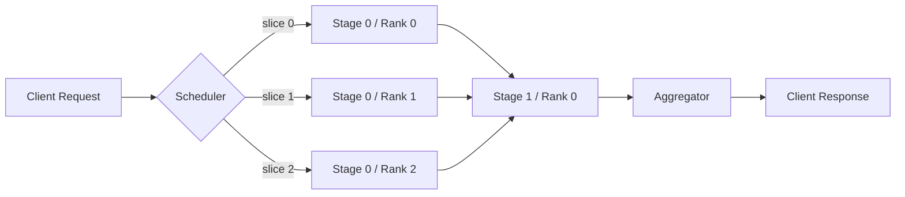

# Multi-Node Pipeline Parallelism for Real-Time Evaluation Engines


## How tensor-slicing coordination keeps inference pipelines from choking on large models.

**TL;DR**
- Pipeline parallelism splits a model across nodes by stage; tensor slicing divides batches within each stage. The two patterns are complementary, but they require explicit scheduling and communication orchestration.
- A central scheduler is usually the simplest mental model, though production systems often use decentralized collectives or mesh-style topologies for lower latency.
- The toy PyTorch example below is illustrative. It skips fault tolerance, checkpointing, load balancing, and the hard details of backpressure in real-time serving.

---

Real-time evaluation engines have a frustrating constraint. They must accept a request, run it through a model, and return a result before the caller times out. When the model fits comfortably in one GPU's memory, life is straightforward. But once a model outgrows a single accelerator—or once throughput demands exceed what one node can deliver—the design space widens quickly.

This post looks at one path through that space: pipeline parallelism combined with tensor-slicing coordination across multiple nodes. The goal is not to pitch a universal architecture. It is to define the actual coordination problem, separate the helpful patterns from the marketing labels, and give a concrete (but simplified) code sketch teams can argue with.

## Why does single-node serving hit a wall?

Single-node inference becomes a bottleneck for two predictable reasons: memory capacity and arithmetic throughput. A large transformer or recommendation model can easily exceed the HBM of one accelerator, and even when it fits, the per-request latency and batch-throughput ceiling of one node may be unacceptable for real-time use.

The natural response is distribution. But "distributed inference" covers several very different strategies:

- **Data parallelism**: each node holds a full copy of the model and processes a different microbatch. The model state is replicated; only activations move between nodes.
- **Model (tensor) parallelism**: a single layer is sharded across devices on the same node, so activations are exchanged frequently over a high-bandwidth NVLink/PCIe mesh.
- **Pipeline parallelism**: the model is divided into coarse stages, each assigned to a different node. A request passes through stage 0, then stage 1, then stage 2, with activations moving between nodes over the network.

Tensor slicing coordination sits at the intersection of these ideas. In a pipeline-parallel engine, each stage may still use data parallelism (different ranks consume different slices of a microbatch) or tensor parallelism (a layer inside the stage is sharded). The scheduler's job is to make sure every slice arrives at the right rank, in the right order, without stalling the pipeline.

This coordination is where most hand-waved diagrams fall apart in practice.

## What does tensor-slicing coordination actually require?

At minimum, it requires three mechanisms working together: a slicing policy that respects tensor semantics, a communication primitive that moves slices to the correct consumers, and a schedule that prevents bubbles and head-of-line blocking.

The slicing policy is the easy part to describe. A batch tensor with shape `[B, ...]` is split along the batch dimension into `[B/R, ...]` chunks, where `R` is the number of ranks in that pipeline stage. More complex splits—across sequence length, hidden dimension, or attention heads—are common in tensor parallelism, but they demand all-to-all or reduce-scatter collectives rather than simple gather.

The communication primitive depends on the parallelism type. Data-parallel stages typically need an all-gather or reduce-scatter to reconstruct the full batch or aggregate gradients. Pipeline-parallel stages need point-to-point sends and receives between adjacent stages, plus careful management of activation checkpoints if you ever train or fine-tune.

The schedule is where real systems diverge. A centralized scheduler is conceptually clean: it knows the global DAG of slices, assigns work, and collects results. But in low-latency serving, a scheduler process can become a choke point. Production engines therefore tend toward collective-based coordination—using NCCL or UCX primitives that the workers execute directly—often with a lightweight controller handling placement, health checks, and load balancing rather than per-token dispatching.

The following diagram shows the high-level flow for a pipeline-parallel stage that also splits its input batch across ranks.



In this picture, Stage 0 uses tensor slicing across ranks; Stage 1 receives the gathered outputs. The scheduler only assigns the initial slices. After that, point-to-point or collective communication carries the pipeline forward.

## A concrete—but intentionally simplified—PyTorch sketch

The code below is not production-ready. It does not handle process-group teardown, device placement, fault tolerance, dynamic batching, or load balancing. What it does show is how a batch is sliced, processed in parallel, and then gathered so the full result is available on every rank.

```python
import os

import torch
import torch.distributed as dist
import torch.nn as nn


class TinyStage(nn.Module):
    """A single stage of a hypothetical deeper model."""
    def __init__(self, in_features: int = 16, out_features: int = 8):
        super().__init__()
        self.fc = nn.Linear(in_features, out_features)

    def forward(self, x: torch.Tensor) -> torch.Tensor:
        return torch.relu(self.fc(x))


def slice_batch(tensor: torch.Tensor, world_size: int, rank: int) -> torch.Tensor:
    """Split a batch along the leading dimension across ranks."""
    if tensor.shape[0] % world_size != 0:
        raise ValueError(
            "Batch size must be divisible by world size in this simplified example"
        )
    chunk_size = tensor.shape[0] // world_size
    start = rank * chunk_size
    return tensor[start : start + chunk_size]


def gather_outputs(local_output: torch.Tensor) -> torch.Tensor:
    """Collect per-rank outputs back to the full batch on every rank."""
    world_size = dist.get_world_size()
    gathered = [
        torch.empty_like(local_output) for _ in range(world_size)
    ]
    dist.all_gather(gatherded, local_output)
    return torch.cat(gathered, dim=0)


def run_pipeline_stage(batch: torch.Tensor) -> torch.Tensor:
    """Run one data-parallel pipeline stage. Assumes init already happened."""
    rank = dist.get_rank()
    world_size = dist.get_world_size()

    local_input = slice_batch(batch, world_size, rank)

    # In a real deployment you would place this on the correct GPU
    # and load only the weights assigned to this stage.
    local_model = TinyStage(in_features=16, out_features=8)
    local_output = local_model(local_input)

    # Reassemble outputs so the next pipeline stage can consume the full batch.
    full_output = gather_outputs(local_output)
    return full_output


def main():
    dist.init_process_group("gloo", init_method="env://")
    rank = dist.get_rank()
    world_size = dist.get_world_size()

    # Only rank 0 invents the input in this sketch.
    if rank == 0:
        batch = torch.randn(64, 16)
    else:
        batch = torch.empty(64, 16)

    # Broadcast the full batch so every rank can slice locally.
    dist.broadcast(batch, src=0)

    full_output = run_pipeline_stage(batch)

    if rank == 0:
        print(full_output.shape)

    dist.destroy_process_group()


if __name__ == "__main__":
    main()
```

A few honest notes about this code:

1. **`all_gather` is a bottleneck at scale.** Reassembling the full batch on every rank wastes interconnect bandwidth. Production systems prefer scatter/gather patterns that send each slice only to the consumers that need it.
2. **`gloo` is for CPUs.** A GPU deployment would use `nccl`, pass a `device_id`, and move `local_input` and the model to the correct CUDA device.
3. **The model is not actually sharded.** `TinyStage` is replicated on every rank. To demonstrate model (tensor) parallelism inside a stage, you would split the layer weights and insert all-reduce or reduce-scatter calls in the forward pass.
4. **Pipeline depth is omitted.** A true pipeline-parallel system would chain multiple stages, with each rank owning one or more stages and passing activations forward and backward.

## Design decisions that separate a prototype from production

Beyond the code, three design choices dominate real systems:

**Microbatch sizing.** In pipeline parallelism, the global batch is broken into smaller microbatches that fill the pipeline stages. If microbatches are too small, communication overhead swamps compute. If they are too large, memory pressure and bubble time increase. There is rarely a single magic number; it depends on the model's layer count, activation size, and the network between nodes.

**Activation checkpointing.** For models large enough to need pipeline parallelism, storing every intermediate activation for a backward pass is prohibitive. Gradient checkpointing trades recomputation for memory, but it changes the throughput/latency tradeoff and must be coordinated across stages.

**Backpressure and autoscaling.** Real-time evaluation engines must not let a slow upstream stage drown a fast downstream stage. Queue sizes between stages, timeout policies, and the ability to route around unhealthy ranks determine whether 99th-percentile latency stays bounded under load.

## Takeaways

Multi-node pipeline parallelism is a coordination problem dressed up as a model-distribution problem. Tensor slicing is the mechanism, but the real engineering work is in scheduling, communication, and managing the memory-throughput-latency triangle.

For teams building real-time evaluation engines, the practical starting point is: fit the model on a single node if you can, then graduate to the simplest distribution pattern that removes the actual bottleneck. Pipeline parallelism across stages plus data parallelism within stages is a common combination, but each additional axis of distribution adds communication overhead, debugging surface, and operational complexity.

The example above is a teaching aid, not a template. Use it to get the conversation right before the commit log fills with half-finished distributed collectives.

__

### Topics
distributed systems, machine learning inference, pipeline parallelism, tensor slicing, PyTorch, real-time serving, model parallelism, MLOps
