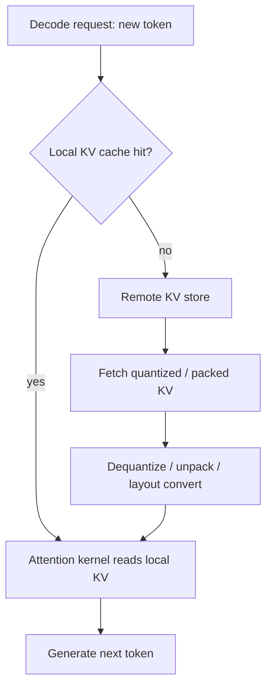

# Optimizing Inter-Node KV Cache Allocation: Four Patterns That Actually Reduce Decode Latency


Quantization, packing, projection, and layout conversion as engineering choices in distributed LLM inference.

**TL;DR**
- The KV cache is increasingly treated as an AI-native data substrate, and its inter-node layout—not just its size—determines whether decode latency stays flat as context grows.
- Quantization, packing, low-dimensional projection, and layout conversion each trade precision or flexibility for memory bandwidth and transfer latency, but they must match what the attention kernel on the receiving node expects.
- The biggest trap is converting between storage and compute formats on every remote hit; the fastest designs fuse dequantization, unpacking, and layout changes into the read path.

## Why does inter-node KV cache allocation dominate decode latency?

Because moving cached tensors across nodes often costs more than computing attention on them once they arrive.

During decode, each new token attends to every retained key and value vector. In long-context chat or multi-step agentic sessions, that history can exceed the high-bandwidth memory of a single GPU, so inference engines fetch KV state from a remote store. The read path now has two cost centers: getting the bytes across the network and preparing them so the attention kernel can use them. If the stored format differs from the compute format, every remote cache hit pays a layout-conversion tax on top of the transfer time. For example, teams running distributed inference often see p99 decode latency roughly double when long-context KV state must be fetched across a pair of top-of-rack switches.

Projects like LMCache frame this explicitly: KV caches are no longer just an accelerator-side optimization buffer; they are a primary data substrate for scaling LLM inference and agentic workloads. That reframing matters because it tells engineers to optimize the cache like they would optimize a column store or a tensor database—pay attention to byte size, access pattern, and format.



## How do these four patterns reduce latency?

Each one targets a different bottleneck in the remote-cache read path: fewer bits transferred, fewer memory allocations, fewer dimensions, or better memory coalescing. The right combination depends on the serving engine, the network, and the acceptable accuracy loss.

### Quantization

Quantization lowers the precision of stored K and V tensors, typically from FP16 to INT8. That halves the bytes moved across the network and can reduce HBM pressure on the receiver. The catch is the attention kernel often still wants FP16 inputs, so INT8 cache entries must be dequantized either on the host or in a fused kernel. If dequantization happens in a slow Python path, the bandwidth savings can disappear.

A safer approach uses per-channel or per-token scales and zero points rather than a single global range. A global min/max can collapse small but important activations into the same bucket and hurt generation quality. When the quantization scheme is paired with a fused attention-dequantization kernel, the read path stays lean.

### Packing

Packing stores multiple related KV tensors in one contiguous allocation. The most common version is storing K and V for a layer or a sequence in a single block instead of two separate tensors, which improves spatial locality and reduces the number of allocation round-trips. Block-based or page-based KV managers often pad blocks to a fixed size; packing reduces per-block fragmentation.

The risk is dynamic shape management. When sequence lengths vary, a packed buffer needs careful bookkeeping of which slots are valid and which are padding. A mismatch between the packed logical shape and the attention kernel’s physical view causes either silent corruption or an expensive re-striding copy.

### Low-Dimensional Projection

Projection reduces the dimensionality of stored KV state—often the head dimension or a compressed token representation. The benefit is large: fewer bytes and less compute in attention. The cost is information loss, which makes projection the riskiest of the four patterns for a production base model.

In practice, teams usually reserve low-dimensional projection for retrieval-oriented designs, not for the exact KV tensor used during live token generation. It can work well when the cache is treated as a queryable memory bank for agents, where approximate matches are acceptable. For exact autoregressive decode, projection needs tight quality validation before it ships.

### Layout Conversion

Layout conversion changes how the tensor is laid out in memory. Inference engines expect different physical arrangements: some kernels want `(batch, num_heads, seq_len, head_dim)`, while FlashAttention-style kernels or paged-attention managers want `(seq_len, batch, num_heads, head_dim)` or blocked `(num_blocks, block_size, num_heads, head_dim)`. A mismatch forces strided memory accesses or explicit permutations, which are slow on memory-bound decode.

The goal is to align the stored layout with the consumer. Sometimes that means storing in token-major order so newly prefilled tokens can be appended contiguously. Sometimes it means matching the paged memory layout used by the engine so the cache can be memory-mapped directly into the page table. The read path should ideally be a zero-copy or single-copy handoff, not a sequence of transpose operations in Python.

## A concrete read-path example

The code below shows how one might quantize an FP16 KV tensor, pack K and V together, and convert to a token-major layout. Real systems would fuse these with the deserialization layer; the sample separates them so the transformations are visible.

```python
import torch

def quantize_kv(x: torch.Tensor, bits: int = 8):
    """
    Per-head-channel INT8 quantization of a KV tensor.
    x shape: (batch, seq_len, num_heads, head_dim)
    """
    qmax = 2**bits - 1
    # scale along head_dim to preserve per-head activation structure
    x_min = x.min(dim=-1, keepdim=True).values
    x_max = x.max(dim=-1, keepdim=True).values
    scale = (x_max - x_min) / qmax
    zero_point = -x_min / scale
    q = torch.clamp(torch.round(x / scale + zero_point), 0, qmax).to(torch.uint8)
    return q, scale.to(torch.float16), zero_point.to(torch.float16)

def pack_kv(k: torch.Tensor, v: torch.Tensor) -> torch.Tensor:
    """
    Pack K and V into one allocation, dim 0 tags key vs value.
    k, v shape: (batch, num_heads, seq_len, head_dim)
    """
    return torch.stack([k, v], dim=0).contiguous()

def to_token_major(kv: torch.Tensor) -> torch.Tensor:
    """
    Reorder from (batch, num_heads, seq_len, head_dim)
    to (seq_len, batch, num_heads, head_dim) so decode steps are contiguous.
    """
    return kv.permute(2, 0, 1, 3).contiguous()

# realistic single-request cache slice
batch, seqlen, heads, head_dim = 1, 2048, 8, 128
kv_fp16 = torch.randn(batch, seqlen, heads, head_dim, dtype=torch.float16)

q, scale, zp = quantize_kv(kv_fp16)
print("quantized", q.shape, q.dtype, "scale", scale.shape)

k = v = kv_fp16.permute(0, 2, 1, 3).contiguous()  # B, H, S, D
packed = pack_kv(k, v)
token_major = to_token_major(k)
print("packed", packed.shape, "token-major", token_major.shape)
```

In production, the remote store would ship `q`, `scale`, and `zp`; the receiver would dequantize directly into the engine’s page table layout, eliminating the intermediate FP16 staging buffer.

## Putting it together without losing correctness

These patterns compose, but composition amplifies risk. Quantization plus packing plus a layout swap can save large amounts of transfer bandwidth, yet each step is a chance to introduce a shape or dtype mismatch that silently degrades output. The safest path is to treat the remote cache read path as an integration surface: define the exact contract—dtype, scale handling, padding, and physical layout—that the attention kernel expects, and validate end-to-end on a held-out prompt set before enabling the optimized path.

It also helps to keep the hot path thin. Deserialization, dequantization, unpacking, and layout conversion should run on the receiving GPU when kernels allow it; otherwise they should be implemented in a compiled host-to-device path, not in interpreted Python. The latency budget of a decode step is measured in milliseconds, and Python-level copies easily consume a large fraction of it.

Finally, not every pattern belongs in every system. Quantization and layout conversion are broadly applicable. Packing is valuable when the cache manager already uses block or page semantics. Low-dimensional projection is best reserved for approximate retrieval or special agent-memory layers, not as a blanket replacement for exact KV state.

## Topics

KV Cache · LLM Inference · Distributed Systems · Quantization · Memory Optimization · Low-Latency Serving · AI-Native Data Substrates