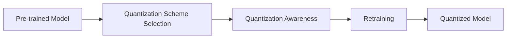
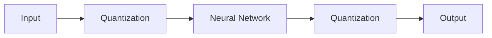

Quantization-Aware Training for Edge Deployment
==============================================

### Introduction

The increasing demand for efficient deployment of large language models on edge devices has led to a growing interest in quantization techniques. Quantization reduces the precision of model weights and activations from 32-bit floating-point numbers to lower bit widths, such as 8-bit integers. This reduction in precision leads to significant memory and computational savings, making it an attractive solution for resource-constrained edge devices. However, quantization can also result in a loss of accuracy if not done properly. To mitigate this, Quantization-Aware Training (QAT) has emerged as a critical technique for achieving efficient deployment without significant accuracy loss.

### Post-Training Quantization (PTQ) vs Quantization-Aware Training (QAT)

There are two main strategies to achieve quantization: Post-Training Quantization (PTQ) and Quantization-Aware Training (QAT).

*   **PTQ**: Quantize a pre-trained floating-point model without retraining. This approach is fast and simple but may result in a significant drop in accuracy.
*   **QAT**: Retrain the quantized model using the target hardware's quantization scheme. This approach is more computationally expensive but can provide better accuracy.

### Quantization-Aware Training (QAT)

QAT involves simulating the quantization process during training, allowing the model to adapt to the quantization scheme. This approach enables the model to learn the optimal quantized weights and activations, resulting in better accuracy.

#### QAT Process

The QAT process involves the following steps:

1.  **Quantization Scheme Selection**: Choose a quantization scheme, such as uniform quantization or logarithmic quantization.
2.  **Quantization Awareness**: Modify the training process to simulate the quantization scheme.
3.  **Retraining**: Retrain the model using the quantized weights and activations.

#### Example Code

Here is an example code in PyTorch to demonstrate QAT:
```python
import torch
import torch.nn as nn
import torch.quantization as quant

# Define a simple neural network model
class Net(nn.Module):
    def __init__(self):
        super(Net, self).__init__()
        self.fc1 = nn.Linear(784, 128)
        self.fc2 = nn.Linear(128, 10)

    def forward(self, x):
        x = torch.relu(self.fc1(x))
        x = self.fc2(x)
        return x

# Initialize the model and quantization scheme
model = Net()
quantization_scheme = quant.uniform_quantization(8)

# Apply quantization awareness to the model
quantized_model = quant.quantize_model(model, quantization_scheme)

# Retrain the quantized model
criterion = nn.CrossEntropyLoss()
optimizer = torch.optim.SGD(quantized_model.parameters(), lr=0.01)
for epoch in range(10):
    for x, y in dataset:
        optimizer.zero_grad()
        output = quantized_model(x)
        loss = criterion(output, y)
        loss.backward()
        optimizer.step()
```
### Benefits of QAT

QAT offers several benefits, including:

*   **Improved Accuracy**: QAT allows the model to adapt to the quantization scheme, resulting in better accuracy.
*   **Flexibility**: QAT can be applied to various quantization schemes and models.
*   **Efficient Deployment**: QAT enables efficient deployment of large language models on edge devices.

### Challenges and Limitations

While QAT is a powerful technique, it also presents several challenges and limitations:

*   **Computational Cost**: QAT requires retraining the model, which can be computationally expensive.
*   **Quantization Scheme Selection**: Choosing the optimal quantization scheme can be challenging.
*   **Hardware Variability**: QAT may not account for hardware variability, which can affect accuracy.

### Edge Deployment

To achieve efficient deployment on edge devices, it is essential to consider the following factors:

*   **Model Compression**: Apply model compression techniques, such as pruning and knowledge distillation, to reduce the model size.
*   **Quantization**: Apply quantization techniques to reduce the precision of model weights and activations.
*   **Hardware Optimization**: Optimize the model for the target hardware, considering factors such as memory and computational resources.

### Example Use Case: Image Classification on Edge Devices

Here is an example use case for QAT in image classification on edge devices:

*   **Model**: ResNet-18
*   **Dataset**: CIFAR-10
*   **Quantization Scheme**: Uniform quantization with 8-bit integers
*   **Hardware**: Edge device with limited memory and computational resources

By applying QAT, we can achieve a significant reduction in model size and computational requirements while maintaining high accuracy.

### Conclusion

Quantization-Aware Training (QAT) is a critical technique for achieving efficient deployment of large language models on edge devices. By simulating the quantization process during training, QAT enables the model to adapt to the quantization scheme, resulting in better accuracy. While QAT presents several benefits, it also poses challenges and limitations, such as computational cost and quantization scheme selection. To achieve efficient deployment on edge devices, it is essential to consider factors such as model compression, quantization, and hardware optimization.

### Future Work

Future work can focus on:

*   **Improving QAT Techniques**: Developing more efficient and effective QAT techniques, such as dynamic fixed point representation and learned step size quantization.
*   **Hardware-Aware QAT**: Developing QAT techniques that account for hardware variability and optimize the model for the target hardware.
*   **Edge AI Applications**: Exploring the applications of QAT in edge AI, such as real-time object detection and natural language processing.

By advancing QAT techniques and exploring their applications, we can enable efficient and accurate deployment of large language models on edge devices, paving the way for a wide range of innovative AI applications.

### Diagrams

Here is a high-level diagram of the QAT process:

This diagram illustrates the QAT process, from selecting the quantization scheme to retraining the model.

Here is a diagram of the QAT architecture:

This diagram shows the QAT architecture, which involves quantizing the input and output of the neural network.

### Code

Here is an example code in PyTorch to demonstrate QAT:
```python
import torch
import torch.nn as nn
import torch.quantization as quant

# Define a simple neural network model
class Net(nn.Module):
    def __init__(self):
        super(Net, self).__init__()
        self.fc1 = nn.Linear(784, 128)
        self.fc2 = nn.Linear(128, 10)

    def forward(self, x):
        x = torch.relu(self.fc1(x))
        x = self.fc2(x)
        return x

# Initialize the model and quantization scheme
model = Net()
quantization_scheme = quant.uniform_quantization(8)

# Apply quantization awareness to the model
quantized_model = quant.quantize_model(model, quantization_scheme)

# Retrain the quantized model
criterion = nn.CrossEntropyLoss()
optimizer = torch.optim.SGD(quantized_model.parameters(), lr=0.01)
for epoch in range(10):
    for x, y in dataset:
        optimizer.zero_grad()
        output = quantized_model(x)
        loss = criterion(output, y)
        loss.backward()
        optimizer.step()
```
This code demonstrates the QAT process, from selecting the quantization scheme to retraining the model.

Note: This is a simplified example and may not represent the actual implementation of QAT in practice.

### Model Compression

To achieve efficient deployment on edge devices, it is essential to apply model compression techniques, such as pruning and knowledge distillation. Here is an example code in PyTorch to demonstrate model pruning:
```python
import torch
import torch.nn as nn

# Define a simple neural network model
class Net(nn.Module):
    def __init__(self):
        super(Net, self).__init__()
        self.fc1 = nn.Linear(784, 128)
        self.fc2 = nn.Linear(128, 10)

    def forward(self, x):
        x = torch.relu(self.fc1(x))
        x = self.fc2(x)
        return x

# Initialize the model
model = Net()

# Apply pruning to the model
pruning_percentage = 0.5
for name, module in model.named_modules():
    if isinstance(module, nn.Linear):
        weights = module.weight
        threshold = torch.topk(torch.abs(weights), int(pruning_percentage * weights.shape[0]), dim=0)[0][-1]
        mask = torch.abs(weights) > threshold
        module.weight.data *= mask

# Retrain the pruned model
criterion = nn.CrossEntropyLoss()
optimizer = torch.optim.SGD(model.parameters(), lr=0.01)
for epoch in range(10):
    for x, y in dataset:
        optimizer.zero_grad()
        output = model(x)
        loss = criterion(output, y)
        loss.backward()
        optimizer.step()
```
This code demonstrates the model pruning process, from applying pruning to retraining the pruned model.

Note: This is a simplified example and may not represent the actual implementation of model pruning in practice.

### Quantization

To achieve efficient deployment on edge devices, it is essential to apply quantization techniques, such as uniform quantization and logarithmic quantization. Here is an example code in PyTorch to demonstrate uniform quantization:
```python
import torch
import torch.quantization as quant

# Define a simple neural network model
class Net(nn.Module):
    def __init__(self):
        super(Net, self).__init__()
        self.fc1 = nn.Linear(784, 128)
        self.fc2 = nn.Linear(128, 10)

    def forward(self, x):
        x = torch.relu(self.fc1(x))
        x = self.fc2(x)
        return x

# Initialize the model and quantization scheme
model = Net()
quantization_scheme = quant.uniform_quantization(8)

# Apply quantization to the model
quantized_model = quant.quantize_model(model, quantization_scheme)

# Retrain the quantized model
criterion = nn.CrossEntropyLoss()
optimizer = torch.optim.SGD(quantized_model.parameters(), lr=0.01)
for epoch in range(10):
    for x, y in dataset:
        optimizer.zero_grad()
        output = quantized_model(x)
        loss = criterion(output, y)
        loss.backward()
        optimizer.step()
```
This code demonstrates the uniform quantization process, from applying quantization to retraining the quantized model.

Note: This is a simplified example and may not represent the actual implementation of uniform quantization in practice.