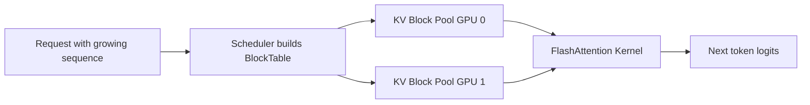

# Slicing the KV Cache: A Block-Based Pattern for Low-Latency Inference


**How tensor-aware cache organization can reduce coordination overhead in distributed transformer serving**

**TL;DR**
- Transformer KV caches are not ordinary key-value stores. They are dense, append-only tensors that must be sliced across sequence length, attention heads, and devices during decoding.
- Treating the cache as a pool of fixed-size, aligned blocks instead of per-token allocations turns dynamic sequence growth into predictable memory operations.
- Separating logical block tables from physical storage keeps tensor-parallel and continuous-batching paths simple, but block size becomes a new tuning knob.

## Why does tensor slicing dominate KV cache design?

Because a single decoding request rarely fits into one tidy memory region.

In a transformer, the KV cache holds the key and value projections for every token a model has seen so far. For one request the shape is roughly `(layers, num_heads, seq_len, head_dim)`. Multiply by batch size, and the cache quickly becomes one of the largest memory consumers in the system. The catch is that serving infrastructure slices this tensor in at least three dimensions at once.

First, sequence length is variable. A chat session can grow from sixteen tokens to four thousand tokens while the model is already decoding the next batch. The cache must be appended, not overwritten. Second, tensor parallelism splits attention heads across GPUs. Each device owns a slice of the heads dimension, so a forward pass gathers partial attention results rather than duplicating the full cache. Third, continuous batching packs requests of different lengths into the same batch, which means every sequence reads a different logical slice of the pooled cache.

These slices are not accidental. They are the mechanism that makes low-batch high-throughput serving possible. But they also turn memory management into a coordination problem. Allocating, addressing, and evicting tensor slices efficiently is the difference between a cache that accelerates inference and a cache that becomes the bottleneck.

## What breaks when the cache is just a hash map?

A dense tensor and a hash table want opposite things.

A hash-based KV cache treats each token position as an independent key. That works for unstructured data, but it is awkward for transformer inference. Tensors are stored contiguously so that matrix-multiplication and attention kernels can read them in wide, predictable bursts. Hash maps scatter related values across memory. The result is poor cache-line utilization, more GPU memory transactions, and kernels that spend cycles gathering strided data instead of computing attention.

Unaligned access is the next problem. A cache line on modern hardware is typically 64 or 128 bytes; GPU global memory is read in much wider transactions. When a sequence slice starts at an arbitrary byte offset, the same memory transaction can pull in data from two unrelated sequences. That is exactly what happens when a naive allocator hands out arbitrary chunks for each new token.

Allocation itself becomes a serial bottleneck. If every newly generated token triggers a fresh memory allocation, the host CPU ends up synchronizing with the GPU on every decode step. In heavy batching scenarios, this serialization can dominate wall-clock time. Teams running tight autoregressive loops often find that the latency profile flattens only after the allocator stops being on the critical path.

The third issue is ownership. In a distributed setup, which device owns which slice of the cache? Which request is allowed to overwrite a block after the request finishes? A hash map does not answer these questions; it just stores pairs. Inference serving needs a structure that tracks lifetime, sharing, and physical placement at the same time.

## A block-based cache pool

The pattern that has emerged in modern serving stacks is to borrow from operating-system paging: divide the KV cache into fixed-size physical blocks and maintain a per-request logical block table.

Instead of allocating memory per token, the system allocates a block of, say, 16 or 32 token positions. A request's cache is then a list of block IDs that may be scattered across the physical pool but appear contiguous in logical sequence space. When the model generates a new token, it writes into the next free slot in the current block. Only when the block fills does the scheduler grab another block.

This design gives three properties that hash maps do not. First, blocks can be aligned to hardware boundaries, so a slice for attention is usually one or two contiguous physical regions. Second, the block table lives on the host or in a small metadata buffer, so growing a sequence is a metadata operation, not a GPU memory allocation. Third, shared prefixes—common in multi-turn chat or speculative decoding—can reuse the same physical blocks by reference counting, without copying tensors.

The separation of logical and physical addressing also makes tensor parallelism straightforward. Each GPU owns its own block pool for the heads it is responsible for. The scheduler keeps one block table per request, but the table is interpreted independently on each device to locate that device's slice of the heads dimension.

```python
from dataclasses import dataclass, field
import numpy as np

@dataclass
class KVBlock:
    block_id: int
    # (layers, heads_per_device, block_size, head_dim)
    data: np.ndarray
    ref_count: int = 0

@dataclass
class BlockTable:
    # logical_block_idx -> physical_block_id
    physical_blocks: list[int] = field(default_factory=list)

class KVBlockPool:
    def __init__(
        self,
        num_blocks: int,
        block_size: int,
        layers: int,
        heads_per_device: int,
        head_dim: int,
    ):
        self.block_size = block_size
        self.blocks: dict[int, KVBlock] = {}
        self.free_list: list[int] = list(range(num_blocks))

        for bid in range(num_blocks):
            shape = (layers, heads_per_device, block_size, head_dim)
            self.blocks[bid] = KVBlock(
                block_id=bid,
                data=np.zeros(shape, dtype=np.float16),
            )

    def allocate(self, num_blocks: int) -> BlockTable:
        # Production code uses a lock-free free stack or bump allocator.
        ids = [self.free_list.pop() for _ in range(num_blocks)]
        for bid in ids:
            self.blocks[bid].ref_count += 1
        return BlockTable(physical_blocks=ids)

    def write_token(
        self,
        table: BlockTable,
        seq_pos: int,
        kv_layer_slice: np.ndarray,
    ) -> None:
        block_idx = seq_pos // self.block_size
        offset = seq_pos % self.block_size
        phys_id = table.physical_blocks[block_idx]
        block = self.blocks[phys_id]
        # kv_layer_slice shape: (layers, heads_per_device, 1, head_dim)
        block.data[..., offset:offset + 1, :] = kv_layer_slice
```

In practice the `data` array lives in GPU memory, and kernels such as FlashAttention read block tables directly or consume block-contiguous ranges. The Python sketch above is only structural: its value is showing how metadata, physical storage, and tensor slicing relate.



## Where does the latency actually go?

Even with blocks, the system is not free. The main residual cost is the scheduling overhead of maintaining block tables under continuous batching. Every decode step may add, remove, or pause requests. The scheduler has to rewrite block tables so that batched kernels see a consistent view of which sequences are active. If that metadata update is not pipelined with the GPU, it can stall the launch queue.

Block size is also a genuine trade-off. Larger blocks reduce metadata pressure and improve kernel efficiency, but they waste memory when sequences are short. A block size of 32 on a request of 33 tokens leaves 31 slots unused in the second block. That internal fragmentation can cost capacity, especially when the serving engine is already memory-bound.

Finally, tensor-parallel communication still matters. Splitting heads across devices means the attention output must be reduced between GPUs each step. Block tables keep the memory layout sane, but they do not remove the need for fast inter-GPU links.

## Takeaways

KV cache design is fundamentally a tensor-slicing problem, not a hash-table problem. The tensor is sliced by sequence, by head, and by device, and the cache layer must make those slices cheap to address and cheap to grow.

A block-based pool separates logical sequence addressing from physical storage. Blocks can be aligned, prefetched, and reference-counted, which makes continuous batching and prefix sharing natural. The pattern is not new—it echoes virtual memory—but applied to transformer serving it removes a surprising amount of host-side coordination from the critical path.

The cost is a new tuning dimension. Block size, allocation strategy, and eviction policy all affect throughput and latency, and there is no universal optimum. Teams adopting this pattern should measure end-to-end p99 latency and memory fragmentation together, because optimizing one in isolation often worsens the other.

*This article was drafted with AI assistance (Groq + Cloudflare Workers AI) based on public technical discussion, and reviewed before publishing.*

## Topics

Transformer Inference, KV Cache Optimization, Distributed Systems, Low-Latency Serving, Tensor Parallelism, Continuous Batching, Memory Management