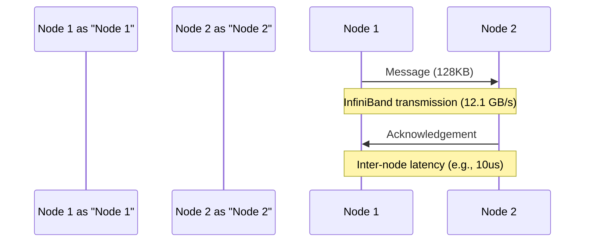

**Inter-node Latency Bottlenecks: A Critical Analysis**
======================================================

In the realm of high-performance computing, particularly in distributed training scenarios, latency plays a pivotal role in determining the overall efficiency of the system. As the demand for faster and more complex computations grows, understanding the bottlenecks that impede performance becomes increasingly important. This draft delves into the nuances of inter-node latency bottlenecks, exploring the factors that contribute to their exponential increase as the inter-node network injects traffic.

**Introduction to Inter-node Latency**
------------------------------------

Inter-node latency refers to the time it takes for data to be transmitted between nodes in a distributed system. In the context of distributed training, where multiple machines (each with multiple GPUs) work together to train a large model, both inter-node and intra-node bandwidth are crucial. The communication between nodes can be a significant bottleneck, especially when dealing with large messages.

### **Intra-node vs. Inter-node Latency**

To understand the scope of the problem, it's essential to differentiate between intra-node and inter-node latency. Intra-node latency pertains to the time it takes for data to be transmitted within a node, whereas inter-node latency refers to the time it takes for data to be transmitted between nodes. While intra-node latency is typically lower due to the faster connectivity within a node (e.g., NVLink), inter-node latency can be significantly higher due to the slower inter-node network links (e.g., InfiniBand).

**Factors Contributing to Inter-node Latency Bottlenecks**
----------------------------------------------------

Several factors contribute to the exponential increase in inter-node latency as the inter-node network injects traffic:

1. **Message Size**: As messages grow larger, the time it takes to transmit them increases. For messages larger than 128KB, the inter-node InfiniBand link operates at full speed (12.1 GB/s), causing messages to accumulate and wait to be forwarded.
2. **Traffic Injection**: As more traffic is injected into the inter-node network, the latency increases exponentially. This is because the network links become saturated, leading to congestion and increased waiting times.
3. **Network Topology**: The topology of the inter-node network can significantly impact latency. For example, a fat-tree topology can provide higher bandwidth and lower latency compared to a simple tree topology.

**Impact of Inter-node Latency on Distributed Training**
------------------------------------------------------

In distributed training scenarios, inter-node latency can have a significant impact on overall performance. As multiple machines work together to train a large model, the communication between nodes can become a bottleneck. On systems like Perlmutter and Alps, communication contributes a small fraction (around 10-18%) of total latency in both prefill and decode phases. However, this fraction can increase as the system scales, making inter-node latency a critical factor to optimize.

### **Code Example: Measuring Inter-node Latency**

To measure inter-node latency, you can use a simple benchmarking tool like the following Python code:
```python
import time
import numpy as np

def measure_inter_node_latency(message_size):
    # Create a message of the specified size
    message = np.random.rand(message_size)

    # Measure the time it takes to transmit the message
    start_time = time.time()
    # Simulate inter-node transmission (e.g., using InfiniBand)
    # ...
    end_time = time.time()

    # Calculate the latency
    latency = end_time - start_time

    return latency

# Example usage:
message_size = 128 * 1024  # 128KB
latency = measure_inter_node_latency(message_size)
print(f"Inter-node latency for {message_size} bytes: {latency:.2f} seconds")
```
This code measures the time it takes to transmit a message of a specified size between nodes and calculates the inter-node latency.

**Diagrams: Understanding Inter-node Latency**
-----------------------------------------

To better understand the factors contributing to inter-node latency, let's consider the following diagrams:

### **Inter-node Network Topology**

The following diagram illustrates a simple inter-node network topology:
```mermaid
graph LR
    A[Node 1] -->|InfiniBand|> B[Node 2]
    B -->|InfiniBand|> C[Node 3]
    C -->|InfiniBand|> A
```
In this topology, each node is connected to every other node via an InfiniBand link. As traffic is injected into the network, the latency increases exponentially due to congestion and waiting times.

### **Message Transmission**

The following diagram illustrates the transmission of a message between nodes:

In this diagram, Node 1 transmits a message to Node 2 via the InfiniBand link. The message is transmitted at a rate of 12.1 GB/s, and the inter-node latency is approximately 10us.

**Conclusion**
----------

Inter-node latency bottlenecks are a critical factor in distributed training scenarios, where multiple machines work together to train a large model. As the inter-node network injects traffic, the latency increases exponentially due to factors such as message size, traffic injection, and network topology. Understanding these factors and optimizing the inter-node network can significantly improve the overall performance of the system. By using benchmarking tools and analyzing diagrams, developers can identify and mitigate inter-node latency bottlenecks, leading to faster and more efficient distributed training.