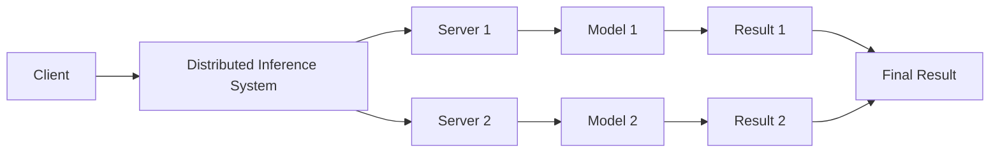
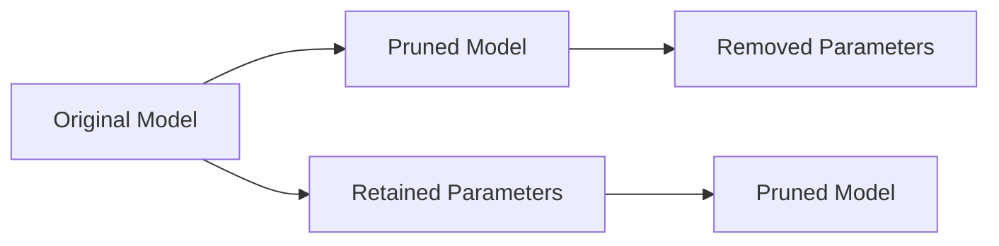
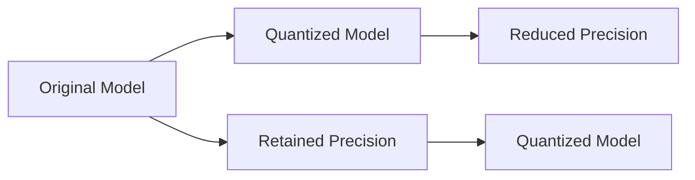

**Distributed Inference Optimization Strategies: Enhancing Efficiency and Scalability**

The proliferation of Artificial Intelligence (AI) and Machine Learning (ML) has led to an exponential increase in the demand for efficient and scalable inference systems. Distributed inference has emerged as a crucial solution to address this need, enabling the processing of requests across a fleet of hardware, including physical and cloud servers. However, optimizing inference models is a critical step in achieving efficient and accurate results. This draft highlights various techniques and strategies for optimizing distributed inference, including model pruning, quantization, and parallelization.

**Introduction to Distributed Inference**

 Distributed inference is a technique that splits requests across multiple servers, allowing each server to process its assigned portion in parallel. This approach offers several benefits, including:

* **Scalability**: Distributed inference can handle large volumes of requests, making it an ideal solution for applications with high traffic.
* **Flexibility**: The use of multiple servers enables flexible deployment options, including on-premises, cloud, or hybrid environments.
* **Fault Tolerance**: Distributed systems can withstand server failures, ensuring minimal downtime and maximizing overall system availability.

**Optimization Techniques for Distributed Inference**

Several optimization techniques can enhance the efficiency and accuracy of distributed inference systems. These techniques include:

### 1. **Model Pruning**

Model pruning involves removing redundant parameters from a model, resulting in a smaller, more efficient model. This technique can be applied to various types of models, including neural networks.

```python
import torch
import torch.nn as nn

# Define a sample neural network model
class SampleModel(nn.Module):
    def __init__(self):
        super(SampleModel, self).__init__()
        self.fc1 = nn.Linear(5, 10)  # input layer (5) -> hidden layer (10)
        self.fc2 = nn.Linear(10, 5)  # hidden layer (10) -> output layer (5)

    def forward(self, x):
        x = torch.relu(self.fc1(x))  # activation function for hidden layer
        x = self.fc2(x)
        return x

# Initialize the model and prune 20% of the parameters
model = SampleModel()
parameters = list(model.parameters())
pruned_parameters = [param for param in parameters if param.numel() > 0]
pruned_parameters = sorted(pruned_parameters, key=lambda x: x.numel())
pruned_parameters = pruned_parameters[:int(0.2 * len(pruned_parameters))]
for param in pruned_parameters:
    param.requires_grad = False
```

### 2. **Quantization**

Quantization involves reducing the precision of model parameters, resulting in a smaller model size and faster inference times. Quantization techniques, such as integer quantization and floating-point quantization, can be applied to various types of models.

```python
import torch
from torch.quantization import quantize

# Define a sample neural network model
class SampleModel(nn.Module):
    def __init__(self):
        super(SampleModel, self).__init__()
        self.fc1 = nn.Linear(5, 10)  # input layer (5) -> hidden layer (10)
        self.fc2 = nn.Linear(10, 5)  # hidden layer (10) -> output layer (5)

    def forward(self, x):
        x = torch.relu(self.fc1(x))  # activation function for hidden layer
        x = self.fc2(x)
        return x

# Initialize the model and apply quantization
model = SampleModel()
quantized_model = quantize(model, inplace=False)
```

### 3. **Parallelization**

Parallelization involves processing multiple requests concurrently, using multiple servers or GPUs. This technique can significantly enhance the throughput and efficiency of distributed inference systems.

```python
import torch
import torch.distributed as dist

# Define a sample neural network model
class SampleModel(nn.Module):
    def __init__(self):
        super(SampleModel, self).__init__()
        self.fc1 = nn.Linear(5, 10)  # input layer (5) -> hidden layer (10)
        self.fc2 = nn.Linear(10, 5)  # hidden layer (10) -> output layer (5)

    def forward(self, x):
        x = torch.relu(self.fc1(x))  # activation function for hidden layer
        x = self.fc2(x)
        return x

# Initialize the model and apply parallelization using PyTorch Distributed
model = SampleModel()
dist.init_process_group('nccl', init_method='env://')
device = torch.device('cuda:0' if torch.cuda.is_available() else 'cpu')
model.to(device)
if torch.cuda.device_count() > 1:
    model = nn.DataParallel(model)
```

**Additional Optimization Strategies**

Several additional optimization strategies can further enhance the efficiency and scalability of distributed inference systems. These strategies include:

* **Speculative Decoding**: This technique involves processing multiple requests speculatively, anticipating the most likely outcome.
* **Sparsity**: This technique involves reducing the number of non-zero parameters in a model, resulting in a smaller model size and faster inference times.
* **Compressing Models**: This technique involves applying compression algorithms to reduce the size of models, resulting in faster loading and inference times.
* **TensorRT-LLM**: This technique involves using the TensorRT-LLM library to optimize and accelerate Large Language Models (LLMs).

**Conclusion**

Distributed inference is a crucial technique for enhancing the efficiency and scalability of AI and ML systems. Optimization techniques, such as model pruning, quantization, and parallelization, can significantly enhance the accuracy and efficiency of distributed inference systems. Additional optimization strategies, such as speculative decoding, sparsity, compressing models, and TensorRT-LLM, can further enhance the performance of these systems. By applying these techniques and strategies, developers can create highly efficient and scalable distributed inference systems, supporting a wide range of applications and use cases.

**Diagrams**

The following diagrams illustrate the distributed inference architecture and the optimization techniques discussed in this draft:

1. **Distributed Inference Architecture**


2. **Model Pruning**


3. **Quantization**


Note: These diagrams are represented using the Mermaid syntax, a simple and intuitive way to create diagrams using Markdown.